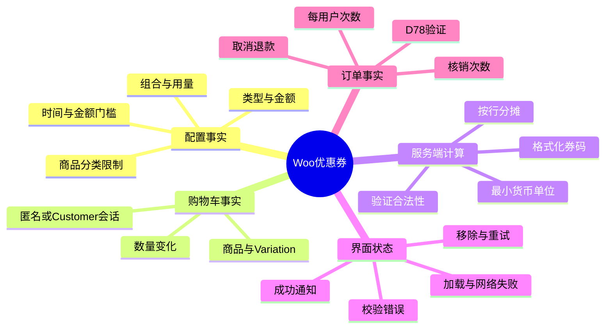

# Day70 WordPress实战：WooCommerce优惠券校验与金额真相

## 相关笔记

- 学习索引：[[WordPress实战笔记索引]]。
- 对应项目笔记：[[../Day70-优惠券规则与边界验证]]。
- 前置学习笔记：[[Day66-集成基线与商品全链路回归]]。
- 后续学习笔记：D71税费、D75配送与D78测试订单完成后回填。

## 今日学习成果

- [ ] 我能解释优惠券配置、购物车应用和订单核销为什么是三层不同事实。
- [ ] 我能从Cart Block请求追到Store API、`WC_Cart`、`WC_Discounts`及服务端金额响应。
- [ ] 我能在独立Local创建、验证并精确回收优惠券/商品/会话；恢复审计12/12、停机、私有目录与同源预演回收站项精确销毁均已通过。

## 真实项目场景

### 今天解决了什么问题

D70要确认DentAll能否直接使用WooCommerce原生百分比、固定购物车、固定商品三种优惠券，而不另加插件或在前端重算金额。真正的风险不是“优惠券按钮能点”，而是舍入、父商品与Variation、最低/最高金额、排除规则、组合顺序、会话隔离、错误提示及购物车变化后的重新计算是否一致。

### 学习范围

- 本篇要掌握：Coupon对象、Cart会话、Store API、`WC_Discounts`验证/分摊、最小货币单位与前端提示的职责链。
- 本篇明确不展开：税前/税后顺序、运费/免邮、订单核销与退款回补；分别留D71、D75、D78。
- 项目真实入口：Cart页#8的`woocommerce/cart`区块；WooCommerce 11.0.0的`src/StoreApi/Routes/V1/CartApplyCoupon.php`、`includes/class-wc-cart.php`、`includes/class-wc-discounts.php`和`includes/class-wc-coupon.php`。
- 验证环境：独立文件副本、独立MySQL数据目录/端口、环回HTTP；不访问Checkout、不创建订单、不触及非Local。

## 先建立整体模型

### 一句话模型

优惠券不是前端把总价减一下，而是服务端先读取券的规则，再用当前购物车事实逐条验证和分摊，最后把权威金额与错误状态返回给界面。

### 记忆宫殿：超市结算台

把优惠券想成一张由门店发行的规则卡：卡片档案写类型、金额、有效期和适用商品；顾客篮子记录当前商品与数量；收银员每次篮子变化都重新核对规则并分摊优惠；收据只打印收银系统算出的结果。结账完成后，后台才给券记录一次“已核销”。

### 比喻对应回真实机制

| 记忆对象 | 真实技术对象 | 不能混淆的边界 |
|---|---|---|
| 规则卡档案 | `WC_Coupon`及其数据存储 | 配置存在不等于已应用，更不等于已核销 |
| 顾客篮子 | `WC_Cart`＋WooCommerce session | 匿名会话彼此隔离；Cart状态不是订单事实 |
| 收银员 | `WC_Discounts`与`WC_Cart_Totals` | 负责验证、分摊、精度与重算，不由浏览器替代 |
| 收据 | Store API响应与Cart Block展示 | 页面文本是服务端结果的呈现，不是独立金额源 |
| 核销台账 | Coupon usage count与订单关联 | 仅加入购物车不会消耗跨订单次数 |

比喻失效处：WooCommerce还要处理税费、运费、待支付订单的暂定占用和退款生命周期，普通超市比喻不能替代这些真实状态机；D70没有验证它们。

## 思维导图



最重要的主干是：配置决定“允许什么”，购物车决定“现在有什么”，服务端决定“实际减多少”，订单才决定“是否消耗次数”。

## 请求与生命周期调用链

```mermaid
flowchart TD
    A[访客在Cart Block提交券码] --> B[Store API batch / cart apply-coupon]
    B --> C[CartApplyCoupon格式化券码]
    C --> D[CartController调用购物车应用]
    D --> E[WC_Cart读取WC_Coupon]
    E --> F[WC_Discounts验证存在/日期/金额/商品/组合/用量]
    F -->|失败| G[Woo错误码与消息]
    F -->|通过| H[按percent/fixed_cart/fixed_product分摊]
    H --> I[WC_Cart_Totals重新计算]
    I --> J[Store API返回行金额/优惠/总额]
    G --> K[Cart Block显示alert并关联输入]
    J --> L[Cart Block更新Chip/总额/live region]
    M[商品数量变化] --> F
```



- 触发条件：提交、移除优惠券或更新购物车商品/数量。
- 输入数据：格式化后的券码、当前用户/会话、商品/Variation、数量、价格与Coupon配置。
- 输出：Store API购物车对象或`woocommerce_rest_cart_coupon_error`。
- 副作用：成功券码进入当前购物车session；D70未创建订单，所有券`usage_count`保持0。
- 可观察证据：HTTP状态/错误码、响应中的`coupons[]`、行`line_total`、购物车`total_discount`/`total_price`、DOM提示与辅助技术语义。

## 核心概念卡

| 概念 | 准确定义 | DentAll真实例子 | 常见误区 | 如何验证 |
|---|---|---|---|---|
| Coupon配置 | `WC_Coupon`保存的类型、金额、限制和用量配置 | 12.5%与最低$25券 | 后台保存成功就等于购买链通过 | 用CRUD getter核对，再进真实Cart应用 |
| 当前购物车应用 | 当前session内已接受的券码及按行折扣 | $24.99应用12.5%后优惠312 cents | 把Cart应用算成一次全局使用 | 应用前后查`usage_count`与订单数 |
| 最小货币单位 | API用整数表达金额，USD两位即cent | 2499、312、2187 | 浏览器用浮点数重算$3.12375 | 核对`currency_code=USD`与`minor_unit=2` |
| 商品级限制 | 验证商品ID及Variation父ID、分类和排除条件 | 父#46限制命中Variation #51 | 只检查Variation自身ID会错误拒绝 | 混合车逐行核对折扣 |
| Individual use | 该券不能与其他券并用的原生组合规则 | 普通券→独用券替换；反向应用普通券被拒 | 假设两个顺序会返回同一动作 | 分别建立新会话验证两个顺序 |
| Usage limit | Coupon在订单生命周期中的总/用户次数约束 | limit=1但Cart应用后count仍0 | 用一次购物车应用证明跨订单次数 | D78创建受控订单后验证 |

## 项目实战代码

> 下列是本机WooCommerce 11.0.0包的真实最小节选，位于隔离运行种子中；DentAll没有修改这些第三方文件。D70测试脚本与私密运行配置不作为站点发布代码。

### 涉及文件

- `wp-content/plugins/woocommerce/src/StoreApi/Routes/V1/CartApplyCoupon.php`：Store API入口与券码格式化。
- `wp-content/plugins/woocommerce/includes/class-wc-cart.php`：购物车应用券与触发总额重算。
- `wp-content/plugins/woocommerce/includes/class-wc-discounts.php`：规则验证及三种券型分摊。
- `wp-content/plugins/woocommerce/includes/class-wc-coupon.php`：Coupon数据、商品适用性和用量计数API。
- `app/public/wp-content/themes/dentall/`与`app/public/wp-content/plugins/dentall-core/`：当前没有优惠券计算或专用Cart覆盖。

### 从入口开始追踪

1. Cart Block提交券码，请求Store API的`/cart/apply-coupon`。
2. 路由先检查全局优惠券开关，再调用`wc_format_coupon_code()`统一输入。
3. Cart Controller把请求交给购物车；`WC_Cart`读取`WC_Coupon`并让`WC_Discounts`验证。
4. 验证成功后按券型和可用行金额分摊，`calculate_totals()`重建总额并写回session。
5. API把整数金额和错误状态返回，Block更新DOM；DentAll Header/Mini Cart不应另算优惠。

### 关键代码片段

源文件`CartApplyCoupon.php`：

```php
$coupon_code = wc_format_coupon_code( wp_unslash( $request['code'] ) );

try {
	$this->cart_controller->apply_coupon( $coupon_code );
} catch ( \WC_REST_Exception $e ) {
	throw new RouteException( $e->getErrorCode(), $e->getMessage(), $e->getCode() );
}
```

源文件`class-wc-discounts.php`的门槛方向：

```php
if ( $coupon->get_minimum_amount() > 0
	&& $coupon->get_minimum_amount() > $subtotal ) {
	// 低于最低金额才失败，因此等值允许。
}

if ( $coupon->get_maximum_amount() > 0
	&& $coupon->get_maximum_amount() < $subtotal ) {
	// 高于最高金额才失败，因此等值允许。
}
```

源文件同类中的Variation父商品判断：

```php
if ( in_array( $item->product->get_id(), $coupon->get_product_ids(), true )
	|| in_array( $item->product->get_parent_id(), $coupon->get_product_ids(), true ) ) {
	$valid = true;
}
```

这三段分别解释了大小写/格式化与错误对象、最低/最高等值边界、父商品限制为何能命中Variation。真正的分摊还包含精度、剩余金额和每行可减上限，不能用这几个节选自行重写计算器。

### 运行证据

- 环境与源完整性：分支`codex/day70-coupon-rules`、基线`c9ca48c8489bf351dcb7ce04bc84080528dc68f1`；源`public`复制范围为13,421个文件，复制前源/复制后源/目标副本树SHA-256同为`A9C8759A6F6335AC20D74F6FE79E7991274F1DC33F8D0921EDBB832B4CDEF528`；自定义主题17文件、Core 7文件另行校验。
- 配置审计：WordPress 7.0.4、WooCommerce 11.0.0、PHP 8.2.29、Storefront 4.6.2、DentAll 0.35.0、Core 0.2.8，HPOS已启用。权威前/后审计均105/105；后审计时间`2026-09-08T06:07:41Z`晚于浏览器结束`06:07:15.381Z`。15张券、角色表、Cart Block、订单0、用量0与`free_shipping=false`保持不变。
- 浏览器与Store API：权威脚本SHA-256为`03FD52B92998DE1AB9FFBC0C80054BEEC49B4C00E22DFD3F9DC8A8C6D7CDCE10`，17项通过、1项P2，P0/P1为0；Console warning为0，11条预期错误已分类，意外错误为0。独立复核结果SHA-256为`21F06E5F0E31E011D5C20231CCF9786861AC5640B5AA208258FE0C96DB66A0CF`，8/8通过且P0/P1/P2为0。
- 金额：2499应用12.5%为312优惠/2187总额；固定整车555；父商品固定商品券只减两件Variation共450；$100固定券在2499封顶。
- 边界：最低25在2499拒绝、2500等值允许、4998允许后降回2499自动移券；最高24.99在2499等值允许、4998自动移券。
- 错误：所有预期400同时核对Woo优惠券错误码、目标券码与语义，不只检查HTTP状态。
- 过期券错误曾出现约5秒短暂骨架，新Oracle确认恢复后骨架0、真实商品#44仍在、行金额和购物车总额均2499、优惠券0，未把瞬态渲染误判为数据丢失。
- 证据不能证明：订单用量消耗、税费、免邮、退款回补、Production缓存和第三方支付集成。

权威结论不纳入旧浏览器轮次或一次30秒中断。旧共享MySQL `10011`及权威前harness预演中的PID guard、`mysqldump` option-file、blanket cache遗漏24个源码文件、router/失败清理与source partial问题均已在权威轮次前关闭，不与终态证据合并。权威服务端PHP Fatal/Warning为0；2条只读CLI内联探针因Windows引号产生Parse error，未写数据。

最终清理后，15券、1 Customer、1边界商品和51 session均已删除，恢复12/12。原`.codex-tmp/day70`已永久删除；另发现的23个同源预演回收站条目（含对应数据与元数据）已按`DeletedFrom`和当前SID物理父目录精确永久删除，未清空其他回收站。独立终审path/recycle/listeners/processes/git全0，P0/P1/安全P2为0。

## 职责边界

| 层级 | 本主题中负责什么 | 不应该负责什么 |
|---|---|---|
| WordPress Core | REST基础、用户/角色、nonce与HTTP生命周期 | 不存Woo优惠规则语义 |
| WooCommerce | Coupon CRUD、Cart、Discounts、Store API、金额精度和错误 | 不替业务方决定正式活动事实 |
| Storefront父主题 | 页面外壳与经典区域样式 | 不修改其核心文件来处理D70 |
| DentAll子主题 | 必要的局部展示与响应式适配 | 不手算金额或复制Cart状态机 |
| `dentall-core` | 既有业务角色与站点级规则 | 不因原生券已可用而新增重复模块 |
| 数据库与session | 保存Coupon、角色与当前购物车状态 | TEST不能留入共享/非Local |
| 浏览器 | 发请求、显示金额/提示、管理交互状态 | 不成为价格、限制或核销真相源 |

## Hook、API或模板机制详解

| 项目 | 说明 |
|---|---|
| 机制类型 | WooCommerce Store API＋CRUD＋Cart/Discount对象 |
| 入口 | `POST /wp-json/wc/store/v1/cart/apply-coupon`，Cart Block批处理时可由`/wc/store/v1/batch`承载 |
| 输入 | 券码与当前浏览器的nonce/session上下文 |
| 验证 | 存在、状态、日期、用量、用户、最低/最高金额、商品/分类、促销品排除和组合规则 |
| 计算 | `percent`、`fixed_cart`、`fixed_product`按内部整数精度分摊到可用行 |
| 返回 | Cart schema：items、coupons、totals、errors；失败为Woo REST错误对象 |
| 影响范围 | 动态Cart请求和当前session；不直接创建订单或扣库存 |
| 覆盖原则 | 优先使用公开API/Filter；D70无覆盖，无证据不自建金额算法 |

## 安全、数据与站点影响

| 检查面 | 本次结论 | 证据或待验证项 |
|---|---|---|
| 输入清洗与验证 | Woo路由格式化券码，服务端逐项验证 | 畸形/未知/大小写重复有错误码与状态证据 |
| Capability | 前台应用券不授予后台能力；WM能力表保持基线 | Content Editor仍不能编辑Coupon |
| Nonce/session | Store API请求使用当前响应nonce与独立Cookie | 匿名A/B互不见对方Cart；nonce不是后台capability |
| 输出转义 | 使用Woo错误对象和Block输出 | D70未新增PHP输出 |
| 数据库写入 | 仅独立Local创建TEST Coupon/Product/Customer/session | 15券、1 Customer、1边界商品、51 session已删除，恢复12/12；私有目录与23个同源回收站条目（含对应数据与元数据）已精确销毁，安全终审P0/P1/P2为0 |
| URL与SEO | 无新公开URL或SEO输出 | 隔离站强制noindex；非Local未部署 |
| 缓存 | Cart为会话动态状态，不可用公共整页缓存替代 | Production排除规则留部署回归 |
| 支付、物流与订单 | D70均未执行 | D71/D75/D78分别验证相邻事实 |
| 部署与回滚 | 运行代码0；删除私有副本即可回滚测试 | 任务分支不等于部署 |

## 动手练习

### 练习一：只读观察

- 目标：确认同一Coupon配置与当前Cart应用是两类证据。
- 操作：用`WC_Coupon`读取type/amount/usage count，再用新匿名会话应用一次券并重读。
- 预期：Cart含券且金额变化，但没有订单时usage count仍为0。
- 实际证据：D70三种券型均符合；跨订单次数仍未验证。

### 练习二：独立Local最小改动

- 改动：创建$25.00隐藏TEST Simple，只用于最低金额等值验证。
- 风险边界：独立datadir/账号/端口与环回HTTP；虚拟、无税、无配送，不进Checkout。
- 验证：Cart总商品2500，10%优惠250，总额2250。
- 回滚：按manifest中的ID和精确SKU用Woo CRUD永久删除，再验证SKU不存在、代表商品与基线一致。

### 练习三：故障推演

- 假设症状：点击Apply后页面一直是骨架，没有成功或错误提示。
- 可能原因：batch请求未结束、前端错误没有释放loading、session/nonce失败或Console异常。
- 第一项检查：Network中batch状态与响应体，同时观察服务端Cart是否实际含券。
- 为什么先查它：先区分“请求没完成”“服务端已失败但UI卡住”和“服务端成功但DOM没更新”，避免直接改CSS掩盖状态问题。

## 常见误区与排错顺序

| 现象或误区 | 可能原因 | 推荐检查顺序 | 最小验证方法 |
|---|---|---|---|
| 总额看似正确就宣布通过 | 限制未命中、舍入或行分摊错误 | API金额→行金额→Cart DOM | 混合车逐行核对整数金额 |
| 任意400都算预期失败 | nonce/auth/路由错误也可能400 | HTTP→Woo错误码→券码→语义 | 同时断言四层Oracle |
| Cart应用后次数应为1 | 把会话应用与订单核销混淆 | 订单数→usage count→当前Cart | 0订单下应用并复查count=0 |
| Variation不受父商品限制 | 只检查Variation ID | 商品类型→parent ID→Coupon getter | 父限制＋混合车实测 |
| 页面无横向滚动即长错误可读 | 内层Flex子项可能被裁切 | 页面宽度→错误client/scroll宽→截图 | 四宽无断点长券码 |

## 掌握标准

- [ ] 能在2分钟内讲清“配置—购物车—订单”三层。
- [ ] 能指出Store API路由、Cart和Discounts入口。
- [ ] 能区分Woo交易职责与DentAll展示职责。
- [ ] 能说明正常、限制失败、网络失败三条路径及证据。
- [ ] 能完整执行业务数据/会话恢复、私有目录/同源回收站项精确销毁，并复述清理Oracle。
- [ ] 能说明对数据、URL/SEO、缓存、支付、物流和部署的影响边界。

当前掌握度：初识，待费曼自测。交易与恢复Oracle已形成可复演材料，但“能解释”及更高等级仍由用户本人评定，不由文档自动提升。

## 费曼测试题

1. 为什么一张券已加入Cart，却仍可能`usage_count=0`？
2. 12.5%×$24.99为什么不能让浏览器自行用浮点数决定最终优惠？
3. 从Cart Block按Enter开始，按顺序说明哪些对象处理券码、验证、分摊和展示。
4. 为什么限制父商品#46的固定商品券可以作用于Variation #51，却不减混合车里的Simple #44？
5. 最低$25与最高$24.99为何在等值时都允许？数量改变后应收集什么证据？
6. 为什么“HTTP 400”不足以证明过期券测试通过？
7. 将相同验证迁到Shopify时，哪些原则可保留，哪些规则必须重新查证？

### 我的费曼答案与纠正

待用户复习时填写。当前技术证据支持问题1～6；问题7的平台具体机制标记待验证。

### 自测评分

| 分数 | 标准 |
|---:|---|
| 0 | 只能描述页面结果 |
| 1 | 能说对象名称，但分不清配置、Cart和订单 |
| 2 | 能同时说明服务端因果链、DentAll证据和未验证边界 |

总分：待填写 / 14。

## 间隔复习记录

| 复习节点 | 计划日期 | 完成 | 暴露的问题 | 修正位置 |
|---|---|---|---|---|
| D+1 | 2026-09-09 | [ ] | 待复习 | 待填写 |
| D+3 | 2026-09-11 | [ ] | 待复习 | 待填写 |
| D+7 | 2026-09-15 | [ ] | 待复习 | 待填写 |
| D+14 | 2026-09-22 | [ ] | 待复习 | 待填写 |

## 收尾总结

- 我今天真正理解了：优惠券金额的权威来源是WooCommerce服务端Cart/Discount链，不是页面文本。
- 我仍然容易混淆：Cart应用、待支付暂定用量和订单最终核销；D78必须结合订单状态重新验证。
- 下次遇到类似问题，我会先检查：请求错误码、服务端Cart整数金额、当前session与订单/usage count是否属于同一层。
- 下一篇直接相关学习笔记：D71税费笔记完成后补成Wiki链接并双向回填。

## 后续如何向AI高效提问

可使用：

```text
环境：WooCommerce版本、币种/小数位、含税设置、Cart或Checkout区块版本。
目标：说明哪种券型、金额、适用商品与预期边界。
证据：Coupon CRUD值、Store API请求/响应、行金额、Cart总额、错误码、订单和usage count。
边界：不改核心、不自定义金额、不建真实订单、不碰Production。

请把事实按“配置、当前购物车、订单核销、前端展示”分层；先指出缺失证据，再给最小Local验证和精确恢复步骤。
```

提问前删除密码、Cookie、nonce、Cart-Token、客户邮箱、私钥与支付凭据。AI解释不是交易证据；版本相关结论必须回到当前源码、官方文档或隔离实验。

## 变种应用到其他项目

| 新场景 | 保持不变的原则 | 可能变化的实现 | 必须重新确认 | 最小验证 |
|---|---|---|---|---|
| 另一个Storefront子主题 | 服务端金额唯一真相、Cart/订单分层 | 子主题Cart局部样式 | Woo/Blocks版本与覆盖 | 三券型＋四端＋恢复 |
| WordPress区块主题 | 同一Store API与交易Oracle | 页面模板和CSS级联 | Cart Block版本/主题样式 | API＋DOM双层测试 |
| 经典Cart模板 | 服务端仍权威 | 表单、notice和AJAX生命周期 | 模板覆盖与nonce路径 | POST/AJAX成功失败 |
| 独立插件 | 不复制Woo计算器 | 只在公开Hook扩展业务限制 | 数据/卸载/HPOS/缓存 | 单元＋真实Cart回归 |
| Shopify或其他平台 | 配置/Cart/订单/展示分层 | Discount Function/API/主题扩展待验证 | 组合、税费、退款、核销语义 | 官方API＋测试店订单 |

## 可复用核心思想

### 跨平台不变量

任何促销系统都应把规则定义、当前购物车分配、订单核销和界面反馈分开验证。边界值必须包含“低一单位、恰好等值、高一单位”，失败Oracle要同时证明错误来自目标规则而非认证或网络偶然错误。

### WordPress/WooCommerce当前实现

WooCommerce 11.0.0通过`WC_Coupon`、`WC_Cart`、`WC_Discounts`、`WC_Cart_Totals`和Store API完成原生闭环；金额在内部整数精度中分摊，Variation限制会考虑父商品。DentAll D70没有新增运行实现。

### Shopify或其他平台的对应机制

可迁移的是“服务端权威金额＋Cart/订单分层＋可逆测试”原则。Shopify的Discount Function、组合策略、税费顺序、订单核销和退款回补规则尚未在本项目实际验证，全部标记待验证，也不属于DentAll第一版实施范围。
