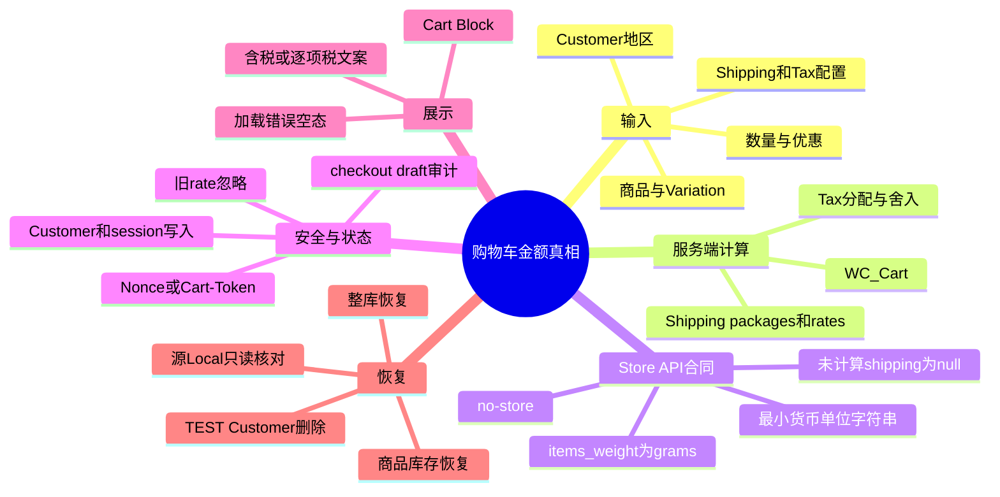
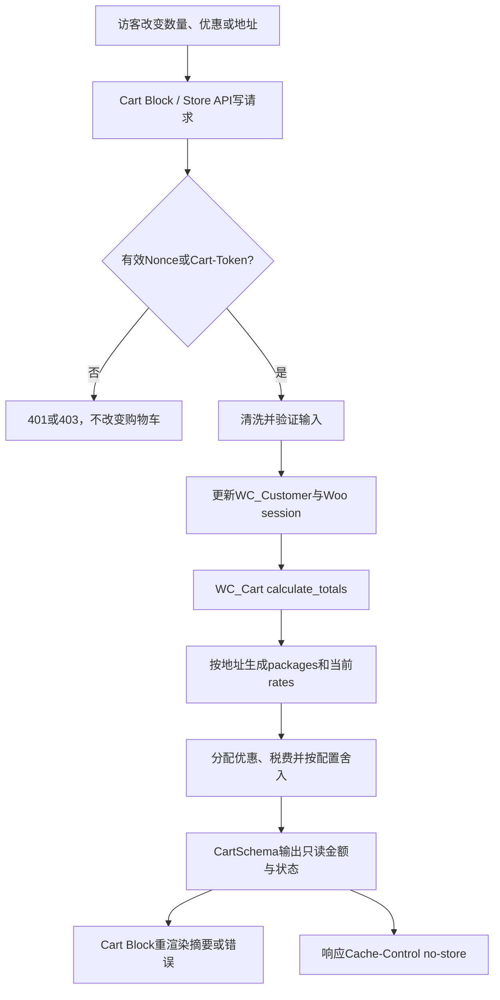

# Day71 WordPress实战：WooCommerce运费、税费与金额真相

## 相关笔记

- 学习索引：[[WordPress实战笔记索引]]。
- 对应项目笔记：[[../Day71-运费税费与金额摘要候选验证]]。
- 前置学习：[[Day68-Cart-Block响应式布局与状态证据]]。
- 后续学习：[[Day72-人工运费报价与结账安全边界]]。

> [!important] 证据边界
> 本篇来自D71独立Local中的TEST配置和WooCommerce 11.0.0源码。它解释计算与状态合同，不提供税务意见，也不把TEST税率、费率、国家或地址当成DentAll正式政策。学习笔记生成不代表用户已完成费曼自测。

## 今日学习成果

- [ ] 我能解释为什么Cart Block、Store API和`WC_Cart`不是三个金额计算器，而是展示、传输和计算三层。
- [ ] 我能区分未计算运费的`null`、已计算但无rate的`0`和真实零价rate，并知道不能仅凭`$0.00`写“Free”。
- [ ] 我能在隔离Local验证地址、rate、税费、舍入、库存和会话，再通过整库恢复证明TEST状态没有留下。

## 真实项目场景

### 今天解决了什么问题

购物车总计会同时受商品数量、Variation、优惠、客户地区、当前配送rate、税率、含税/未税显示和舍入配置影响。如果主题再写一套`单价 × 数量 + 运费 + 税`，很快会与WooCommerce在优惠税额分摊、含税反推和1美分舍入处冲突。D71要确认原生计算链足够，并找出Cart页地区入口与正式物流政策仍缺什么。

### 学习范围

- 本篇要掌握：`WC_Cart`计算、Store API金额结构、Shipping/Tax状态、Nonce/Cart-Token、Customer/session副作用、Cart Block展示和可逆验证。
- 本篇明确不展开：税务合规、真实Shipping Zone/免邮、Shipping Class、体积重、承运商、Checkout字段、订单、支付、退款、邮件和库存扣减。
- 项目真实入口：Page ID 8的Cart Block、`/wp-json/wc/store/v1/cart`、`cart/update-customer`、`cart/select-shipping-rate`、`app/public/wp-content/themes/dentall/inc/setup.php`。
- 验证版本与环境：WordPress 7.0.4、WooCommerce 11.0.0、Storefront 4.6.2、PHP 8.2.29；独立文件与数据库副本，源Local只读。

## 先建立整体模型

### 一句话模型

浏览器把客户动作交给受保护的Store API，WooCommerce在服务器内更新Customer/session并由`WC_Cart`重算，Store API再把只读金额结果交给Cart Block显示。

### 记忆宫殿：机场托运行李柜台

把购物车想成机场托运行李流程：旅客提供目的地和行李，值机系统查当前航线与规则，计费台统一出报价，屏幕只显示结果。屏幕不能因为看见“重量2kg”就自己猜价格；没有航线与免费航线也不能都显示成“0元”。

### 比喻对应回真实机制

| 记忆对象 | 真实技术对象 | 不能混淆的边界 |
|---|---|---|
| 旅客与行李 | `WC_Customer`地址、Cart items、Variation重量/尺寸 | schema通过不等于真实地址或可投递 |
| 航线表 | Shipping Zone、package与当前rates | Flat Rate不会自动按kg/cm计价 |
| 计费台 | `WC_Cart::calculate_totals()`、Shipping/Tax API | 主题和浏览器不应复制计算 |
| 登机牌防伪 | Store API Nonce或Cart-Token | Token是会话秘密，不能进日志或Git |
| 大屏幕 | Cart Block DOM | 可见文本是表达层，不是独立事实源 |
| 当班航班缓存 | Woo session中的chosen method/package cache | 地址或包裹变化后必须按当前package重验 |

比喻的失效边界：机场通常验证真实身份和目的地，而Woo地址schema只验证输入格式与可计算性；承运商服务性需要后续真实集成。

## 思维导图



最重要的主干是“输入变化 → Woo服务端统一重算 → Store API结构化输出 → Cart Block表达”，任何客户端金额分支都会破坏这条单向链。

## 请求与生命周期调用链



- 触发条件：购物车GET，或加购、改数量、应用coupon、更新Customer、选择rate等写请求。
- 加载入口：WordPress REST路由与WooCommerce Store API；Cart页面由WordPress解析Block后加载前端组件。
- 执行顺序：鉴权 → 清洗/验证 → Customer/session更新 → totals重算 → schema响应 → UI重渲染。
- 输入数据：产品/Variation ID、数量、coupon code、结构化地址、当前rate选择；金额字段不是客户端写入项。
- 输出或副作用：购物车、Customer/session、当前rate和金额变化；既有checkout draft可能被同步，因此测试必须审计draft。
- 可观察证据：HTTP状态、`has_calculated_shipping`、rates、totals、DOM金额、响应头、两会话差异和恢复审计。

## 核心概念卡

| 概念 | 准确定义 | DentAll真实例子 | 常见误区 | 如何验证 |
|---|---|---|---|---|
| `has_calculated_shipping` | 当前Cart是否满足展示并包含配送计算的条件 | 未定位为false；TX无方式仍为true | 把“有无rate”与“是否计算过”混为一谈 | 同时读取布尔值、rates与shipping totals |
| 最小货币单位 | Store API以字符串表达币种最小单位 | `3275`表示USD `$32.75` | 用浮点`32.75`继续运算 | 与currency minor unit一起读，比较原始整数串 |
| `items_weight` | Store API购物车总重，固定以克输出 | 1.2kg商品返回1200 | 按后台kg直接读为1200kg | 对照商品getter和`CartSchema`源码 |
| 当前rate | 当前package实际返回且被选中的配送方案 | CA与NY的rate ID不同 | 只信客户端提交的旧/伪造ID | 提交后重新GET Cart，核对当前package |
| 优惠税额分配 | coupon不仅减少商品净额，也会减少相应税额 | `$3.12`优惠同步移除`$0.23`税 | 从总价直接减coupon而忽略税基 | 分别核对discount、discount tax、item tax、total tax |
| 舍入层级 | 按行或按小计舍入会产生合法的最小单位差异 | 同一TEST输入相差1美分 | 把1美分差异直接判成Bug | 固定输入，仅切换round-at-subtotal后比较 |

## 项目实战代码

> [!important] 代码真实性
> D71没有新增运行代码。下列第一段来自当前DentAll子主题；第二段来自隔离副本中已安装的WooCommerce 11.0.0，只用于读源码，禁止修改插件核心。

### 涉及文件

- `app/public/wp-content/themes/dentall/inc/setup.php`：只在Cart页面加载既有`cart.css`，不介入金额计算。
- `wp-content/plugins/woocommerce/src/StoreApi/Schemas/V1/CartSchema.php`：WooCommerce已安装版本的Cart响应结构和金额语义。
- `wp-content/plugins/woocommerce/src/StoreApi/Routes/V1/AbstractCartRoute.php`：Store API购物车响应头和写请求Nonce检查。
- `wp-content/plugins/woocommerce/src/StoreApi/Routes/V1/CartUpdateCustomer.php`：地址清洗、验证、Customer保存和重算。

### 从入口开始追踪

1. WordPress解析`/cart/`的Page ID 8及Cart Block。
2. `wp_enqueue_scripts`优先级55调用`dentall_enqueue_cart_assets()`；只有`is_cart()`才加载展示CSS。
3. Cart Block读取Store API；写动作携带同会话有效Nonce或Cart-Token。
4. Woo更新购物车/Customer/session并调用`calculate_totals()`。
5. `CartSchema`将服务端状态与金额转为只读响应，Block再更新DOM。

### 关键代码片段一：DentAll只负责Cart样式入口

源文件：`app/public/wp-content/themes/dentall/inc/setup.php`。

```php
function dentall_enqueue_cart_assets() {
	if ( ! function_exists( 'is_cart' ) || ! is_cart() ) {
		return;
	}

	// 省略版本读取与wp_enqueue_style()参数。
}
add_action( 'wp_enqueue_scripts', 'dentall_enqueue_cart_assets', 55 );
```

这段入口没有读取价格、税率、地址或session。若把金额计算加进主题，将让跨主题交易规则依赖展示层，违反低耦合边界。

### 关键代码片段二：未计算运费用`null`表达

源文件：WooCommerce 11.0.0 `src/StoreApi/Schemas/V1/CartSchema.php`，最小节选。

```php
'total_shipping' => $cart->has_calculated_shipping()
	? $this->prepare_money_response( $cart->get_shipping_total(), $decimals )
	: null,
```

| 代码 | 表面动作 | WooCommerce中的真实作用 | 为什么重要 |
|---|---|---|---|
| `has_calculated_shipping()` | 先检查状态 | 区分“尚未算”与“已算出0” | 避免把pending写成Free |
| `prepare_money_response()` | 格式化金额 | 输出最小货币单位字符串 | 避免浮点误差和区域格式混算 |
| `: null` | 未计算时不返回数字 | 把未知状态保留下来 | UI可显示“到Checkout计算”而不是假报价 |

### 运行证据

- 页面/API：`/cart/`、`/wp-json/wc/store/v1/cart`及更新子路由。
- 正常结果：CA/NY当前rate、未税/含税、coupon和两种舍入下，getter、Store API与DOM一致。
- 失败或边界：缺/错Nonce为401/403；无效国家400且旧状态不变；旧/伪造rate被忽略；缺货/超库存400；网络失败后状态保留且可重试。
- 证据能证明：当前版本、当前TEST输入和当前运行树的计算与状态合同。
- 证据不能证明：正式政策、真实地址、可投递性、承运商报价、Checkout/订单或Production缓存行为。

## 职责边界

| 层级 | 本主题中负责什么 | 不应该负责什么 |
|---|---|---|
| WordPress Core | Page/REST生命周期、用户与脚本基础能力 | 修改核心或决定商城金额 |
| WooCommerce | Product/Variation、Customer/session、Cart、Shipping/Tax、Store API和金额重算 | 被主题绕过或依赖内部表结构 |
| Storefront父主题 | Cart页面外围模板与基础样式 | 承担DentAll正式物流规则 |
| DentAll子主题 | 条件加载Cart CSS和展示微调 | 计算税、运费、优惠或库存 |
| `dentall-core` | 本日无新增职责 | 不把TEST税率/费率写成常驻业务逻辑 |
| 数据库 | 保存Woo配置、Customer/session与商品事实 | 把TEST配置冒充正式政策 |
| 浏览器 | 发动作、显示Block状态和错误 | 自行推导权威总计或信任旧rate |

## REST机制详解

| 项目 | 说明 |
|---|---|
| 机制类型 | WordPress REST / WooCommerce Store API |
| 名称或入口 | `wc/store/v1/cart`、`cart/update-customer`、`cart/select-shipping-rate`等 |
| 注册位置 | WooCommerce插件Store API路由；D71不注册自定义路由 |
| 回调输入 | 结构化Cart动作；写请求还需同会话Nonce或有效Cart-Token |
| 返回内容 | items、addresses、rates、totals、errors及货币元数据 |
| 副作用 | 写请求可更新Cart、Customer/session，并可能同步既有checkout draft |
| 影响范围 | 匿名/登录访客的购物车；不同会话必须隔离 |
| 缓存合同 | 购物车API响应`Cache-Control: no-store`；Token/Cookie不可共享缓存 |

## 安全、数据与站点影响

| 检查面 | 本次结论 | 证据或待验证项 |
|---|---|---|
| 输入清洗与验证 | Woo地址schema和商品/数量校验生效 | 无效国家400；schema不验证真实可投递性 |
| Capability | 前台购物车不以后台capability授权 | 会话身份和Store API安全合同仍必须成立 |
| Nonce | 写请求缺失401、错误403 | Nonce不能代替后台capability；Cart-Token同样是秘密 |
| 输出转义 | 继续使用Woo Block输出 | D71无自定义HTML或文案输出 |
| 数据库写入 | 仅独立副本的Woo CRUD/API与TEST配置 | Customer、session、库存、tax/rate后整库恢复 |
| URL与SEO | 无变化 | 未改Page、Canonical、robots、sitemap或Schema |
| 缓存 | 无自定义缓存；Store API为no-store | CDN/公开页面缓存未验 |
| 支付、物流与订单 | 仅TEST固定费率与计算；订单/draft为0 | 真实承运商、Checkout、支付和订单未验 |
| 部署与回滚 | 未部署；整库恢复与基线一致 | Staging/Production需另行配置、备份和回归 |

## 动手练习

### 练习一：只读观察

- 目标：区分未计算运费与无可用方式。
- 操作：分别读取未定位Cart与已填TX TEST地址后的`has_calculated_shipping`、rates、`total_shipping`。
- 预期：前者`false/null`，后者`true/空数组/0`。
- 实际证据：D71主报告两种状态均通过，DOM均未标“Free”。

### 练习二：Local最小改动

- 改动：仅在一次性独立库切换`woocommerce_tax_round_at_subtotal`，其他输入保持一致。
- 风险边界：不改源Local、核心、订单、支付或Production；TEST配置不代表政策。
- 验证：逐行舍入总计6694/税453；小计舍入总计6693/税452。
- 回滚：停止隔离服务，整库导入预测试dump，再比较功能审计哈希。

### 练习三：故障推演

- 假设症状：地区切换后Cart总计已变化，但Header Mini Cart仍显示旧小计。
- 可能原因：Cart Block读取了新Store API状态，而D69的经典fragment刷新签名只覆盖item key与数量。
- 第一项检查：同一会话同时抓Cart Store API、Cart DOM和Mini Cart DOM/fragment的时间顺序与金额。
- 为什么先查它：先确认是不是两个消费者刷新时机不同，再决定是否改缓存签名；不能先改金额公式。

## 常见误区与排错顺序

| 现象或误区 | 可能原因 | 推荐检查顺序 | 最小验证方法 |
|---|---|---|---|
| `shipping=0`就显示Free | 未区分无rate与零价rate | 状态 → packages/rates → selected → amount | 使用未定位、无方式和真实零价方式三个夹具 |
| Store API与PHP getter不一致 | 未计算时API用`null`、getter为0 | 先比状态，再比金额 | 固定同一trace，在REST响应末尾记录脱敏getter摘要 |
| 含税价格被重复加税 | 客户端再次计算或误读净/税字段 | 配置 → line subtotal/tax → shipping/tax → total | 只比较Woo原始整数串与DOM |
| 地址更新200却不能配送 | schema只验证格式，或没有该区rate | address → ship-to范围 → zone → package rates | 使用允许销售但不可配送的TEST国家 |
| 旧rate仍留在session | 地址/包裹变化或缓存未失效 | 当前package → selected rate → totals → session隔离 | 提交旧/伪造ID后重新GET Cart |
| 1美分差异 | 舍入层级不同 | decimals → tax config → line totals → total | 同输入只切换round-at-subtotal |

## 掌握标准

- [ ] 不看笔记，能在2分钟内讲清“计算层—API层—展示层”。
- [ ] 能解释`null`、无rate的`0`和零价rate三种状态。
- [ ] 能指出CartSchema、AbstractCartRoute、CartUpdateCustomer和DentAll Cart资源入口的职责。
- [ ] 能说明Nonce、Cart-Token、Customer/session与checkout draft风险。
- [ ] 能用Local TEST输入复现1美分舍入差异并完整回滚。
- [ ] 能判断Cart内地址入口为何需要产品和架构决定，而不是顺手补JavaScript。

当前掌握度：初识；等待用户完成费曼自测后再提升。

## 费曼测试题

1. 为什么Cart Block、Store API和`WC_Cart`不是三个金额计算器？请用机场比喻后再对应真实对象。
2. 为什么`total_shipping=null`与`total_shipping="0"`不能显示成同一句话？还缺哪一项rate证据？
3. 从一次`cart/update-customer`开始，按顺序说明鉴权、清洗、Customer/session保存、重算和DOM更新。
4. 为什么后台使用kg时Store API仍返回grams？Variation继承为空字段时如何验证有效重量？
5. 旧或伪造rate请求返回200，为什么仍可能是安全结果？应检查什么最终状态？
6. 同一购物车相差1美分时，如何区分合法舍入差异、客户端重复计算和真实服务端Bug？
7. Cart中没有地址表单时，为什么不能直接写一个客户端估算器？D72/D73/D75各要确认什么？

### 我的费曼答案与纠正

待用户自测。每题按“通俗解释、准确术语、DentAll证据”评分；任何题为0分时不提升掌握度。

### 自测评分

| 分数 | 标准 |
|---:|---|
| 0 | 无法解释，或把UI当成金额事实源 |
| 1 | 能说术语，但说不清状态、副作用和恢复 |
| 2 | 能用自己的话解释，并引用D71真实源码路径与TEST证据 |

总分：尚未自测 / 14。

## 间隔复习记录

| 复习节点 | 计划日期 | 完成 | 暴露的问题 | 修正位置 |
|---|---|---|---|---|
| D+1 | 2026-09-09 | [ ] | 待自测 | 自测后记录 |
| D+3 | 2026-09-11 | [ ] | 待自测 | 自测后记录 |
| D+7 | 2026-09-15 | [ ] | 待自测 | 自测后记录 |
| D+14 | 2026-09-22 | [ ] | 待自测 | 自测后记录 |

## 收尾总结

- 我今天真正理解了：运费、税费、优惠和库存都要汇入同一个Woo服务端Cart重算，Store API和DOM只是不同观察面。
- 我仍然容易混淆：未计算与已算为0、地址格式有效与可投递、Flat Rate拿到重量输入与按重量计价。
- 下次遇到类似问题，我会先检查：当前环境/会话身份、`has_calculated_shipping`与rates、原始金额字段，再看DOM和缓存时序。
- 下一篇直接相关学习笔记：[[Day72-购物车状态联动与完整回归]]（创建后双向回填）。

## 后续如何向AI高效提问

### 提问公式

`Woo/WP/PHP版本 + 会话类型 + 地址/商品/配置TEST输入 + Store API原始状态与金额 + Cart/Mini Cart DOM + 已排除缓存 + 安全和恢复边界 + 期望最小修复`

### 提问前准备

- 记录`has_calculated_shipping`、当前rate ID/selected、currency minor unit和各totals原始字符串。
- 说明匿名还是登录Customer、是否已有地址、是否存在checkout draft。
- 提供脱敏后的HTTP状态/响应头布尔值、DOM选择器与可见文本；删除Cookie、Nonce、Cart-Token和完整地址。
- 明确TEST或正式配置，以及不能触碰的订单、支付、税率、物流、缓存和部署边界。
- 先说明能否整库恢复，不用Production试错。

### 可复制的排错提示词

```text
这是WooCommerce购物车金额不一致问题。请先区分服务端计算、Store API传输、Cart Block和Mini Cart展示，不要建议客户端重写金额。

环境：[WordPress/WooCommerce/PHP/主题版本，Local或Staging]
会话：[匿名或Customer，是否已有地址/checkout draft]
TEST输入：[商品/Variation、数量、coupon、地区、含税/未税、舍入配置]
Store API证据：[has_calculated_shipping、rates、totals原始最小单位字符串]
DOM证据：[Cart、Mini Cart、错误/加载状态]
安全边界：[不输出Cookie/Nonce/Cart-Token/地址，不进Checkout/订单/支付]
恢复方式：[数据库/商品/session如何恢复]

请输出：事实、最可能原因、最小只读检查、确认后的最小修复候选、回归矩阵和回滚步骤。
```

> [!warning] AI验证边界
> AI给出的税率、配送规则、源码行为或平台映射不是业务政策和验收证据。版本相关事实回到当前WooCommerce源码或官方文档，金额结论回到隔离测试；真实税务和物流需业务/专业方确认。

## 变种应用到其他项目

| 新场景 | 保持不变的原则 | 可能变化的实现 | 必须重新确认 | 最小验证 |
|---|---|---|---|---|
| 另一个Storefront子主题 | 单一服务端金额源、状态可区分 | Cart Page内容、主题CSS和插件组合 | Woo版本、Cart/Classic模板、税/物流配置 | 同输入比getter、API和DOM |
| WordPress区块主题 | 金额不由主题重算 | Block模板、`theme.json`和资源入口 | 是否仍使用Woo Cart Block | 四端＋Store API＋缓存 |
| Classic Cart项目 | 服务端Cart仍权威 | shortcode、模板Hook与AJAX fragments | 模板覆盖、shipping calculator和缓存 | Classic DOM/API/订单前审计 |
| 独立前端消费Woo | Token、金额单位和服务端rate仍权威 | CORS、会话、API客户端和渲染层 | Cart-Token保管、域名、缓存 | 两会话、负向鉴权、端到端金额 |
| Shopify或其他平台 | 报价/税/折扣必须由平台权威接口给出 | 平台Cart API、Functions、主题与发布机制 | 官方能力、权限、市场和税务服务 | 官方沙盒固定输入对账；本日待验证 |

### 变种练习

若改为独立前端，先回答：哪个接口出权威金额、如何绑定会话、哪些响应绝不能共享缓存、如何区分未报价与零价、如何防止Token泄漏、如何在不下单时证明测试数据可恢复。不能把Woo PHP Hook直接搬到浏览器。

## 可复用核心思想

### 跨平台不变量

金额、库存和配送可用性都需要权威服务端；传输层保留未知/错误/零值差异，展示层忠实表达，不再推导。负向输入、两会话隔离、缓存头与恢复审计，是交易正确性的一部分，不是测试附录。

### WordPress/WooCommerce当前实现

WooCommerce 11.0.0由`WC_Cart`汇总商品、coupon、Shipping和Tax，Store API用最小货币单位字符串输出，并以`has_calculated_shipping`决定运费字段是金额还是`null`；写请求由Nonce或Cart-Token保护，地址更新会写Customer/session并重算。DentAll D71保持运行代码零新增。

### Shopify或其他平台的对应机制

可迁移的是“服务端报价为真、Token按秘密管理、零与未知分开、缓存按会话隔离、TEST可恢复”。Shopify的Cart、Functions、配送与税务机制本日未在官方沙盒验证，具体映射标记为待验证，不纳入DentAll实施范围。
