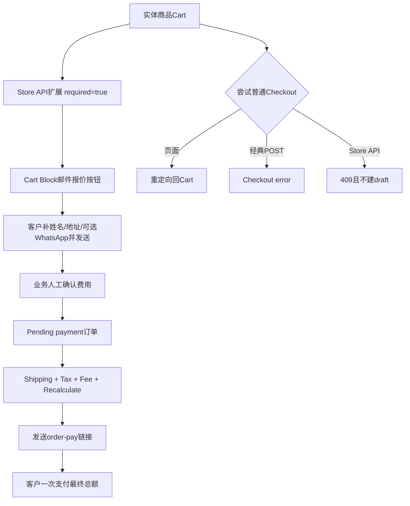

# Day72 WordPress实战：人工运费报价与结账安全边界

## 相关笔记

- 学习索引：[[WordPress实战笔记索引]]。
- 对应项目笔记：[[../Day72-人工运费邮件报价与购物车收口]]。
- 前置学习：[[Day71-WooCommerce运费税费与金额真相]]。
- 前置项目笔记：[[../Day71-运费税费与金额摘要候选验证]]。

## 今日学习成果

- [ ] 我能解释为什么人工运费报价不是0元配送，也不是先付商品后补运费。
- [ ] 我能区分Cart Block展示Filter、Store API扩展、服务端结账守卫和Woo原生订单明细的职责。
- [ ] 我能说明无配送方法时`WC_Cart::needs_shipping()`为何可能为false，以及如何用商品事实修正判断。

## 真实项目场景

DentAll商品价格确定，但运费必须由业务人员根据数量和收货地址人工报价。第一版选择邮箱：Cart生成邮件草稿，业务确认Shipping、Tax、Fee后创建待付款订单，客户通过`order-pay`一次支付最终总额。

本篇不展开站内表单、询价CPT、WhatsApp API、承运商实时报价、SMTP、支付网关和税务合规。验证只代表当前独立Local版本；正式邮箱与非Local仍待。

## 先建立整体模型

### 一句话模型

Cart负责准备报价材料，Core负责守住“未报价不能付款”，业务人员把线下结果写回Woo原生订单明细，`order-pay`只为已确认订单开放。

### 记忆宫殿：货运柜台与收银台

把网站想成有两个柜台：货运柜台先根据货物和目的地写报价单；收银台只接收已经盖章的最终账单。把运费填成0相当于“没报价却盖了免费章”；只改按钮相当于封住正门但忘了侧门API。

真实机制对应如下：

| 比喻 | WooCommerce真实对象 | 边界 |
|---|---|---|
| 货物清单 | Cart Store API中的items、SKU、variation、quantity、totals | 浏览器不重算最终总额 |
| 报价邮件 | `mailto:`预填subject/body | 不写WordPress数据库，依赖本机邮件客户端 |
| 门禁 | `template_redirect`、`woocommerce_checkout_process`、`woocommerce_store_api_cart_errors` | 前端按钮不是安全边界 |
| 盖章账单 | `WC_Order`及Shipping/Tax/Fee明细 | 不直接改模糊总金额 |
| 收银通道 | `order-pay` | 必须放行已确认待付款订单 |

## 思维导图



## 关键机制

### 1. 为什么不用`cartNeedsShipping`作为唯一判断

WooCommerce 11.0.0的`WC_Cart::needs_shipping()`先检查全站是否启用Shipping且至少有一个Shipping Method。没有任何方法时，它直接返回false，即使Cart中的`WC_Product::needs_shipping()`为true。人工报价方案本来就可能不配置自动方法，因此平台字段和业务问题并不等价。

DentAll改为遍历Cart item中的`WC_Product`，按商品自身`needs_shipping()`判断，再通过Cart Store API扩展输出：

```json
{
  "extensions": {
    "dentall/shipping-quote": {
      "required": true
    }
  }
}
```

### 2. Cart Block Filter只负责展示

`proceedToCheckoutButtonLabel`把实体Cart按钮改为邮件报价文案；`proceedToCheckoutButtonLink`根据Filter当次传入的Cart构造`mailto:`。数量变化后Cart Store会重新提供items和totals，因此链接不能在PHP首屏写死。

Cart Block在当前Woo版本可能向Filter传“原始Store Cart”或映射后的Cart形态；代码同时读取`items/totals/coupons`与`cartItems/cartTotals/cartCoupons`，单元测试覆盖两种合同。

### 3. 服务端守卫与已报价地址锁

| 入口 | Hook | 结果 |
|---|---|---|
| 普通Checkout页面 | `template_redirect` | notice后安全跳回Cart |
| 经典Checkout AJAX/POST | `woocommerce_checkout_process` | 添加error，不创建订单 |
| Cart/Checkout Store API | `woocommerce_store_api_cart_errors` | POST验证阶段返回409；Woo在创建draft前停止 |

`order-pay`和`order-received`是已有订单端点，不属于“拿当前Cart直接结账”，所以页面守卫明确放行。Woo同时注册带版本/无版本Store API并允许Batch子请求，而且REST路由匹配不区分大小写，因此Core用回调期路由栈识别真实子请求并覆盖三种旁路。

动态测试创建一个带TEST Shipping的Pending order，付款页200，然后删除订单并确认draft为0。对于已带Shipping line的待付款订单，Store API付款前若尝试改变公司或完整配送地址会返回409；若Woo配置为按Billing计税，会同时锁定账单国家、州、省、市和邮编，避免客户带着旧运费或税额改目的地。对于含实体或无法解析商品、但缺Shipping line的待付款订单，Store API付款返回409，经典`order-pay`提交回到原付款页并显示错误，付款网关尚未执行。

## 项目实战代码入口

- `app/public/wp-content/plugins/dentall-core/includes/shipping-quote.php`：设置、实体Cart事实、Store API扩展和守卫。
- `app/public/wp-content/themes/dentall/assets/js/shipping-quote.js`：邮件草稿与Cart Block Filter。
- `app/public/wp-content/themes/dentall/inc/setup.php`：只在Cart加载脚本并传递配置。
- `project-docs/tests/day72-shipping-quote-php-unit.php`：不启动WordPress的Core分支测试。
- `project-docs/tests/day72-shipping-quote-unit.mjs`：不依赖浏览器页面的Filter与邮件合同测试。

## 数据与安全检查

| 检查面 | 当前结论 | 仍待验证 |
|---|---|---|
| 输入 | 邮箱保存时验证；空值合法；无效值保留旧配置 | 正式邮箱所有权 |
| 权限 | 复用WooCommerce Shipping设置页能力 | 非Local角色实测 |
| 隐私 | mailto不向WordPress提交姓名、地址、WhatsApp | 公司邮箱留存/删除SOP |
| 绕过 | 页面、经典POST、Store API带版本/无版本/Batch/大小写守卫及已报价地址锁 | Express钱包在真实支付启用前回归 |
| 订单 | Woo CRUD与原生Shipping/Tax/Fee | 真实支付、邮件、库存 |
| 缓存 | Cart条件JS；动态页规则不变 | Production/CDN |
| SEO | 无新URL或Schema | 非LocalHead回归 |

## 测试证据与失败驱动修正

- 首轮动态测试：实体商品自身需要配送，但Store API的`needs_shipping=false`，邮件按钮未出现。
- 根因：站点没有Shipping Method，Woo核心提前返回false。
- 修正：建立独立Store API扩展字段并新增“无rate但实体商品”单元测试。
- 最终：PHP 36/36、JS 23/23、隔离Local主集成18/18；普通Checkout回Cart，Store API直接与Batch提交409且draft 0，`order-pay`可访问，改址及无Shipping付款被拒绝，TEST订单与option清理为0，端口停止。

这说明测试不能只覆盖“配置了固定费率”的理想环境；人工报价最关键的状态恰好是“没有自动方法但仍需物流”。

## 常见误区与排错顺序

| 现象 | 常见原因 | 先查什么 |
|---|---|---|
| 实体商品仍显示普通Checkout | 只依赖`cartNeedsShipping`，站点方法数为0 | Product `needs_shipping()`与扩展字段 |
| 邮件数量不更新 | PHP首屏写死链接或读取了错误Cart形态 | Filter当次args、Store API update响应 |
| 改按钮后API仍能下单 | 只有前端Filter | Store API POST是否409、draft是否增加 |
| 直接请求能拦但Batch能下单 | 只看外层REQUEST_URI | 回调期真实子请求路由栈与Batch 207子响应 |
| 付款链接可改目的地 | 只放行order-pay、未锁报价地址 | Checkout Order API的Shipping/Billing地域及订单总额 |
| 旧草稿混入实体商品 | 只在Cart POST建单前检查 | 付款订单是否含Shipping line；REST与经典付款双入口 |
| 人工付款页被重定向 | 守卫没有区分order-pay | endpoint条件和真实Pending order链接 |
| 运费显示0 | 使用Free Shipping/0元占位 | Shipping Methods与订单Shipping明细 |
| 邮件少商品 | 只读`cartItems`或只读`items` | 当前Woo版本Filter参数结构 |

## 掌握标准与费曼测试

- [ ] 两分钟讲清Cart、报价、订单、付款四个阶段。
- [ ] 不看代码说出三条服务端绕过路径。
- [ ] 解释为何无Shipping Method会影响`WC_Cart::needs_shipping()`。
- [ ] 指出Shipping、Tax、Fee在订单中的不同语义。
- [ ] 说明为何mailbox、SMTP、WhatsApp和站内表单不是同一范围。

费曼题：如果未来增加一个全虚拟下载商品，怎样证明它仍走普通Checkout？如果新增站内报价表单，哪些数据、权限、垃圾提交、邮件投递和删除规则必须重新确认？

当前掌握度保持“初识”，待用户脱离笔记自述后再提升。

## 后续如何向AI高效提问

```text
环境：WooCommerce版本、Cart是Block还是Classic、是否有Shipping Method。
业务：哪些商品需要人工报价，报价前后何时创建订单、何时付款。
证据：Product needs_shipping、Cart Store API extensions、Checkout响应、draft/order数量。
边界：不改核心、不用0元占位、不发送真实邮件、不启用真实支付。
请先区分展示入口、服务端门禁、最终订单明细和付款端点，再给最小修复与回滚。
```

## 变种应用到其他平台

| 场景 | 保持不变 | 可能变化 | 必须重验 |
|---|---|---|---|
| Woo经典Cart | 服务器门禁、订单分项 | 按钮Hook和AJAX | Classic模板与POST |
| 区块主题 | Store API事实和订单边界 | Block模板与资源注册 | 主题/Blocks版本 |
| 站内报价表单 | 报价前不付款 | 数据库、邮件队列、防垃圾 | 权限、隐私、恢复 |
| Shopify等平台 | Draft/最终订单分离 | 平台订单草稿和付款链接API | 官方能力与沙盒 |

## 可复用核心思想

### 跨平台不变量

凡是“价格的一部分需要人工确认”，都必须把询问、确认、最终订单和付款拆成明确状态。未知费用不能伪装成0；界面入口不能替代服务端授权；最终账单要按费用类型保留可审计明细。

### WordPress/WooCommerce当前实现

DentAll使用Cart Block Filter生成邮件入口，用Store API扩展传递项目业务事实，用页面/经典/Store API三条守卫阻断旁路，最终复用WooCommerce Pending order、Shipping、Tax、Fee、Recalculate和`order-pay`。所有结论限于已验证版本与独立Local。

### Shopify或其他平台的对应机制

可迁移的是状态机、服务端门禁、分项账单、隐私和回归矩阵；Woo Hook、Store API字段和Order Pay URL不能直接迁移。其他平台的Draft Order、付款链接与物流行机制须查官方文档并在沙盒验证。
