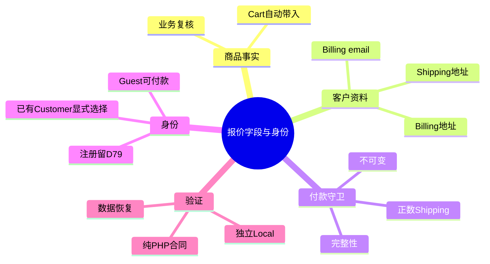
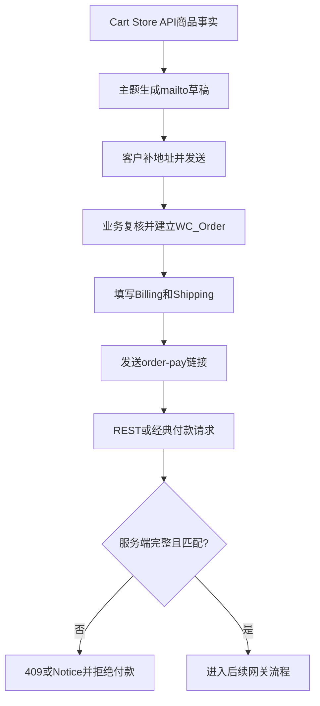

# Day73 WordPress实战：WooCommerce报价字段与客户身份边界

## 相关笔记

- 学习索引：[[WordPress实战笔记索引]]。
- 对应项目笔记：[[../Day73-报价字段与客户身份合同]]。
- 前置学习：[[Day72-人工运费报价与结账安全边界]]。
- 后续学习：[[Day75-WooCommerce报价过期与订单生命周期]]。
- 前置项目笔记：[[../Day72-人工运费邮件报价与购物车收口]]。

## 今日学习成果

- [ ] 我能解释为什么`mailto:`里的Required只是沟通提示，服务端仍需在订单付款前验证原生字段。
- [ ] 我能沿Cart邮件、`WC_Order` Billing/Shipping字段和`order-pay`守卫追踪同一份报价资料。
- [ ] 我能区分Guest订单、WordPress User、WooCommerce Customer及“相同邮箱”，并说明为何不能自动猜测账号归属。

## 真实项目场景

DentAll的实体商品先人工确认运费，再建立待付款订单。原D73计划中的公共Checkout地址表单已被CR-012改变；客户先在本机邮件草稿里提供资料，业务人员复核后写入WooCommerce订单，客户最后通过`order-pay`付款。

本日需要补齐两个漏洞：邮件模板必须明确结构化Billing/Shipping资料；订单进入付款前必须确认这些资料完整且未被客户改动。同时允许新客户免注册付款，但不能因为邮箱相同就把订单自动关联给某个已有账号。

学习范围不包括D79注册表单、邮箱所有权验证、D77 SMTP投递、正式税率或Production客户数据。

## 先建立整体模型

### 一句话模型

Cart负责携带商品事实，客户通过邮件提供地址，业务人员把复核结果写入订单，服务端在付款前再次检查“字段完整、内容未变、账号归属明确”。

### 记忆宫殿：仓库出货单与会员档案

把订单想成仓库出货单：箱内商品由系统打印，收件地址由客户填写，业务人员核对后盖章。会员档案是另一只文件柜；出货单上的邮箱与档案邮箱相同，只是线索，不足以证明两者属于同一人。

| 记忆对象 | 真实技术对象 | 不能混淆的边界 |
|---|---|---|
| 系统打印的商品行 | Cart items、SKU、Variation、quantity、coupon | 不让客户重复手抄，也不信任邮件自行计算金额 |
| 地址栏 | `WC_Order` Billing/Shipping字段 | 邮件正文不是订单数据库事实 |
| 核对盖章 | 付款前完整性与不可变守卫 | 前端文案不能替代服务端检查 |
| 会员文件柜 | WordPress User / WooCommerce Customer | 相同邮箱不等于已验证身份 |

比喻的边界：WooCommerce实际请求还包含REST、经典表单、订单key、session和网关生命周期，不能把“盖章”理解成单一页面按钮。

## 思维导图

最重要的主干是：邮件收集只是输入渠道，订单字段才是付款时的交易事实。

## 请求与生命周期调用链

- 触发条件：含需配送商品的待付款订单进入付款页或付款提交。
- 加载入口：`dentall-core/includes/shipping-quote.php`由Core主入口加载。
- 输入数据：订单原生Billing/Shipping字段、Billing email、Shipping line和付款请求地址。
- 输出或副作用：允许继续，或返回错误并保持订单不可付款；不在此自动创建客户。
- 可观察证据：PHP合同断言、REST状态、经典Notice、订单CRUD回读和终态恢复。

## 核心概念卡

| 概念 | 准确定义 | DentAll真实例子 | 常见误区 | 如何验证 |
|---|---|---|---|---|
| Guest order | `customer_id=0`或未关联账号的Woo订单 | 新客户直接使用付款链接 | Guest等于不需要Billing email | 订单CRUD与付款页访问 |
| Customer关联 | 订单明确引用已有客户账号 | 员工核对后后台选择Customer | 邮箱相同会安全自动关联 | 检查订单customer ID及登录账号 |
| 地址完整性 | 合同要求的原生字段均有有效值 | 姓名、国家、州省、城市、邮编、地址1 | 邮件写了地址就等于订单完整 | 对每个订单getter做负向测试 |
| 地址锁 | 付款请求地址与已报价订单一致 | 修改街道或邮箱被拒绝 | 只锁国家/州省即可 | REST逐字段变更矩阵 |
| 邮箱格式 | 字符串通过WordPress邮箱校验 | Billing email可用于订单联系 | 格式正确等于邮箱属于付款人 | D79另验所有权与登录 |

## 项目实战代码

### 涉及文件

- `app/public/wp-content/themes/dentall/assets/js/shipping-quote.js`：把Cart事实与待填写地址字段映射到邮件草稿。
- `app/public/wp-content/plugins/dentall-core/includes/shipping-quote.php`：订单是否需要人工报价、正数Shipping、字段完整性及地址锁候选。
- `project-docs/tests/day72-shipping-quote-php-unit.php`：D72基础上扩展D73纯合同测试；PHP语法与59项断言通过。
- `project-docs/tests/day72-shipping-quote-unit.mjs`：邮件模板静态合同；当前Local实现已通过Node语法与46项断言。

### 从入口开始追踪

1. Cart Block调用主题Filter生成当前购物车的`mailto:`。
2. 业务人员从邮件读取资料，在WooCommerce订单中使用原生字段建单。
3. 客户打开`order-pay`；Core先确认订单仍需付款且含实体商品。
4. Core检查正数Shipping和所需Billing/Shipping字段，再比较付款请求与订单已确认值。
5. 任一缺失或变化都在网关之前失败；通过后才交给WooCommerce后续支付生命周期。

`dentall_core_order_has_required_quote_details()`把字段完整性收敛到一个可单测判断，并使用WordPress邮箱校验处理Billing email。PHP 59项与邮件JavaScript 46项合同均通过；真实Woo及展示Filter负向场景40/40、权限与REST审计15/15、四端Cart和四类付款页也通过。Guest实际扣款、目标网关回调和账号注册仍分别留D76/D78及D79。

## 职责边界

| 层级 | 本主题中负责什么 | 不应该负责什么 |
|---|---|---|
| WordPress Core | User、邮箱校验、Hook和请求生命周期 | 不修改核心文件，不替业务验证身份 |
| WooCommerce | Cart、Customer、Order、地址与付款端点 | 不自动理解DentAll的人工报价规则 |
| DentAll子主题 | 邮件草稿展示映射 | 不保存客户资料或决定付款资格 |
| `dentall-core` | 跨主题付款完整性与不可变规则 | 不渲染复杂前台表单，不自动合并账号 |
| 数据库 | 保存Woo订单原生字段 | 不新增重复客户/地址表 |
| 业务人员 | 核对邮件、身份和订单资料 | 不拿邮箱相同代替身份验证 |

## 安全、数据与站点影响

| 检查面 | 本次结论 | 证据或待验证项 |
|---|---|---|
| 输入清洗与验证 | 订单字段通过Woo CRUD的`edit`上下文读取；请求值按文本字段比较；Billing email需合法格式 | PHP 59/59、展示Filter与动态缺失/变化场景通过 |
| Capability / Nonce | 前台付款沿用Woo订单key、会话与Store API安全合同；后台建单沿用订单权限 | D79账号矩阵、非Local角色另验 |
| 输出转义 | 错误文案使用国际化；最终HTML由Woo渲染 | 四端Cart和四类付款页通过，Console Error为0 |
| 数据库写入 | 使用Woo原生订单字段，不新增表 | 仅隔离数据库写入；共享Local与非Local未改 |
| URL与SEO | 不新增URL或索引输出 | 原生`order-pay`真实HTTP回归通过 |
| 缓存 | 动态交易页继续禁止页面缓存 | 非Local缓存另验 |
| 支付、物流与订单 | 网关前检查字段；D73不启真实支付 | D76/D78接续 |

## 动手练习

### 练习一：只读观察

- 目标：分辨订单中Billing和Shipping是否完整。
- 操作：用Woo CRUD逐项读取一个TEST订单的getter，不输出真实个人数据。
- 预期：能列出缺失字段，但不修改订单。
- 实际证据：真实Woo CRUD夹具和权限审计已覆盖完整与缺失资料；证据只保留TEST标识，不记录真实客户数据。

### 练习二：Local最小改动

- 改动：在隔离Local的TEST订单中暂时清空Shipping city。
- 风险边界：不发邮件、不连网关、不碰共享Local或非Local。
- 验证：付款守卫应在网关前拒绝；恢复后重新通过。
- 回滚：删除TEST订单或恢复完整快照并核对订单计数。

### 练习三：故障推演

- 假设症状：已有客户看不到订单，或错误客户在账户中看到订单。
- 可能原因：订单保持Guest、后台选错Customer，或把邮箱匹配误当身份验证。
- 第一项检查：只读检查订单customer ID、Billing email和当前登录user ID。
- 为什么先查它：先确认归属事实，再排查界面或缓存，避免扩大越权。

## 常见误区与排错顺序

| 现象或误区 | 可能原因 | 推荐检查顺序 | 最小验证方法 |
|---|---|---|---|
| 邮件有地址但付款被拒绝 | 后台订单字段未完整写入 | 订单getter → Shipping line → 请求差异 | 纯合同缺字段矩阵 |
| 相同邮箱订单没有自动出现在账户 | 订单是Guest或未显式关联 | customer ID → 用户邮箱 → D79平台行为 | 两个独立账号的隔离测试 |
| 客户在付款页修改地址后金额未变 | 守卫未覆盖完整字段或入口 | REST路由 → 请求字段 → 订单值 | 逐字段篡改返回码 |

## 掌握标准与费曼测试

- [ ] 能在2分钟内讲清“邮件字段、订单字段、账号身份”三层区别。
- [ ] 能指出主题邮件入口和Core付款守卫文件。
- [ ] 能说明Guest付款与自助注册为什么可以分开。
- [ ] 能说明至少一个地址篡改失败路径和恢复方法。
- [ ] 能判断哪些结论必须留到D79、D76或D78。

1. 为什么不能在邮件正文写Required后就宣称字段已强制必填？
2. Guest、Customer和User分别是什么，DentAll在哪一步决定关联？
3. 为什么Billing email合法仍不足以自动关联已有账号？
4. 从Cart到`order-pay`，商品事实和地址事实分别在哪里变成权威数据？
5. 若客户只改Address line 1，系统为何仍必须重新报价？
6. 你会用哪三类证据证明缺字段订单没有进入网关？

当前掌握度：初识；费曼答案和评分待用户自测。

## 收尾总结

- 我今天真正理解了：输入渠道、订单事实和身份归属必须分别建模。
- 我仍然容易混淆：邮箱格式、邮箱所有权和账号关联。
- 下次遇到类似问题，我会先检查：订单customer ID、原生地址字段和付款请求差异。
- 下一篇直接相关学习笔记：[[Day75-WooCommerce报价过期与订单生命周期]]。

## 可复用核心思想

### 跨平台不变量

“客户填写了什么”“系统保存了什么”“付款时允许什么”和“订单属于谁”是四个独立判断。安全交易必须把它们连接起来，但不能把任意两项合并成同一个事实。

### WordPress/WooCommerce当前实现

WooCommerce原生Cart与Order承担商品和地址数据，Guest订单允许在没有WordPress账号时付款；DentAll主题只构造邮件，Core只补付款守卫。账号注册与历史订单归属留给D79按实际版本验证。

### Shopify或其他平台的对应机制

其他平台也有Guest checkout、Customer记录、Draft Order和地址对象，但自动客户合并规则可能不同。迁移时应重新验证身份、邮件所有权和订单可见性，不能照搬WooCommerce行为。
