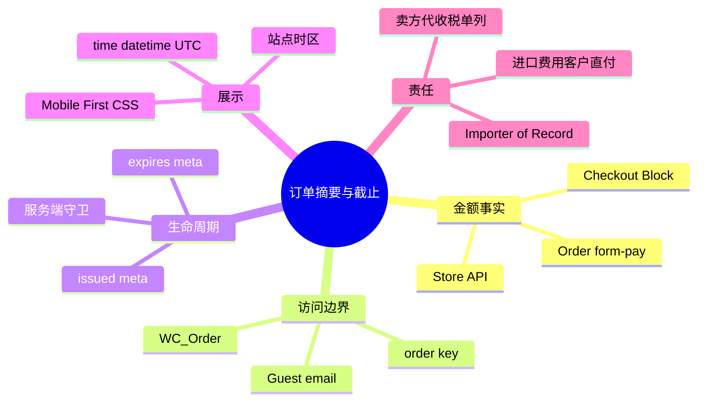
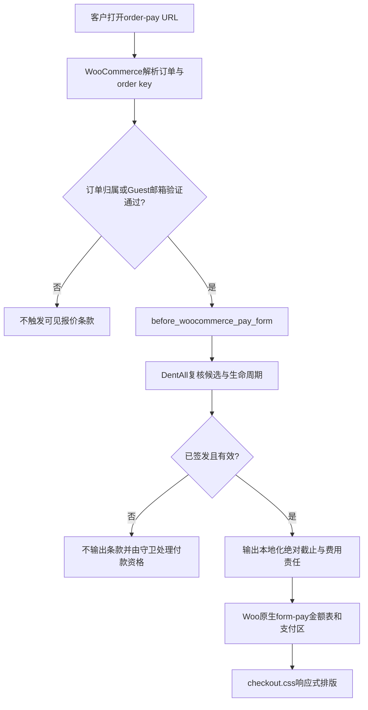

# Day74 WordPress实战：WooCommerce订单摘要与服务端截止时间

## 相关笔记

- 学习索引：[[WordPress实战笔记索引]]。
- 对应项目笔记：[[../Day74-订单摘要与四端结账]]。
- 前置学习：[[Day73-WooCommerce报价字段与客户身份边界]]、[[Day75-WooCommerce报价过期与订单生命周期]]。
- 前置项目：[[../Day73-报价字段与客户身份合同]]、[[../Day75-人工物流与报价72小时生命周期]]。

## 今日学习成果

- [ ] 我能解释为什么Checkout Block与`order-pay`可以有不同DOM，但必须共享WooCommerce金额事实。
- [ ] 我能沿`before_woocommerce_pay_form`追踪Guest验证、订单对象、生命周期meta和转义输出的顺序。
- [ ] 我能用DevTools判断44px、长文本和断点问题，并只修改子主题局部CSS。

## 真实项目场景

### 今天解决了什么问题

DentAll有两条结账路径：虚拟商品直接进入普通Checkout Block；实体商品先人工报价，再通过`order-pay`付款。D74要让两条路径的金额摘要在手机、平板和PC可读，同时向报价客户显示确定的截止时间、Importer of Record及税费责任。

核心难点不是“再做一个摘要”，而是避免第二套金额算法。商品、coupon、Shipping、Tax、Fee和Total必须继续由WooCommerce计算；DentAll只决定何时补充业务说明和如何排版。

### 学习范围

- 本篇掌握：金额事实源、付款页Hook位置、服务端时间展示、条件加载CSS和Mobile First排版。
- 不展开：目标网关webhook、SMTP投递、正式税率、各国税务注册、Staging/Production缓存。
- 真实入口：`dentall-core/includes/shipping-quote-lifecycle.php`、主题`inc/setup.php`和`assets/css/checkout.css`。
- 当前版本：DentAll 0.44.0候选、Core 0.4.1候选。

## 先建立整体模型

### 一句话模型

WooCommerce像收银系统负责算钱，DentAll业务层只在已验证的报价票据上印截止与责任，子主题再把同一张票排成各视口可读的布局。

### 记忆宫殿：机场值机柜台

把订单想成机场登机牌：票价和税费由航空公司的出票系统打印，柜台不能拿计算器另算；安检完成身份核对后，工作人员才能看到这张票并加盖“最晚登机时间”；大屏和手机只是不同排版，不能改变票价或登机资格。

### 比喻对应回真实机制

| 记忆对象 | 真实技术对象 | 不能混淆的边界 |
|---|---|---|
| 出票系统 | WooCommerce Cart/Order/Store API/Checkout Block/`form-pay` | 主题不能另算金额 |
| 安检 | 订单key、归属、Guest邮箱验证 | 前端看到URL不等于已授权 |
| 登机截止章 | D75保存的`_dentall_quote_expires_at` | 不是页面加载时重新加72小时 |
| 大屏与手机 | 同一语义DOM上的响应式CSS | 不能复制四套页面 |
| 登机口拒绝 | 服务端付款守卫 | 倒计时或文案不能代替交易判断 |

## 思维导图



主干是：先由WooCommerce确认访问和金额，再由Core读取订单事实，最后由主题排版；顺序不可反转。

## 请求与生命周期调用链



- 触发条件：访问WooCommerce付款端点并通过原生访问验证。
- 加载入口：Core插件注册Action；子主题在`wp_enqueue_scripts`优先级55条件加载CSS。
- 输入数据：WooCommerce传入的`WC_Order`及D75已保存的原始生命周期meta。
- 输出：转义后的HTML与一份CSS资源；没有数据库写入或金额副作用。
- 可观察证据：有效/无效报价DOM、`time[datetime]`、金额行、Network资源和四端几何尺寸。

## 核心概念卡

| 概念 | 准确定义 | DentAll例子 | 常见误区 | 验证 |
|---|---|---|---|---|
| 单一金额事实源 | 所有可见金额都来自同一交易引擎的状态 | Checkout Block和`form-pay`读取Woo事实 | 在JS拼出“应付总额” | 对照DOM、Store API和订单getter |
| 绝对截止时间 | 已保存时间点，而非浏览器相对计时 | UTC meta＋站点时区显示 | 每次打开页面重新算72小时 | 重发前后meta与DOM不变 |
| 展示Hook | 在已定义生命周期点追加HTML | `before_woocommerce_pay_form` | 把Action当授权机制 | 阅读调用前的Woo验证分支 |
| 条件加载 | 只在需要页面请求资源 | `is_checkout()`排除received页 | 全站加载结账CSS | 检查Network和页面body类 |

## 项目实战代码

### 涉及文件

- `app/public/wp-content/plugins/dentall-core/includes/shipping-quote-lifecycle.php`：报价截止、资格复核和责任说明。
- `app/public/wp-content/themes/dentall/inc/setup.php`：结账CSS条件加载。
- `app/public/wp-content/themes/dentall/assets/css/checkout.css`：Checkout Block与`order-pay`响应式展示。
- `app/public/wp-content/themes/dentall/assets/js/shipping-quote.js`：Cart报价邮件责任说明。

### 从入口开始追踪

1. WooCommerce付款短代码先读取并验证订单。
2. 原生逻辑确认order key、登录归属或Guest邮箱后触发`before_woocommerce_pay_form`。
3. DentAll回调只接收Woo传入的订单对象，再检查人工报价候选和阻断原因。
4. 到期meta用`edit`上下文读取，显示用`wp_date()`和`wp_timezone()`本地化。
5. Woo随后渲染原生金额表和支付区；主题CSS只改变几何布局。

### 关键代码片段

源自生命周期模块，重点是Hook参数而不是自行从URL查订单：

```php
add_action(
    'before_woocommerce_pay_form',
    'dentall_core_render_shipping_quote_payment_terms',
    20,
    1
);
```

源自主题加载函数，重点是作用域：

```php
if ( ! is_checkout() || is_order_received_page() ) {
    return;
}
```

| 代码 | 表面动作 | 真实作用 | 为什么这样写 |
|---|---|---|---|
| `get_meta(..., 'edit')` | 读meta | 绕开展示Filter，读取交易原值 | 展示插件不能改变付款事实 |
| `gmdate(...Z)` | 生成UTC字符串 | 给`time[datetime]`机器时间 | 可见本地化与机器值分责 |
| `min-width:0` | 允许Flex/Grid子项收缩 | 防止长SKU/规格撑出视口 | 不用隐藏内容掩盖溢出 |
| `min-height:44px` | 设置触控下限 | 不受父主题根字号换算影响 | 首轮42px证据后最小修复 |

### 运行证据

- 合同：D73 59/59、D75 95/95、邮件46/46。
- 静态：PHP/JS语法与`git diff --check`通过。
- 负向：未签发、内容变化、过期订单不输出条款。
- 独立审查：代码与安全P0～P3均为0。
- 浏览器：真实WooCommerce/Chrome 150/150；两条路径各覆盖390/768/1024/1440，金额、Guest防泄露、绝对截止、时区不变、重发不续期、无`Tax 0`、长文本、焦点和无溢出通过。首轮Checkout按钮42px P2最终以局部高特异性44px规则修复并四端关闭。
- 错误与恢复：Console/pageerror/HTTP/PHP应用错误为0；TEST商品、订单、checkout draft、计划任务、独立数据库、账号、进程和端口清理完成。
- 不能证明：真实网关、SMTP、正式税务、边缘缓存和非Local行为。

## 职责边界

| 层级 | 本主题负责 | 不负责 |
|---|---|---|
| WordPress Core | 日期、时间、时区、资源队列 | 不修改核心 |
| WooCommerce | 订单访问、金额、Checkout、付款表单 | 不绕过CRUD或内部表 |
| Storefront | 父主题基础样式 | 不修改父主题 |
| DentAll子主题 | 按页资源和响应式排版 | 不承载付款资格或金额算法 |
| `dentall-core` | 报价生命周期与站点业务说明 | 不堆纯视觉规则 |
| 浏览器 | 渲染DOM/CSS | 不决定订单是否合法付款 |

## Hook、API或模板机制详解

| 项目 | 说明 |
|---|---|
| 机制类型 | WooCommerce Action＋WordPress Enqueue＋Woo Order CRUD读取 |
| 名称 | `before_woocommerce_pay_form`、`wp_enqueue_scripts` |
| 注册位置 | Core生命周期模块、主题`inc/setup.php` |
| 优先级 | 展示Hook 20、资源加载55；accepted args分别为1与默认1 |
| 回调输入 | Woo已验证的`WC_Order`；前台请求上下文 |
| 返回 | Action不通过返回值改数据；按条件输出HTML或注册CSS |
| 副作用 | 仅响应HTML和样式资源，无订单写入 |
| 移除方式 | 移除对应Action/加载函数并恢复版本；无需数据库迁移 |

## 安全、数据与站点影响

| 检查面 | 结论 | 证据或待验证 |
|---|---|---|
| 输入 | 不读取请求订单ID或金额 | 只接收Woo传入订单 |
| Capability/Nonce | 前台展示不新建后台动作 | 依赖Woo原生order key/归属/Guest验证 |
| 输出转义 | 文本、属性分别转义 | 代码与安全复核通过 |
| 数据库 | 无新增写入/meta | 只读D75既有事实 |
| URL/SEO | 无新URL/Schema/索引输出 | 静态差分 |
| 缓存 | 交易页必须no-cache；CSS版本失效 | 非Local边缘缓存待验 |
| 支付/物流/税 | 不改金额或网关；只澄清责任 | 正式税务与网关待后续 |
| 部署 | 当前未合并、未部署 | Staging/Production待授权 |

## 动手练习

### 练习一：只读观察

- 目标：找到可见截止时间的事实来源。
- 操作：在Local查看订单`_dentall_quote_expires_at`、页面`time`文本和`datetime`。
- 预期：数据库UTC时间点不变，可见文本按站点时区格式化。

### 练习二：Local最小改动

- 目标：把PC摘要卡的内边距从Token 24临时改成Token 16并安全恢复。
- 操作：先在DevTools试验，再只改`checkout.css`，四端回归后恢复。
- 边界：不得改Woo模板或金额DOM。

### 练习三：故障推演

- 场景：Action Scheduler延迟，订单已过绝对截止时间。
- 正确判断：页面倒计时是否存在无关紧要；请求时服务端守卫读取同一截止事实并拒付。
- 排错：订单原始meta → 生命周期block reason → Hook输出 → Woo付款资格 → 缓存。

## 常见误区与排错顺序

1. 先确认订单、Cart或Store API金额事实，不先调CSS。
2. 再确认访问验证和生命周期状态，避免把“不输出条款”误判为模板故障。
3. 检查页面body类和`checkout.css`是否按页加载。
4. 检查长文本、`min-width`、表格布局和44px几何尺寸。
5. 最后检查页面/边缘缓存；不要用前端强制显示掩盖服务端资格问题。

## 掌握标准

- [ ] 能不用文档说清两条结账路径和同一金额事实源。
- [ ] 能解释为什么Hook位置不能替代回调内的生命周期复核。
- [ ] 能说明UTC机器值、站点时区文本和浏览器倒计时的区别。
- [ ] 能在四端用DevTools定位42px、长文本和Grid问题。
- [ ] 能陈述税费展示合同与正式财税判断的边界。

## 费曼测试题（6道）

1. 为什么不能在`shipping-quote.js`里重算应付总额？
2. `before_woocommerce_pay_form`之前WooCommerce做了哪些访问检查？
3. 为什么读取生命周期meta使用`edit`上下文？
4. 为什么`time`同时需要可见文本和`datetime`？
5. 为什么`2.75rem`首轮仍只有42px，最终改为44px？
6. “客户支付进口税费”为什么不等于“DentAll不用代收Sales Tax/VAT/GST/HST”？

### 我的费曼答案与纠正

待用户自测后补充；技术证据通过不等于已经掌握。

### 自测评分

- 当前：初识。
- 达到“能解释”：6题至少5题无需查看答案，且第6题不能混淆税种责任。
- 达到“能修改”：能完成练习二并四端回归、恢复源码。

## 间隔复习记录

| 日期 | 内容 | 结果 |
|---|---|---|
| 待复习 | 6道费曼题与付款页调用链 | 待填写 |

## 收尾总结

本日最值得迁移的不是某段CSS，而是三层分责：WooCommerce提供金额和访问事实，Core解释生命周期与业务责任，子主题负责可读布局。三层都不能越权替代另外两层。

## 后续如何向AI高效提问

### 提问公式

“在WooCommerce版本、结账路径、订单状态和视口明确的前提下，先定位金额/访问/生命周期事实，再给最小主题或Core改动，并列出四端、Guest、税费和缓存验证。”

### 提问前准备

- 页面URL类型和body类。
- 订单状态、是否Guest、是否已签发及到期meta。
- DOM中的金额行与Store API/订单getter结果。
- 实测视口、按钮尺寸、Console和PHP错误。

### 可复制的代码理解提示词

> 请从WooCommerce调用点开始，解释这个Hook之前完成了哪些订单访问验证、回调拿到什么对象、DentAll又检查什么生命周期事实，以及最终哪些HTML仍由Woo原生模板输出。

### 可复制的排错提示词

> 某个order-pay页面没有显示报价期限。请按订单key/Guest验证、订单候选、签发与到期meta、block reason、Hook注册、CSS可见性和缓存顺序排查，不要先建议复制模板。

## 变种应用到其他项目

- 普通B2C商城：没有人工报价时可移除期限说明，但金额事实源原则不变。
- 批发站：可把报价有效期、客户等级与付款资格纳入服务端状态机，仍不让前端倒计时作安全判断。
- 多币种站：显示币种和换算必须交给已确认的货币系统，不能在摘要组件自行换算。
- 其他框架：服务端API负责金额和权限，前端组件只渲染；同样需要机器时间和明确时区。

### 变种练习

设计一个“报价剩余不足12小时”的提示：提示可由服务端根据同一到期事实决定，但不能改变截止时间、自动续期或替代付款守卫。说明缓存策略和无JavaScript时行为。

## 可复用核心思想

### 跨平台不变量

交易金额、付款资格和展示布局必须分层。金额只能由交易事实源计算；截止只能由服务端持久化事实判断；响应式只改变排列，不改变交易含义。进口责任和卖方代收税属于不同义务，不能用一句“税费客户承担”合并。

### WordPress/WooCommerce当前实现

WooCommerce Order/Cart/Store API/Checkout Block/`form-pay`是金额事实；Core通过已验证后的Action读取`edit`原始meta并转义输出；子主题使用条件加载与Mobile First CSS。Checkout和`order-pay`不能被页面缓存。

### Shopify或其他平台的对应机制

其他平台也应由平台Checkout、订单或Draft Order API计算金额，并通过受支持的扩展点补责任说明。Shopify的B2B、Markets、Duty、Tax和Checkout扩展能力随套餐、地区与版本变化，本项目没有验证，迁移前必须查当前官方能力，不能把WooCommerce Hook或PHP代码直接照搬。
