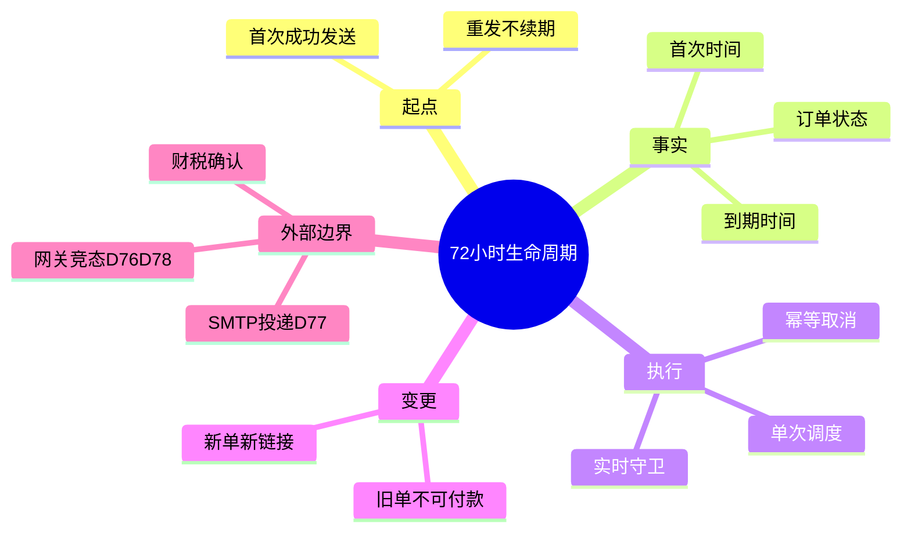
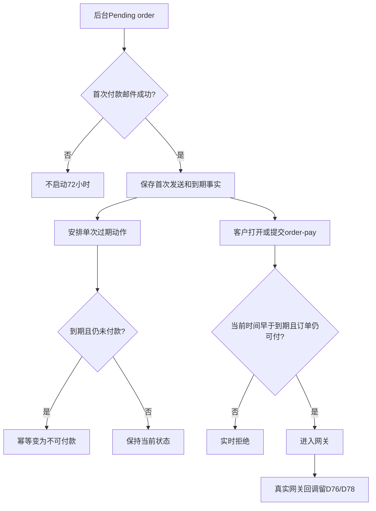

# Day75 WordPress实战：WooCommerce报价过期与订单生命周期

## 相关笔记

- 学习索引：[[WordPress实战笔记索引]]。
- 对应项目笔记：[[../Day75-人工物流与报价72小时生命周期]]。
- 前置学习：[[Day73-WooCommerce报价字段与客户身份边界]]、[[Day72-人工运费报价与结账安全边界]]。
- 前置项目笔记：[[../Day73-报价字段与客户身份合同]]。

## 今日学习成果

- [ ] 我能说明为什么72小时必须从业务事件“首次成功发送付款邮件”起算，而不是从建单时间起算。
- [ ] 我能解释异步调度与请求时实时守卫为何必须读取同一份到期事实并保持幂等。
- [ ] 我能指出网页拒付、订单取消和真实网关晚到webhook是三个不同层次，后者必须留D76/D78验证。

## 真实项目场景

DentAll人工报价只在三天内有效。客户可能晚几小时才收到付款链接，业务人员也可能重复发送邮件；因此`date_created`、`date_modified`或最后一次重发时间都不符合合同。唯一可靠起点是第一次成功发送付款邮件，之后重发不能续期。

项目还要求：商品、数量、coupon、地址或费用变化时，旧订单先不可付款，再重新确认并创建新订单。进口环节费用不由DentAll代收；卖方销售税仍待财税确认。

本篇聚焦生命周期模型。最终Hook、meta和Action Scheduler合同通过83项带桩纯PHP断言，并在隔离Local用真实Woo订单、Customer Invoice、Action Scheduler、Store API、展示Filter负向场景、普通停用路径和浏览器验证。目标网关扣款、晚到webhook、目标主机Cron及SMTP投递仍按D76/D77/D78分别验收。

## 先建立整体模型

### 一句话模型

第一次成功发送付款邮件把订单从“未报价草稿”推进为“有截止时间的报价”，异步任务负责到点取消，付款请求负责随时复核，网关回调负责最终交易状态且须另做竞态验证。

### 记忆宫殿：有截止时间的取货票

业务人员第一次把取货票交给客户时盖上时间戳；复印同一张票不会换新时间。仓库每天巡检过期票，但即使巡检迟到，收银员看到已过时也必须拒绝。客户已经把卡交给银行时，银行晚到的回执是另一条通道，不能假设收银员拒绝就能自动消失。

| 记忆对象 | 真实技术对象 | 不能混淆的边界 |
|---|---|---|
| 首次盖章 | 第一次付款邮件成功事件 | 建单时间、预览和发送失败不算 |
| 票面截止时间 | 订单首次发送/到期事实 | 重发不能覆盖 |
| 仓库巡检 | Action Scheduler单次过期动作 | 可能延迟，不是硬实时 |
| 收银员复核 | `order-pay`实时服务端守卫 | 页面倒计时不是安全边界 |
| 银行晚到回执 | 网关webhook/callback | 必须在D76/D78单独验证 |

## 思维导图

最重要的主干是：同一个到期事实必须同时服务异步任务和同步付款检查。

## 请求与生命周期调用链

- 触发条件：人工报价订单首次成功发送付款邮件、到期任务运行、客户请求付款或订单提前终止。
- 加载入口：`dentall-core/includes/shipping-quote-lifecycle.php`，由Core主入口加载；当前Local实现以`woocommerce_email_sent`、`wp`、`rest_dispatch_request`、`woocommerce_update_order`和订单状态变化等Hook连接生命周期。
- 输入数据：订单状态、是否含实体商品、正数Shipping、首次发送/到期事实及当前时间。
- 输出或副作用：保存最少订单meta、安排/取消动作、到期后使旧单不可付款并写订单备注。
- 可观察证据：83项纯PHP合同、40/40真实Woo及展示Filter负向集成、15/15权限审计、停用3/3、四类付款页、浏览后4/4终态及Action `#745=complete`共同覆盖meta、调度参数、原始状态、经典/REST守卫和清理。

## 核心概念卡

| 概念 | 准确定义 | DentAll真实例子 | 常见误区 | 如何验证 |
|---|---|---|---|---|
| 业务起点 | 合同指定的第一次有效事件 | 首次付款邮件发送成功 | 用订单创建时间代替 | 建单后不发邮件应无到期事实 |
| 幂等 | 同一动作重复执行不改变已完成结果 | 重发不续期、过期任务重复不重复取消 | 只靠“通常只跑一次” | 连续调用并比较时间/状态 |
| 异步调度 | 稍后执行的队列动作 | 72小时单次过期 | 等同精确闹钟 | 让任务延迟后访问付款页 |
| 实时守卫 | 每次付款请求都重新判断 | 到期但任务未跑仍拒付 | 只在邮件生成时判断 | 模拟未来时间或过期meta |
| 晚到webhook | 网关在站点状态变化后回调 | 订单取消后网关报告成功 | 网页拒付即可覆盖 | 目标网关沙盒延迟回调 |
| 替换订单 | 变化后新建完整报价订单 | 地址变更后旧单取消、新单新链接 | 修改旧订单并继续用旧key | 对比两订单ID/key/状态 |

## 项目实战代码

### 涉及文件

- `app/public/wp-content/plugins/dentall-core/includes/shipping-quote.php`：D72/D73人工报价订单判断、正数Shipping、完整资料和地址锁。
- `app/public/wp-content/plugins/dentall-core/includes/shipping-quote-lifecycle.php`：D75首次签发、原始值内容签名、72小时到期、单次调度、实时守卫、不可逆关闭、变化失效和动作清理。
- `project-docs/tests/day75-shipping-quote-lifecycle-unit.php`：带桩纯PHP生命周期合同；语法与83项断言通过。
- WooCommerce Action Scheduler：动作名`dentall_expire_shipping_quote`、动作组`dentall-shipping-quote`；真实到期动作已执行到`complete`，有效报价保留一个未来`pending`动作。

### 从入口开始追踪

1. 先用现有订单判断确认目标是含实体商品、具备报价资料的人工待付款订单。
2. 在第一次付款邮件成功事件中只写一次首次发送和到期事实。
3. 使用唯一动作参数安排该订单的单次过期任务；重复发送时读取旧事实并直接保留。
4. 任务执行时重新加载订单并判断当前状态，只有仍未付款且已到期才推进。
5. 付款入口也读取相同事实；任务尚未运行不能成为继续付款的理由。
6. 支付、取消或替换时清理不再需要的动作；订单离开`pending`/`failed`时按精确token取消单次任务。普通后台停用先查询全部待付款/失败订单，取消已签发和未签发的后台实体报价候选，逐单确认持久化后才清理专用动作组；任一步失败都会阻止停用。

实现以`_dentall_quote_issued_at`、`_dentall_quote_expires_at`、`_dentall_quote_signature`、`_dentall_quote_token`、`_dentall_quote_closed_at`和`_dentall_quote_closed_reason`保存生命周期。83项合同已验证首次写入、重发不覆盖、原始值签名、客户关联、标准Woo对象meta、内容变化、到期幂等、无效邮件抑制、展示Filter隔离、经典/Store API权限边界、停用成功及失败中止；这些内部名称不是第三方稳定公共API。带私有状态且未实现`JsonSerializable`/`get_data()`的第三方普通对象meta按RSK-047/P2在插件引入前另验。

## 职责边界

| 层级 | 本主题中负责什么 | 不应该负责什么 |
|---|---|---|
| WordPress Cron | 触发Action Scheduler runner所需请求基础 | 不保证硬实时执行 |
| WooCommerce / Action Scheduler | 订单状态、邮件生命周期和后台动作 | 不自动知道DentAll三天规则 |
| `dentall-core` | 起点、到期事实、调度和实时付款规则 | 不实现网关私有回调，不判断税务义务 |
| DentAll子主题 | 可展示到期说明时只作展示 | 不决定订单是否能付款 |
| 业务人员 | 复核订单、首次发信、变化时替换旧单 | 不通过重发延长旧报价 |
| 支付网关 | 授权、捕获与webhook | 不能未经D76/D78测试假定遵守取消状态 |

## 安全、数据与站点影响

| 检查面 | 本次结论 | 证据或待验证项 |
|---|---|---|
| 输入清洗与验证 | 订单ID和时间事实按Woo/WordPress API处理 | PHP、真实Woo和独立安全Review通过 |
| Capability / Nonce | 后台发信沿用Woo订单权限；前台付款沿用订单key/网关合同 | 实际Hook矩阵待验证 |
| 数据库写入 | 最少订单meta与Action Scheduler记录；Woo CRUD、HPOS兼容 | 隔离Local真实队列和订单终态通过 |
| URL与SEO | 继续使用原生`order-pay`，无新可索引URL | 非Local输出另验 |
| 缓存 | 到期判断读取服务端订单事实 | Order Pay缓存排除待非Local确认 |
| 支付、物流与订单 | 正数Shipping；过期旧单不可付款 | 晚到webhook是D76/D78闸门 |
| 部署与回滚 | 普通停用先取消报价候选并验证，再清专属动作；保留历史订单 | 停用3/3通过；静默停用/更新会绕过Hook，非Local必须维护窗口演练 |

## 动手练习

### 练习一：只读观察

- 目标：区分订单创建时间、首次付款邮件时间与到期时间。
- 操作：读取一个隔离TEST订单的日期和候选meta，不发送真实邮件。
- 预期：未首次成功发送时没有72小时起点。
- 实际证据：首封实际邮件生成后建立72小时事实，重发不变；所有数据仅在隔离Local。

### 练习二：Local最小改动

- 改动：用可控时钟或TEST过滤器把候选订单置于到期前后边界。
- 风险边界：仅隔离Local；不等待真实72小时，不触发外部SMTP/网关。
- 验证：到期前可进入下一阶段，到期时及之后实时拒绝；重复任务幂等。
- 回滚：删除TEST订单、动作和meta并核对队列/订单计数。

### 练习三：故障推演

- 假设症状：72小时后旧链接仍出现网关按钮。
- 可能原因：首次时间未写、时区转换错误、只依赖调度、页面缓存或守卫入口缺失。
- 第一项检查：只读比较服务器当前UTC、订单到期UTC、订单状态和待执行动作。
- 为什么先查它：先验证共享事实，再区分调度延迟、页面输出和支付入口问题。

## 常见误区与排错顺序

| 现象或误区 | 可能原因 | 推荐检查顺序 | 最小验证方法 |
|---|---|---|---|
| 重发后又多72小时 | 写入逻辑覆盖首次时间 | meta → 邮件Hook调用次数 → 幂等分支 | 连续发送两次并比较值 |
| 到期任务没跑且仍能付款 | 缺少实时守卫 | 到期事实 → 付款Hook → 调度队列 | 把任务置为past-due后请求付款 |
| 已付款订单被取消 | 任务未重新读取状态 | 订单状态 → 任务回调 → 竞态日志 | 先付款再运行旧任务 |
| 取消订单仍被网关改成成功 | 晚到webhook | 网关事件 → Woo日志 → 状态Hook | D76/D78沙盒延迟回调 |

## 掌握标准与费曼测试

- [ ] 能解释业务起点与数据库时间字段为何不能随意替换。
- [ ] 能画出邮件事件、调度任务、付款请求和webhook四条路径。
- [ ] 能说明Action Scheduler延迟时系统如何继续安全。
- [ ] 能设计重发、边界秒、重复任务、已付款和替换订单测试。
- [ ] 能说清进口费用与卖方销售税为何是两个问题。

1. 为什么订单创建时间不能作为本项目报价有效期起点？
2. 重发不续期需要哪个幂等事实，如何证明没有被覆盖？
3. Action Scheduler可能延迟时，实时付款守卫应怎样工作？
4. 到期取消前为什么必须重新读取订单状态？
5. 旧单变化后为什么选择新建订单，而不是更新旧单继续发原链接？
6. 网页已经拒付，为什么仍要测试晚到webhook？
7. 客户自付进口关税为何不能直接推导卖方无需代收Sales Tax/VAT/GST？

当前掌握度：初识；费曼答案和评分待用户自测。

## 收尾总结

- 我今天真正理解了：业务有效期需要一个不可重复覆盖的起点和两条互补执行路径。
- 我仍然容易混淆：订单取消、网页拒付和网关最终回调。
- 下次遇到类似问题，我会先检查：共享到期事实、当前订单状态、调度队列和网关事件顺序。
- 下一篇直接相关学习笔记：D76支付沙盒学习笔记完成后回填。

## 可复用核心思想

### 跨平台不变量

过期机制不是一个定时任务，而是“稳定起点＋不可变截止时间＋异步推进＋同步复核＋幂等状态转换＋外部回调竞态”的组合。

### WordPress/WooCommerce当前实现

Woo订单保存报价事实，Action Scheduler承担延迟工作，`order-pay`请求承担实时复核。实现必须使用Woo CRUD并兼容HPOS；邮件投递、网关回调和税务政策分别留给对应责任层。

### Shopify或其他平台的对应机制

Draft Order、invoice或payment link也可能支持过期，但重发、状态转换和webhook顺序由平台决定。迁移时保留生命周期问题，重新验证平台API和最终支付状态语义。
