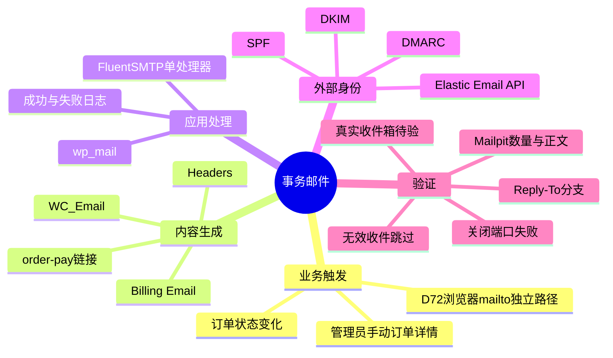
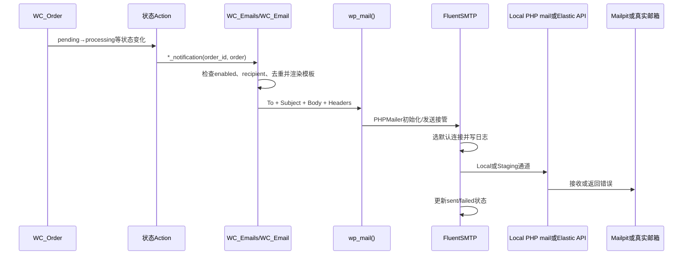

# Day77 WordPress实战：事务邮件链与可观察性

## 相关笔记

- 学习索引：[[WordPress实战笔记索引]]。
- 对应项目笔记：[[../Day77-FluentSMTP事务邮件Local验证]]。
- 前置学习：[[Day72-人工运费报价与结账安全边界]]。
- 前置项目笔记：[[../Day72-人工运费邮件报价与购物车收口]]。
- 后续学习：D78订单状态、库存与支付合成验证完成后回填。

## 今日学习成果

- [ ] 我能解释收件邮箱、WooCommerce邮件对象、`wp_mail()`、FluentSMTP、Elastic Email和DNS认证各自解决什么问题。
- [ ] 我能沿订单状态变化追到具体Woo邮件，并说明管理员通知与客户通知的Reply-To为什么不同。
- [ ] 我能在隔离Local验证成功、跳过、去重、付款链接和连接失败，且不会把密钥、客户资料或TEST订单留在项目中。

## 真实项目场景

D72已经让实体Cart通过`mailto:`向公司邮箱请求人工运费；业务人员完成Shipping、Tax和Fee后，还要把待付款订单详情发给客户。D77解决后半段：WooCommerce怎样生成客户和管理员事务邮件，WordPress怎样交给邮件处理器，Local怎样在不访问互联网的情况下验证，非Local又需要哪些域名与服务证据。

本篇掌握事务邮件链、原生触发、Header、日志和故障验证。不展开邮件视觉模板定制、营销订阅、批量群发、退信Webhook、自定义队列、真实支付或Production上线。

## 先建立整体模型

### 一句话模型

WooCommerce根据订单事实写信，`wp_mail()`把信交给唯一的邮局柜台，FluentSMTP选择运输通道并登记结果，Elastic Email负责把非Local邮件送上互联网，DNS记录证明发件域名身份，最终仍要到真实收件箱检查送达。

### 记忆宫殿：公司信件室

想象一家有信件室的公司：

| 记忆对象 | 真实技术对象 | 不能混淆的边界 |
|---|---|---|
| 部门写好的信 | WooCommerce `WC_Email`对象与模板 | 它决定业务内容，不保证互联网送达 |
| 内部投递窗口 | WordPress `wp_mail()` | 统一接口，不等于可靠外发服务 |
| 唯一收发登记员 | FluentSMTP | 选择连接和记日志，不是客户邮箱 |
| 快递公司 | Elastic Email | 接受API请求并外发，不负责Woo订单状态 |
| 公司抬头和印章 | From、SPF、DKIM、DMARC | 身份对齐提高可信度，不保证进主收件箱 |
| 收件部门 | 公司邮箱或客户邮箱 | 必须是真实可收信mailbox，Elastic Email不能替代 |
| 本机假收件箱 | Mailpit | 能证明内容和Headers，不证明互联网声誉 |

比喻的边界：现实快递“已揽收”不等于邮件系统的最终送达状态；Local Mailpit甚至没有进入互联网。因此每一层只能证明自己观察到的事实。

## 思维导图



最重要的主干是“业务事实→邮件对象→统一接口→单一处理器→外发服务→域名身份→真实收件箱”，不能跳过中间层后把某一层成功当成全链路成功。

## 请求与生命周期调用链



- 触发条件：订单状态变化，或管理员主动调用客户订单详情邮件。
- 加载入口：WooCommerce注册事务邮件Action，FluentSMTP作为活动插件接管WordPress邮件发送。
- 输入数据：订单ID、Billing Email、状态、订单行项目、金额、店铺邮件设置。
- 输出或副作用：外发尝试、FluentSMTP日志；真实环境还会产生第三方API请求。
- 可观察证据：Woo跳过Action、日志状态、Mailpit内容、付款页HTTP、真实收件箱/垃圾箱。

## 核心概念卡

| 概念 | 准确定义 | DentAll真实例子 | 常见误区 | 如何验证 |
|---|---|---|---|---|
| mailbox | 能真正接收、保存和回复邮件的邮箱 | 批准公司邮箱接报价和管理员通知 | 把Elastic Email发送账户当收件箱 | 从外部地址发送并实际回复 |
| email provider | 接受应用请求并尝试互联网投递的服务 | Staging计划使用Elastic Email | 认为开通Add-on后WordPress自动接入 | 查看应用连接与服务日志 |
| mailer plugin | 在WordPress内接管发送、选连接和记录结果 | FluentSMTP | 同时启用两个处理器“提高可靠性” | 活动插件、连接数和PHPMailer Hook |
| From | 邮件声明的发件身份 | 批准公司邮箱 | 只改显示名就算域名已认证 | 检查原始Headers和DNS对齐 |
| Reply-To | 点击回复时默认目标 | 客户邮件回公司；管理员通知回客户 | 强制所有邮件使用同一个Reply-To | 分邮件类型检查Mailpit Headers |
| Return-Path | 退信/信封发件相关地址 | Local强制为批准公司邮箱 | 与From完全等义 | 查看原始邮件与服务商退信设置 |
| 可观察性 | 能从日志判断触发、跳过、成功或失败 | 11 sent、1 failed、2 skipped | “页面无报错”就是成功 | 正常和故障注入都留证据 |

## WooCommerce邮件触发的真实规则

### 1. 状态Action与邮件对象

WooCommerce先把订单状态变化注册为事务邮件Action，再由邮件对象监听带`_notification`后缀的Action。D77实测的主路径如下：

| 状态变化 | 管理员邮件 | 客户邮件 |
|---|---|---|
| Pending→Processing | New Order | Processing Order |
| Processing→Completed | — | Completed Order |
| Pending→Failed | Failed Order | Failed Order |
| Processing→Cancelled | Cancelled Order | Cancelled Order |

状态变化本身是订单事实；邮件只是观察者。测试不能为了凑邮件数量直接改内部订单表，而要用`WC_Order::update_status()`让WooCommerce完整触发原生生命周期。

### 2. 手动订单详情与自动通知不同

`WC_Email_Customer_Invoice`用于管理员手动发送订单详情/付款说明。WooCommerce 11的实现只要有有效Recipient就发送，即使这个邮件对象的普通自动开关关闭；这是“人工动作应立即发送”的语义。D77连续手动触发两次，得到两封邮件，证明它不会像New Order那样自动去重。

### 3. New Order的幂等保护

成功发送新订单通知后，WooCommerce在订单上保存`_new_order_email_sent`。同一订单再次触发`WC_Email_New_Order::trigger()`时，默认直接返回。D77在第一次成功后重复触发两次，FluentSMTP日志增量为0。

这类幂等保护防止状态重放造成重复通知，但不要把它误用成全局去重：手动订单详情、处理、完成等邮件有各自语义。

### 4. 收件人校验有两层

WooCommerce CRUD在`WC_Order::set_billing_email()`时拒绝明显非法地址；D77得到`order_invalid_billing_email`。邮件对象发送前又会用`is_email()`过滤Recipient；空值或过滤后的无效值触发`woocommerce_email_skipped`，理由为`no_recipient`。

第一层保护订单数据，第二层保护发送动作。即使后台或导入路径将来变化，发送层仍应安全失败。

## Header为什么分两条Reply-To路径

WooCommerce 11的`WC_Email::get_headers()`对管理员订单通知有专门规则：New Order、Cancelled Order和Failed Order在客户有Billing Email及姓名时，把Reply-To设成客户；其余邮件使用后台配置的自定义Reply-To，缺少时再回退到From。

因此D77的“批准公司邮箱统一Reply-To”准确含义是：公司邮箱负责所有非管理员通知的Reply-To；管理员订单通知保留Woo原生“回复客户”路径。统一业务身份不等于抹平邮件类型的交互目的。

## 项目实战代码

### 涉及文件

- `project-docs/tests/day77-transactional-email-audit.php`：隔离环境护栏、TEST订单、成功/失败矩阵和精确清理。
- `project-docs/tests/day77-results.json`：不含秘密和个人资料的机器可读结果。
- WooCommerce `includes/class-wc-emails.php`：事务邮件Action注册。
- WooCommerce `includes/emails/class-wc-email.php`：Recipient、Headers、发送与跳过行为。
- WooCommerce `includes/emails/class-wc-email-new-order.php`：新订单邮件去重。

### 环境护栏

下面是D77审计脚本的真实节选：

```php
$marker = (string) get_option( 'dentall_d77_isolated_marker', '' );
$host   = (string) wp_parse_url( home_url(), PHP_URL_HOST );

if ( 'local' !== wp_get_environment_type() || '127.0.0.1' !== $host || 0 !== strpos( $marker, 'dentall_d77_' ) ) {
    dentall_d77_fail( '安全中止：本测试只允许在带 D77 独立标记的 127.0.0.1 Local 副本运行。' );
}
```

三项条件缺一不可：环境类型避免明显非Local，Host避免共享Local域名，随机隔离标记证明数据库来自本轮副本。清理时还要逐个核对订单meta，不根据宽泛日期、状态或邮箱批量删除。

### 不依赖真实商品的订单夹具

测试通过WooCommerce CRUD创建订单与`WC_Order_Item_Product`，行项目名称带`TEST`但不绑定真实Product ID。这样能渲染真实订单邮件和总额，同时不触发商品库存扣减或修改现有商品。Shipping也用原生`WC_Order_Item_Shipping`，使D72的实体订单付款守卫看到明确运费明细。

### 为什么查询FluentSMTP日志而不只看`wp_mail()`返回值

`wp_mail()`返回true表示PHPMailer没有在调用层报告失败，不证明互联网收件箱已收到。D77同时核对：

1. FluentSMTP新增的`sent`或`failed`状态；
2. Mailpit实际捕获数量与Headers；
3. WooCommerce跳过Action；
4. 付款页HTTP结果；
5. 关闭端口后Mailpit数量不增加。

这五项把“业务没触发”“收件人被跳过”“应用发送失败”“Local接收成功”和“付款链接本身不可用”区分开。

## 数据与安全检查

| 检查面 | Local证据 | 非Local仍待 |
|---|---|---|
| 密钥 | Local无Elastic Email API Key；测试脚本不含完整公司邮箱 | 环境秘密注入与轮换 |
| 权限 | Website Manager无`manage_options` | Staging角色和插件UI实测 |
| 日志 | 表结构、11 sent、1 failed；终审后清理 | 保留期、访问审计、支持导出脱敏 |
| 个人信息 | TEST客户邮箱只用`example.test`；原始正文不入Git | 真实客户数据最小化与隐私政策 |
| 失败 | 关闭端口留下failed且无fallback | Elastic API拒绝、限流、退信和告警 |
| 域名身份 | Local不验证 | SPF/DKIM/DMARC与From对齐 |
| 数据恢复 | 仅删除带本轮标记的6个TEST订单 | Staging TEST订单和日志清理SOP |

FluentSMTP日志表会保存正文和Headers，不能因为它叫“日志”就当成无敏感信息的技术数据。付款链接带订单Key，和密码一样不应出现在公开截图、Issue或Markdown结果中。

## 性能、SEO、缓存与交易边界

- 性能：非Local每封邮件增加一次Elastic Email外部请求和一次日志写入；每日Cron会清理旧日志。未测量前不声称性能零影响。
- SEO：邮件插件不应改变Title、Canonical、Schema、robots或Sitemap；D77无新公共URL。
- 缓存：订单邮件不能从页面缓存判断；Cart、Checkout、My Account和Order Pay仍须排除页面缓存。
- 交易：邮件通知不是订单状态真相。发送失败不能回滚订单，邮件成功也不能证明支付或库存已正确处理。
- 回滚：停用FluentSMTP只停止处理器，不自动删除Options、日志表、外部Add-on、DNS记录或API Key；必须分层回滚。

## 实际证据与首轮失败如何修正

首轮成功矩阵在准备“非法Billing Email订单”时被WooCommerce CRUD抛出的`WC_Data_Exception`中止。这个失败不是产品缺陷，而是测试错误地假设非法地址能保存。修正后测试分成两项：

1. 在未保存订单对象上确认CRUD明确拒绝非法地址；
2. 对一个有效TEST订单临时使用Recipient Filter返回非法地址，确认发送层过滤并触发`no_recipient`。

随后完整重跑得到：11条成功日志、11封Mailpit邮件、2次跳过、非法地址拒绝、重复新订单0增量；关闭端口新增1条失败日志。这个过程体现了测试也要尊重平台数据模型，不能用错误夹具制造“边界覆盖”。

## 动手练习

### 练习一：只读观察

- 目标：理解邮件类型、收件人与Reply-To。
- 操作：在Local读取WooCommerce邮件设置，再查看`WC_Email::get_headers()`与对应邮件对象的`trigger()`。
- 预期：能区分管理员通知、客户通知和人工订单详情。
- 实际证据：D77管理员4封Reply-To客户，客户7封Reply-To公司邮箱。

### 练习二：Local最小改动

- 改动：只在有D77标记的隔离副本建立一个PHP mail连接，并把SMTP端口指向Mailpit。
- 风险边界：无互联网、无真实客户、无Elastic Key、不改共享Local。
- 验证：发送一个TEST订单详情，检查日志与Mailpit；完成后清理。
- 回滚：删除TEST订单、日志、Mailpit消息和隔离数据库，停止进程。

### 练习三：故障推演

- 假设症状：订单状态已变化，但客户说没收到邮件。
- 第一项检查：确认该邮件类型是否应由该状态触发、Recipient是否有效，以及Woo是否记录跳过。
- 第二项检查：FluentSMTP是否有sent/failed日志、使用哪个连接。
- 第三项检查：服务商事件、DNS认证、退信、垃圾箱和真实收件地址。
- 为什么这样排：先区分“没生成”“应用失败”和“互联网送达问题”，避免直接反复重发或盲改DNS。

## 常见误区与排错顺序

| 现象或误区 | 可能原因 | 推荐检查顺序 | 最小验证方法 |
|---|---|---|---|
| 后台显示发送，收件箱没有 | 日志只是应用成功；服务商拒绝、DNS或垃圾箱问题 | Woo日志→FluentSMTP→Elastic事件→DNS→收件箱/垃圾箱 | 同一TEST订单发到两个受控收件箱 |
| 报价邮件正常，订单邮件失败 | `mailto:`与WordPress是两条链 | 浏览器客户端→Woo触发→Fluent连接 | 分别发送一封报价邮件和订单详情 |
| 客户点击回复回到自己 | Reply-To配置错误或Header被第二插件覆盖 | 邮件类型→原始Header→活动插件 | Mailpit检查客户通知Reply-To |
| 管理员邮件回复到公司邮箱 | 覆盖了Woo原生客户Reply-To | 检查自定义Header Filter | 禁用覆盖后重发管理员TEST通知 |
| 失败时没有任何日志 | 插件未启用、日志表缺失、权限/Cron或第二处理器干扰 | 活动插件→连接→表→`wp_mail_failed` | 关闭端口发送一封TEST邮件 |
| 停用插件后以为数据已删除 | Options和日志表仍在 | 数据清单→保留要求→批准清理 | 只读检查Options和表是否存在 |

## 掌握标准

- [ ] 两分钟内讲清从订单状态到收件箱的完整链。
- [ ] 能解释为什么Mailpit成功不代表Elastic Email真实送达。
- [ ] 能指出New Order去重、Invoice手动发送和`no_recipient`跳过的差异。
- [ ] 能解释管理员与客户邮件Reply-To的原生分支。
- [ ] 能设计一轮不含真实密钥/客户数据的Local成功与失败测试。
- [ ] 能列出停用插件后仍需处理的Options、日志、外部账户、DNS和密钥。

当前掌握度：初识。

## 费曼测试题

1. 为什么“公司有一个邮箱”和“WordPress能可靠发信”是两个问题？
2. 从Pending订单进入Processing开始，按顺序说出Woo Action、邮件对象、`wp_mail()`、FluentSMTP和连接各做什么。
3. 为什么客户邮件和管理员订单通知的Reply-To不应该强行相同？
4. `wp_mail()`返回成功、FluentSMTP状态为sent、Elastic Email接受和真实收件箱收到分别能证明什么？
5. 如何验证重复新订单通知不会发送，但人工订单详情允许再次发送？
6. 为什么关闭SMTP端口且不配置fallback是一项有价值的测试？
7. 更换同域邮箱与更换发件域名分别要重验哪些层？

### 我的费曼答案与纠正

待填写。每题标记`通过`、`含糊`或`答错`，把知识缺口链接回本篇对应章节。

### 自测评分

| 分数 | 标准 |
|---:|---|
| 0 | 只能说“装SMTP插件”，无法分层 |
| 1 | 能说出组件名称，但说不清触发、证据和回滚 |
| 2 | 能用通俗语言解释，并对应DentAll的源码、日志和故障证据 |

总分：待填写 / 14。

## 间隔复习记录

| 复习节点 | 计划日期 | 完成 | 暴露的问题 | 修正位置 |
|---|---|---|---|---|
| D+1 | 2026-09-22 | [ ] | 待填写 | 待填写 |
| D+3 | 2026-09-24 | [ ] | 待填写 | 待填写 |
| D+7 | 2026-09-28 | [ ] | 待填写 | 待填写 |
| D+14 | 2026-10-05 | [ ] | 待填写 | 待填写 |

## 收尾总结

- 我今天真正理解了：事务邮件可靠性来自多层证据，不来自某个插件页面上的一个绿色状态。
- 我仍然容易混淆：应用发送成功与互联网最终送达，以及From、Reply-To、Return-Path的不同职责。
- 下次遇到类似问题，我会先检查：业务是否触发、Recipient是否合法、单一处理器日志是否存在，再检查服务商和DNS。
- 下一篇直接相关学习笔记：D78订单状态、库存与支付合成验证完成后补链接。

## 后续如何向AI高效提问

```text
这是一个WordPress/WooCommerce事务邮件排错问题。

环境：[WordPress/WooCommerce/PHP/FluentSMTP版本，Local或Staging]
邮件类型与订单状态：[例如Pending→Processing的客户/管理员邮件]
预期收件人：[只写角色或脱敏地址]
实际证据：[Woo跳过事件、FluentSMTP状态、服务商事件、原始Header]
DNS事实：[SPF/DKIM/DMARC验证状态，不粘贴密钥]
已尝试：[最小步骤]
边界：[不发真实客户、不改Production、不启用fallback等]

请按“业务触发→Recipient→WordPress处理器→服务商→DNS→收件箱”排序原因，
为每层给出只读检查、最小复现、确认后的修复和回滚。区分事实、推断和待验证项。
```

> [!warning] AI验证边界
> 不向AI提供API Key、完整付款链接、订单Key、Cookie、原始客户正文或数据库。版本相关结论回到官方文档、插件源码或隔离Local复演。

## 变种应用到其他项目

| 新场景 | 保持不变的原则 | 可能变化的实现 | 必须重新确认 | 最小验证 |
|---|---|---|---|---|
| 另一个WooCommerce站 | 单处理器、域名身份、失败可见、隐私最小化 | 邮件插件和服务商 | Woo/插件版本、邮件类型、角色 | TEST订单＋本地捕获＋失败注入 |
| WordPress非商城站 | `wp_mail()`链与服务商/DNS分层 | 表单、账号重置或通知插件 | 消息触发与个人信息 | 一封正常、一封失败、一条跳过 |
| 自研应用 | 内容生成、队列/处理器、提供商、DNS和收件箱分层 | 语言SDK、队列、Webhook | 重试、幂等、退信 | 沙盒域名＋故障注入 |
| Shopify或托管商城 | 发件身份、Reply-To、DNS与真实送达仍需验证 | 平台托管通知和可配置范围 | 当前官方限制、域名认证、日志可见性 | 平台TEST订单与受控收件箱；具体机制待验证 |

## 可复用核心思想

### 跨平台不变量

通知可靠性是一条证据链：业务事件产生消息，应用选择收件人，唯一处理器提交给服务商，域名身份支持可信投递，真实收件箱确认结果。失败必须可见，日志必须按敏感业务数据治理。

### WordPress/WooCommerce当前实现

WooCommerce的`WC_Email`、状态Action、CRUD、Recipient过滤、Header分支和新订单去重构成业务层；`wp_mail()`是统一接口；FluentSMTP承担连接与日志；Elastic Email承担非Local外发。每层都应使用公开API或插件配置，不直接修改Woo、WordPress或第三方插件核心。

### Shopify或其他平台的对应机制

托管平台可能把应用处理器和外发服务隐藏在平台内部，但仍要验证通知触发、To/From/Reply-To、域名认证、失败与真实送达。Shopify具体可配置字段、DNS和日志能力在采用时查当前官方资料；这里标记为待验证，不扩大DentAll范围。
