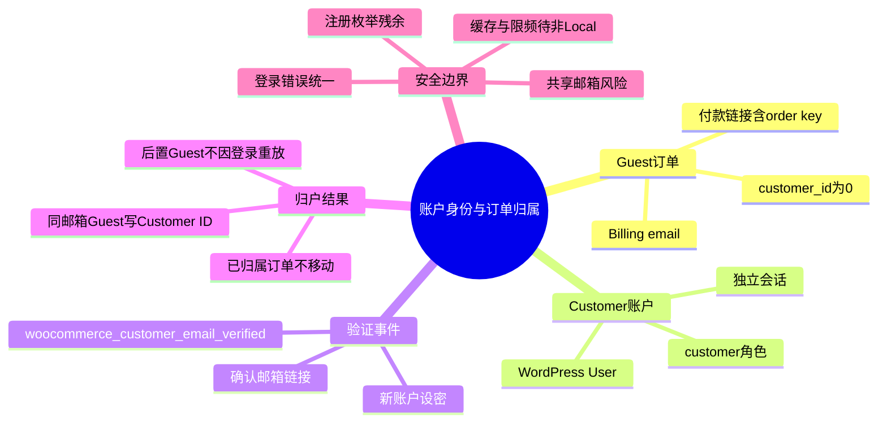
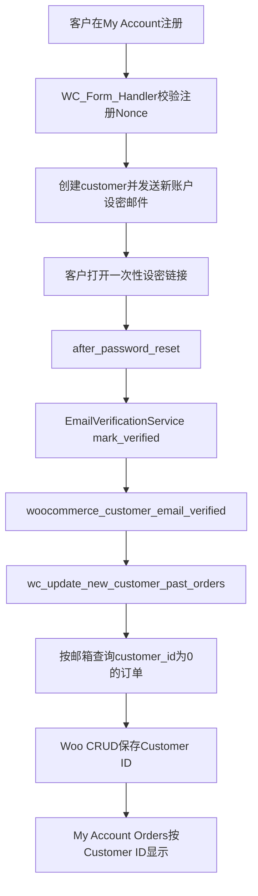

# Day79 WordPress实战：WooCommerce账户身份与订单归属

## 相关笔记

- 学习索引：[[WordPress实战笔记索引]]。
- 对应项目笔记：[[../Day79-登录注册与订单归属]]。
- 前置学习笔记：[[Day72-人工运费报价与结账安全边界]]。
- 后续学习笔记：[[Day80-WooCommerce密码重置与防枚举]]。

## 今日学习成果

- [ ] 我能解释Guest订单、Customer账号、Billing email与订单`customer_id`为什么是四个不同事实。
- [ ] 我能从新账户设密追踪到`woocommerce_customer_email_verified`和历史Guest订单归户。
- [ ] 我能在Local验证正向归户、负向不移动、后置Guest和订单快照，并说明不能外推到真实SMTP、支付和缓存。

## 真实项目场景

### 今天解决了什么问题

DentAll允许客户不注册付款，也允许客户后来注册查看属于自己的订单。真正困难的不是显示两个表单，而是回答“何时有足够证据把Guest订单交给某个账号”。D79选择WooCommerce 11.0原生邮箱验证事件作为门槛：只有客户证明控制账户邮箱后，才按Billing email认领仍为Guest的历史订单。

### 学习范围

- 本篇掌握：认证请求、公开错误、邮箱验证事件、Customer/Order归属、会话与付款链接边界。
- 本篇不展开：真实SMTP、完整找回密码、网关付款、账户Dashboard/地址/订单页面设计、共享缓存和WAF。
- 真实入口：`dentall-core/includes/customer-account.php`、Woo `VerificationEventListener`、`EmailVerificationService`、`wc_update_new_customer_past_orders()`、My Account原生模板。
- 验证版本：WordPress 7.1、WooCommerce 11.0.0、Storefront 4.6.2、PHP 8.2.29，仅独立Local。

## 先建立整体模型

### 一句话模型

注册只创建一张客户证件，邮箱验证才证明持证人控制这个邮箱，Woo随后只把“同邮箱且还没有主人”的Guest订单写上该Customer ID。

### 记忆宫殿或实体比喻

把账户系统想成酒店失物招领处：Guest订单是贴了联系邮箱但尚未领走的包裹；Customer账号是领取人档案；邮件设密/确认是发送到登记邮箱的一次取件凭证；订单`customer_id`是包裹上最终写下的领取人编号。已经写了别人编号的包裹不能仅因联系邮箱相似就改主人。

### 比喻对应回真实机制

| 记忆对象 | 真实技术对象 | 不能混淆的边界 |
|---|---|---|
| 未领包裹 | `customer_id=0`的Woo订单 | Billing email存在不等于账号已拥有订单 |
| 领取人档案 | WordPress User＋Woo Customer | 注册成功不等于邮箱已验证 |
| 取件凭证 | 设密/确认邮件中的一次性链接 | 登录Cookie、Nonce和邮箱Key职责不同 |
| 包裹主人编号 | 订单Customer ID | 历史订单地址和金额仍是订单快照，不随客户档案变化 |

比喻失效处：真实WooCommerce会按邮箱批量查询全部符合条件的Guest订单，并非工作人员逐个查看业务证明；所以共享邮箱必须在业务规则中禁止直接自动归户。

## 思维导图



最重要的主干是“创建账号 → 证明邮箱控制权 → 只认领无主订单”，三个动作不能合并成一句“注册后自动有订单”。

## 请求与生命周期调用链



- 触发条件：客户完成邮件设密，或既有未验证客户完成确认邮箱链接。
- 加载入口：WooCommerce邮件验证服务与事件监听器；DentAll不重写该链。
- 输入数据：目标User ID、账户当前邮箱、Guest订单Billing email和现有Customer ID。
- 输出副作用：订单Customer ID持久更新；已归属他人的订单不变。
- 可观察证据：A验证前看不到历史Guest单，验证后看到3张；不同邮箱仍为0，B订单仍为B。

## 核心概念卡

| 概念 | 准确定义 | DentAll真实例子 | 常见误区 | 如何验证 |
|---|---|---|---|---|
| 认证 | 判断提交的账号凭据能否建立登录态 | My Account用户名/邮箱＋密码 | Nonce等于身份认证 | 错密、未知账号、无效Nonce和有效登录分开测 |
| Nonce | 防止跨站伪造特定表单动作的时效令牌 | `woocommerce-login-nonce` | Nonce能证明用户是谁 | 无效Nonce不能登录，但正确Nonce仍需正确密码 |
| 邮箱验证 | 证明当前用户控制账户邮箱 | 新账户邮件设密触发`after_password_reset` | 注册成功已证明邮箱 | 验证前后检查`_wc_email_verified`和订单归属 |
| 订单归属 | 订单保存的Customer ID | A验证后Guest订单改为A ID | Billing email就是永久所有者 | 查Customer ID并做负向订单测试 |
| 订单快照 | 下单/报价时保存在订单上的地址、金额和Shipping | 改A默认地址后历史报价单不变 | 客户地址会回写历史单 | 修改Customer后逐字段比对订单 |
| Bearer链接 | 持有完整秘密URL即可获得指定能力 | Guest `order-pay`的ID＋order key | 登录警告会阻止付款 | 宽限期、邮箱校验、错误key与归户后登录门槛分测 |

## 项目实战代码

### 涉及文件

- `app/public/wp-content/plugins/dentall-core/includes/customer-account.php`：My Account登录公开错误边界。
- `app/public/wp-content/themes/dentall/inc/setup.php`：未登录账户页条件enqueue。
- `app/public/wp-content/themes/dentall/assets/css/account-auth.css`：Mobile First认证布局。
- `project-docs/tests/day79-account-fixture-audit.php`：Woo CRUD夹具、归属与恢复审计。
- `project-docs/tests/day79-account-browser-audit.cjs`：真实浏览器注册、邮件确认、权限与四端路径。

### 从入口开始追踪

1. WordPress完成`authenticate` Filter后，若认证失败，会以原始`WP_Error`触发`wp_login_failed`；Core入口在该Action优先级99读取错误，但不替换对象或错误码。
2. 回调再确认这是Woo My Account的POST、专用字段为字符串且登录Nonce有效；`wp-login.php`、无效Nonce和其他认证入口不进入本规则。
3. 默认的`invalid_username`、`invalid_email`、`incorrect_password`会写入当前请求的一条通用公开文案；若同一错误对象还有限频、MFA等非凭据错误，则优先保存第一条非凭据提示。
4. Woo从原始错误取消息后，会在写入Notice前应用`login_errors`；DentAll只在这里换成刚才保存的公开文案。原始错误码仍可被失败审计、限频和安全插件读取。
5. Woo原生表单继续负责输出转义、Nonce、Cookie、redirect和Notice；空字段或没有凭据错误码的结果保持原文案。

### 关键代码片段

源文件：`app/public/wp-content/plugins/dentall-core/includes/customer-account.php`。

```php
$credential_errors     = array( 'invalid_username', 'invalid_email', 'incorrect_password' );
$authentication_errors = $error->get_error_codes();

$other_errors = array_diff( $authentication_errors, $credential_errors );
foreach ( $other_errors as $error_code ) {
	$public_error = $error->get_error_message( $error_code );
	if ( '' !== $public_error ) {
		dentall_core_customer_login_public_error( $public_error );
		return;
	}
}
```

| 代码 | 表面动作 | 真实作用 | 为什么这样写 |
|---|---|---|---|
| `array_intersect()` | 找凭据错误 | 确认需要隐藏账号存在性差异 | 不解析翻译后文案 |
| `array_diff()` | 找其他错误 | 让限频、MFA或插件提示优先公开 | 安全拦截不能被通用凭据提示遮住 |
| 请求级文案状态 | 暂存最终允许公开的消息 | 只桥接本次`wp_login_failed`到后续`login_errors` | 不写数据库、不跨请求保留 |
| 原始`WP_Error`不变 | 不替换错误对象或代码 | 审计和限频组件仍收到真实失败原因 | 展示隐私不能破坏安全观测 |

### 运行证据

- `php project-docs/tests/day79-login-error-unit.php`：16/16，并断言公开文案变化时原始错误码不变。
- 主Playwright矩阵：108/108；后置Guest和明确关联各17/17。
- 四端：390/768/1024/1440，横向溢出、重复ID、Console和Page error均为0。
- 证据证明当前Local代码与Woo 11.0流程可用；不能证明真实SMTP、网关、Cloudways缓存/WAF或Production负载。

## 职责边界

| 层级 | 本主题中负责什么 | 不应该负责什么 |
|---|---|---|
| WordPress Core | User、认证Filter、`wp_login_failed`、密码重置事件、Cookie与安全redirect | 不直接保存Woo订单业务事实 |
| WooCommerce | 注册表单、Customer、邮箱验证、订单CRUD、My Account订单查询、Guest付款 | 不替业务判断共享邮箱是否代表唯一所有人 |
| Storefront父主题 | 页面外壳与Woo原生样式 | 不直接修改其文件 |
| DentAll子主题 | 条件加载认证页CSS和响应式布局 | 不承载订单归属、安全认证或邮件Key |
| `dentall-core` | 跨主题登录公开错误规则 | 不重写注册、邮箱验证、订单查询或IP限频 |
| 数据库 | 保存User、验证Meta、订单Customer ID和快照 | 不直接写内部表，项目代码使用Woo CRUD/API |
| 浏览器 | 表单交互、Cookie、响应式和可见Notice | 可见页面不能代替数据库归属与权限审计 |

## Hook、API或模板机制详解

| 项目 | 说明 |
|---|---|
| 机制类型 | WordPress Action/Filter＋WooCommerce Action/CRUD＋条件enqueue |
| DentAll入口 | `wp_login_failed` Action优先级99读取原始错误；`login_errors` Filter优先级99只改最终公开文案 |
| 原生归户事件 | `woocommerce_customer_email_verified` |
| 原生归户函数 | `wc_update_new_customer_past_orders( $customer_id )` |
| 回调输入 | 登录标识和原始`WP_Error`；最终Woo错误字符串；验证事件接收User ID |
| 必须返回 | `login_errors`返回字符串；失败Action不返回认证结果且不改原始Error |
| 副作用 | DentAll只保存当前请求内的公开文案、无数据库写；Woo验证事件会更新符合条件订单Customer ID |
| 影响范围 | 有效Woo My Account登录POST；邮箱验证后的历史Guest订单 |
| 回滚 | 移除Core模块加载；订单已归户的数据不能靠代码回滚自动撤销 |

## 安全、数据与站点影响

| 检查面 | 本次结论 | 证据或待验证项 |
|---|---|---|
| 输入清洗与验证 | 请求方法和Nonce先确认字符串并清洗；畸形字段安全失败 | 纯PHP畸形输入通过 |
| Capability | Customer无后台/订单管理；WM能力未扩大 | 隔离能力审计 |
| Nonce | 登录、注册、发送确认邮件均复用Woo原生Nonce | 无效Nonce均无副作用；Nonce不代替密码/登录态 |
| 输出转义 | 通用错误使用i18n纯文本，由Woo Notice输出 | 不把提交的账号拼进错误 |
| 数据库写入 | 邮箱确认由Woo CRUD更新订单Customer ID | 代表订单正负向验证；无Schema迁移 |
| URL与SEO | 无新URL；原生My Account端点 | 非Local noindex/缓存仍复验 |
| 缓存 | Local响应为private/no-cache；真实Varnish/CDN未验 | D100/部署门槛 |
| 支付、物流与订单 | 身份入口通过；无真实付款 | 网关幂等留D76～D78，CR-012保持 |
| 部署与回滚 | 未部署；代码和数据库设置分别回滚 | 已归户订单须审计后逐单处理 |

## 动手练习

### 练习一：只读观察

- 目标：区分Billing email和Customer ID。
- 操作：在隔离Local用Woo CRUD读取一张Guest订单和一张Customer订单的`get_billing_email()`与`get_customer_id()`。
- 预期：两张订单都可有邮箱，只有后者Customer ID非0。
- 实际证据：A历史Guest初始为0，B明确订单为B ID。

### 练习二：Local最小改动

- 改动：只在My Account有效登录POST归一化三类凭据错误。
- 风险边界：仅Local；不改核心、真实支付、邮件服务或Production数据。
- 验证：未知邮箱与B错密同文案；无效Nonce、空字段和复合限频错误保持原对象。
- 回滚：删除模块加载并回退Core版本。

### 练习三：故障推演

- 假设症状：客户验证邮箱后看不到旧订单。
- 可能原因：Billing email不同、订单已归别人、邮箱未验证、验证的是另一账号、后置Guest订单不重放归户。
- 第一项检查：用Woo CRUD同时读取账户邮箱、订单Billing email和Customer ID。
- 为什么先查它：三项可直接区分“没有命中候选”“已有所有者”和“页面查询问题”，比先改模板更接近真相源。

## 常见误区与排错顺序

| 现象或误区 | 可能原因 | 推荐检查顺序 | 最小验证方法 |
|---|---|---|---|
| 注册后立即应看到Guest订单 | 邮箱尚未通过邮件证明 | 1. `default_password_nag`；2.验证Meta；3.订单Customer ID | 完成设密前后对比 |
| 每次登录都应重新扫描Guest订单 | Woo对已验证用户`mark_verified()`直接返回 | 1.验证状态；2.订单创建时间；3.是否需WM明确关联 | 验证后建Guest单再登录 |
| 相同邮箱订单都能移动 | 已有Customer ID不会被查询命中 | 1.Customer ID；2.Billing email；3.订单审计 | 构造B所有、A邮箱的负向单 |
| 统一一个错误就完成账户防枚举 | 注册和找回密码仍有不同响应 | 1.登录；2.注册；3.找回；4.限频层 | 分入口比较状态、文案和副作用 |
| 付款链接有邮箱校验就等于邮箱已验证 | 超过宽限期只是匹配Billing email知识 | 1.订单年龄；2.Session；3.Customer ID；4.order key | Guest `order-pay`新/旧订单分测 |

## 掌握标准

- [ ] 不看笔记，能在2分钟内讲清整体因果链。
- [ ] 能指出Core模块、Woo验证事件和归户函数。
- [ ] 能区分Nonce、密码认证、邮箱验证、Customer ID和订单Key。
- [ ] 能说明正向归户与三个负向边界。
- [ ] 能在Local完成最小验证，并说清代码回滚与数据回滚不同。
- [ ] 能判断缓存、邮件、支付和部署为何仍需独立证据。

当前掌握度：初识。

## 费曼测试题

1. 为什么“Guest订单填了邮箱”不等于“该账号已经拥有订单”？
2. 从新账户设密开始，按顺序说出触发事件、查询条件和最终保存字段。
3. 为什么已归属B、但Billing email与A相同的订单不能移给A？
4. 为什么D79统一登录错误后，仍不能宣称注册和密码找回完全防枚举？
5. Guest `order-pay`中的order key、Billing email匹配和账户登录分别证明什么？
6. 客户修改默认地址后，为什么历史报价订单必须保持原地址和金额？
7. 如果换到其他电商平台，哪些身份与归属原则不变，哪些API必须重新查证？

### 我的费曼答案与纠正

待用户自测；当前没有以AI生成答案代替本人掌握证据。

### 自测评分

总分：待填写 / 14；存在0分题时不提升掌握度。

## 间隔复习记录

| 复习节点 | 计划日期 | 完成 | 暴露的问题 | 修正位置 |
|---|---|---|---|---|
| D+1 | 2026-09-22 | [ ] | 待填写 | 待填写 |
| D+3 | 2026-09-24 | [ ] | 待填写 | 待填写 |
| D+7 | 2026-09-28 | [ ] | 待填写 | 待填写 |
| D+14 | 2026-10-05 | [ ] | 待填写 | 待填写 |

## 收尾总结

- 我今天真正理解了：账户创建、邮箱验证和订单归属是三个连续但独立的状态变化。
- 我仍然容易混淆：Guest付款页的邮箱匹配只是订单访问校验，不等于账户邮箱已验证。
- 下次遇到类似问题，我会先检查：账户邮箱、订单Billing email、Customer ID和验证事件是否实际发生。
- 下一篇直接相关学习笔记：[[Day80-WooCommerce密码重置与防枚举]]。

## 后续如何向AI高效提问

提问时提供WordPress/Woo/PHP版本、目标入口、三项身份事实、最小复现、日志与边界；删除密码、Cookie、Nonce、确认Key、order key和真实客户资料。要求AI区分“源码事实、Local证据、非Local待验”，不要只给模板覆盖或插件清单。

示例：

```text
环境：WordPress 7.1、WooCommerce 11.0、独立Local。
目标：判断某张Guest订单为什么没有在客户邮箱确认后归户。
证据：账户邮箱、订单Billing email、Customer ID、验证Meta和触发时间（已脱敏）。
边界：只读排查，不直接SQL写订单，不改Woo核心。
请按触发链定位最小原因，并给出Woo CRUD验证步骤。
```

## 变种应用到其他项目

| 新场景 | 保持不变的原则 | 可能变化的实现 | 必须重新确认 | 最小验证 |
|---|---|---|---|---|
| 另一个Storefront子主题 | 数据归属和展示分层 | Token与账户CSS | Woo版本、模板与插件 | 同邮箱正负向＋四端 |
| 其他经典主题 | 不修改核心、只补缺口 | Hook、容器和样式权重 | 主题扩展点 | 登录/注册DOM与资源隔离 |
| WordPress区块主题 | Customer/Order事实不变 | 区块模板和`theme.json` | Woo Blocks账户支持 | 原生端点与四端 |
| 独立插件 | 跨主题规则高内聚 | 模块加载和命名空间 | 生命周期、冲突与卸载 | 多主题回归 |
| Shopify或其他平台 | 验证身份后才能认领订单 | Customer/Order API与账户模型 | 官方认领机制、权限和数据政策 | Guest→客户正负向实验，待验证 |

## 可复用核心思想

### 跨平台不变量

先定义可证明的身份，再定义允许移动的数据集合；模糊匹配只能作用于“无主”对象，不能覆盖已有明确所有者。展示成功不等于数据归属正确，必须同时检查页面、权限和持久化事实。

### WordPress/WooCommerce当前实现

WooCommerce 11.0以WordPress User/Woo Customer为账户，以订单Customer ID为最终归属，以Billing email筛选Guest候选，并在邮箱验证事件后通过Woo CRUD保存。DentAll在`wp_login_failed`读取但不改变原始错误，再由`login_errors`统一最终公开提示，并在子主题条件加载账户样式。

### Shopify或其他平台的对应机制

Guest Checkout、客户账户、订单认领和付款链接秘密在其他平台仍是独立概念；Shopify具体是否支持自动历史归户、需要何种Customer API或邮件验证门槛，本轮未验证，不可把Woo Hook名称或数据模型直接迁移，也不扩大DentAll范围。
