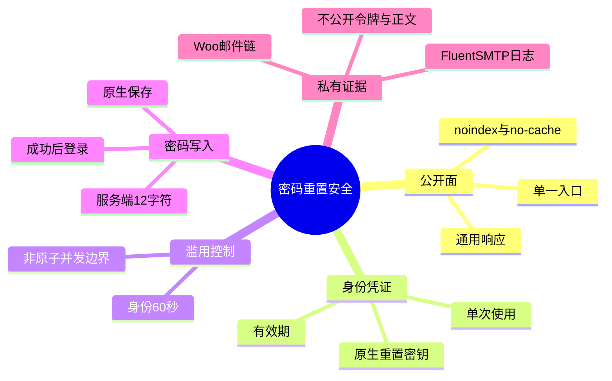
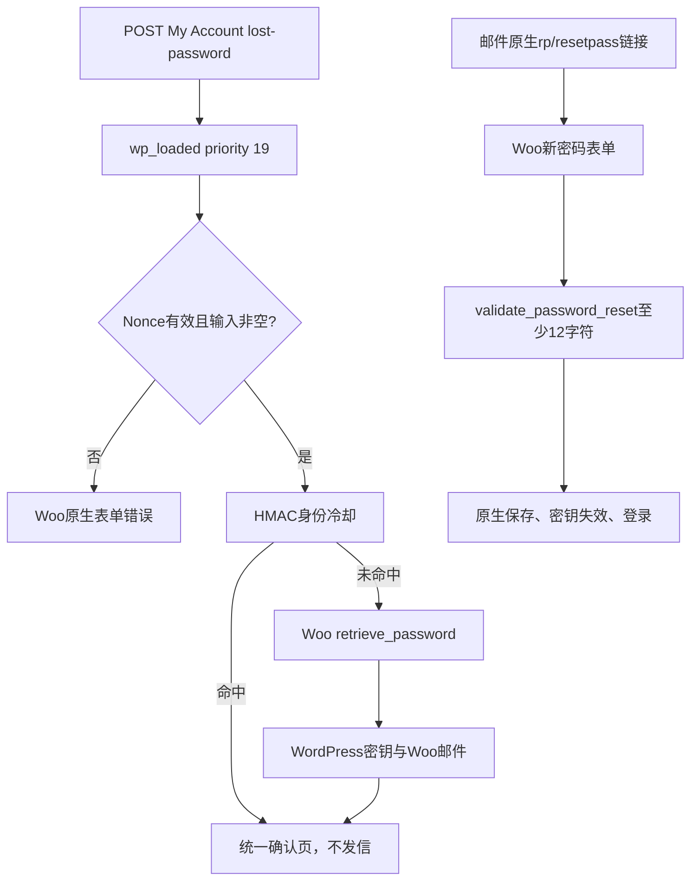

# Day80 WordPress实战：WooCommerce密码重置与防枚举

## 相关笔记

- 学习索引：[[WordPress实战笔记索引]]
- 对应项目笔记：[[../Day80-密码重置流程|Day80-密码重置流程]]
- 前置学习笔记：[[Day79-WooCommerce账户身份与订单归属]]
- 同主题知识：[[Day77-WordPress事务邮件链与可观察性]]
- 后续学习笔记：D81尚未开始

## 今日学习成果

- [ ] 我能解释为什么“提示文字相同”只是防枚举的一层，而不是完整安全保证。
- [ ] 我能从Woo找回表单追踪到原生密钥、邮件、新密码验证和登录结果。
- [ ] 我能在不复制Woo重置系统的前提下补入口、限频和服务端密码底线，并完成四端与负向验证。

## 真实项目场景

### 今天解决了什么问题

D79已经开放My Account注册和登录，但密码找回仍可能通过不同错误暴露账号是否存在，也没有项目明确的重复投递冷却和12字符服务端底线。D80需要保留Woo/WordPress成熟的令牌链，只收口DentAll特有的公开、安全和视觉边界。

### 学习范围

- 要掌握：入口归一、Nonce、公开响应、HMAC限频、原生重置令牌、服务端密码校验和缓存/日志边界。
- 不展开：CAPTCHA、异步邮件队列、WAF实现、第三方安全插件、Production压力测试。
- 真实入口：`dentall-core/includes/customer-account.php`、`dentall/inc/setup.php`、`dentall/assets/css/account-auth.css`、`/my-account/lost-password/`。
- 验证边界：隔离Local；Staging真实SMTP、代理和缓存待验。

## 先建立整体模型

### 一句话模型

浏览器只得到统一回执，应用层只决定“本次是否允许调用原生发送链”，而密码重置的身份凭证和写入仍归WordPress/WooCommerce。

### 记忆宫殿或实体比喻

把它想成酒店前台代客转交一只密封信封：访客报一个名字，前台无论是否找到住客都只说“若匹配会转交”；保安控制同一线索和入口短时间内的重复请求；信封里的唯一钥匙由酒店总控系统生成，前台不自制钥匙；住客拿钥匙进入专用房间后，还必须设置满足底线的新密码。

### 比喻对应回真实机制

| 记忆对象 | 真实技术对象 | 不能混淆的边界 |
|---|---|---|
| 前台统一回执 | 通用标题、正文和重定向路径 | 不代表内部是否发信相同 |
| 保安登记 | `WC_Rate_Limiter`中的HMAC身份键 | 不是原子锁，也不是WAF |
| 密封信封和钥匙 | WordPress/Woo原生重置密钥与邮件 | DentAll不自定义令牌或有效期 |
| 专用房间 | 原生`rp/resetpass`处理和新密码表单 | 不能把请求入口跳转误用于有效重置链接 |

## 思维导图



最重要的主干是：公开结果、投递控制和重置凭证是三层职责，不能用一层冒充全部安全。

## 请求与生命周期调用链



- 触发条件：Woo找回表单POST、有效Nonce、非空`user_login`。
- 加载入口：`dentall-core.php`加载客户账户模块。
- 执行顺序：DentAll优先级19，Woo默认处理器优先级20。
- 输入数据：账号线索与Nonce；密码仅保留原始字符做长度判断。应用层不猜测代理后的来源地址。
- 副作用：允许时生成原生密钥并进入邮件链；写入短期限频项；成功重置后保存新密码。
- 可观察证据：公开页面、私有邮件捕获、限频记录、目标客户会话和已用链接结果。

## 核心概念卡

| 概念 | 准确定义 | DentAll真实例子 | 常见误区 | 如何验证 |
|---|---|---|---|---|
| 账号枚举 | 通过内容、状态、路径或时序推断账号是否存在 | 已知/未知账号公开三项相同 | 只改一句错误就称完全防枚举 | 比较内容、状态、路径并记录时序边界 |
| HMAC限频键 | 用站点秘密盐把输入映射为不可逆固定标识 | 邮箱/用户名不明文入表 | 普通Hash等于保护隐私 | 查看键形态并确认盐参与 |
| Nonce | 限定请求来源和意图的时效令牌 | `lost_password`表单校验 | Nonce等于登录或权限 | 无效Nonce应由Woo拒绝，不能执行发送 |
| 重置密钥 | WordPress为特定User生成的短期单次凭证 | 邮件中的原生重置链接 | 自定义一个URL参数更简单 | 成功使用后同链接不可重放 |
| 服务端规则 | 在真正保存前由服务器验证 | `validate_password_reset`至少12字符 | HTML `minlength`足够 | 直接POST 11/12字符边界 |

## 项目实战代码

### 涉及文件

- `app/public/wp-content/plugins/dentall-core/includes/customer-account.php`：跨主题找回安全规则。
- `app/public/wp-content/themes/dentall/inc/setup.php`：账户样式条件加载。
- `app/public/wp-content/themes/dentall/assets/css/account-auth.css`：找回和重置表单展示。

### 从入口开始追踪

1. `wp_loaded`时Woo表单已经可识别，但Woo默认找回处理尚未运行。
2. DentAll只接管有效、非空的Woo请求；空输入或无效Nonce仍由Woo输出可修正错误。
3. 冷却未命中才调用`WC_Shortcode_My_Account::retrieve_password()`。
4. 无论内部结果如何，都清理公开Notice并跳到同一确认页。
5. 新密码提交在`validate_password_reset`上增加长度错误，之后仍由原生代码保存。

### 关键代码片段

源自`customer-account.php`，节选：

```php
$limited = dentall_core_throttle_password_reset(
    dentall_core_password_reset_rate_limits( $login )
);

if ( ! $limited && class_exists( 'WC_Shortcode_My_Account' ) ) {
    WC_Shortcode_My_Account::retrieve_password();
}
```

| 代码 | 表面动作 | WordPress中的真实作用 | 为什么这样写 |
|---|---|---|---|
| `sanitize_user()` | 规范身份线索 | 与Woo账号清洗语义靠拢 | 减少大小写/等价输入绕过 |
| `hash_hmac()` | 生成限频ID | 不把原始邮箱或用户名写入表 | 普通Hash可被字典预计算 |
| 先检查全部键再写 | 命中即返回 | 不让受限重试续期或制造新键 | 避免滑动锁死和写放大 |
| 原生`retrieve_password()` | 发起重置 | 继续使用核心密钥和邮件 | 不重复安全敏感能力 |

### 运行证据

- 命令：D80合同28/28、D79回归16/16、Node语法和PHP lint。
- 浏览器：五状态四宽135/135，页面、Console和请求失败均为0。
- 失败边界：11字符拒绝、其他已登录账号拒绝、已用链接拒绝、重复请求不增加邮件。
- 能证明：当前版本Local的顺序请求、公开内容、密钥生命周期和四端布局。
- 不能证明：真实SMTP送达、代理地址合同、WAF强度、真正并发原子性、Production负载。

## 职责边界

| 层级 | 本主题中负责什么 | 不应该负责什么 |
|---|---|---|
| WordPress Core | 用户、重置密钥、密码写入、核心登录动作 | 不修改核心文件 |
| WooCommerce | My Account表单、邮件触发、端点与成功后体验 | 不复制到DentAll模板 |
| Storefront父主题 | 基础账户页面结构 | 不直接修改父主题 |
| DentAll子主题 | 条件加载和响应式展示 | 不生成令牌或判断账号存在 |
| `dentall-core` | 入口、公开反馈、限频和密码底线 | 不自建邮件/账户系统 |
| 数据库 | 原生用户密钥和Woo限频记录 | 不新增重复Schema |
| 浏览器 | 表单交互与可访问呈现 | 不作为密码长度的唯一守卫 |

## Hook与API机制详解

| 项目 | 说明 |
|---|---|
| 机制类型 | Action与Filter |
| 入口 | `wp_loaded`、`login_form_lostpassword`、`login_form_retrievepassword`、`validate_password_reset` |
| 优先级 | 找回处理19，早于Woo默认20；长度校验10 |
| 回调输入 | 超全局表单、`WP_Error`、Woo翻译/确认消息 |
| 副作用 | 可能设置限频、触发原生邮件、重定向、添加验证错误 |
| 影响范围 | My Account找回与重置；不扩展到后台用户管理 |
| 回滚 | 移除对应Hook并回退Core/主题版本 |

## 安全、数据与站点影响

| 检查面 | 本次结论 | 证据或待验证项 |
|---|---|---|
| 输入清洗与验证 | 请求方法/字段类型、Nonce、非空与账号归一化均检查 | 合同覆盖命名Nonce与`_wpnonce` |
| Capability | 匿名找回不要求Capability | 身份证明来自单次重置密钥，不由Nonce替代 |
| Nonce | Woo表单Nonce有效才接管 | 无效Nonce继续由Woo处理 |
| 输出转义 | 自定义文字由国际化函数提供，Woo模板负责输出 | 未加入动态用户输入 |
| 数据库写入 | 原生重置密钥和Woo限频；无新表 | TEST记录已清理 |
| URL与SEO | 统一My Account，保留原生重置链接，继续noindex | Staging复核 |
| 缓存 | 账户和重置响应必须私有/no-cache | 目标Varnish/CDN待验 |
| 支付、物流与订单 | 无变化 | D75归属合同不受影响 |
| 部署与回滚 | 当前Local候选 | Staging以备份点和受控发布提交回滚 |

## 动手练习

### 练习一：只读观察

- 目标：区分公开确认与私有投递事实。
- 操作：分别提交已知、未知账号，记录标题、正文、路径和私有邮件计数。
- 预期：公开三项相同；只有允许的已知账号产生邮件。
- 实际证据：Local通过。

### 练习二：Local最小改动

- 改动：把测试密码从11字符改为12字符，不改浏览器属性。
- 风险边界：只在隔离Local TEST客户上使用。
- 验证：11拒绝、12接受、成功后登录、旧链接失效。
- 回滚：删除TEST客户与隔离库，不恢复共享Local。

### 练习三：故障推演

- 假设症状：所有客户偶尔都收不到重置邮件。
- 可能原因：边缘层错误地把共享反向代理地址当作访客地址做来源限频。
- 第一项检查：目标代理拓扑、可信客户端地址来源与边缘限频规则。
- 为什么先查它：共享来源会同时解释跨账号、跨浏览器误伤，且错误信任转发头会引入伪造风险。DentAll应用层当前只保留身份冷却，不使用未经证明安全的`REMOTE_ADDR`。

## 常见误区与排错顺序

| 现象或误区 | 可能原因 | 推荐检查顺序 | 最小验证方法 |
|---|---|---|---|
| 提示相同就认为完全防枚举 | 状态、路径或时序仍不同 | 内容→状态/路径→时序→边缘限频 | 已知/未知成对请求 |
| 重置邮件重复发送 | 冷却未命中或并发窗口 | 私有日志→限频键→请求时间→并发 | 顺序重试与受控并发分开测 |
| 有效链接打开错误页面 | 错把`rp/resetpass`也重定向 | login action→query→Woo端点 | 打开新生成链接并核对表单 |
| 前端阻止短密码但直接POST成功 | 只有HTML约束 | 服务端Hook→错误对象→保存结果 | 直接提交11/12字符 |

## 掌握标准与费曼测试

- [ ] 两分钟讲清公开反馈、限频和重置凭证三层。
- [ ] 指出优先级19为何存在、Woo默认处理器为何仍被复用。
- [ ] 解释Nonce、重置密钥和Capability为什么不是同一件事。
- [ ] 说明HMAC键保护什么、不保护什么。
- [ ] 说明Local证据为何不能证明Staging代理和真实SMTP。
- [ ] 给出回滚后密码不会自动恢复的原因。

当前掌握度：初识。个人费曼答案与评分待用户自测后填写。

## 间隔复习记录

| 复习节点 | 计划日期 | 完成 | 暴露的问题 | 修正位置 |
|---|---|---|---|---|
| D+1 | 2026-09-23 | [ ] | 尚未复习 | — |
| D+3 | 2026-09-25 | [ ] | 尚未复习 | — |
| D+7 | 2026-09-29 | [ ] | 尚未复习 | — |
| D+14 | 2026-10-06 | [ ] | 尚未复习 | — |

## 收尾总结

- 真正理解：不要重造令牌链；只在职责边界明确的地方补公开反馈、冷却和服务端规则。
- 容易混淆：通用文案不是恒定时间，应用限频也不是WAF或原子锁。
- 下次先检查：目标环境入口、代理地址、缓存、私有邮件日志和原生令牌生命周期。

## 变种应用到其他项目

| 新场景 | 保持不变的原则 | 可能变化的实现 | 必须重新确认 | 最小验证 |
|---|---|---|---|---|
| 另一个经典Woo主题 | 原生令牌、统一公开结果、服务端校验 | DOM和样式Hook | 主题/Woo版本 | 已知/未知＋四端 |
| WordPress区块主题 | 跨主题规则仍在插件 | 账户区块和资源加载 | 当前Blocks能力 | 原生链接与表单 |
| 独立插件 | 高内聚安全规则 | 命名空间、卸载和配置 | 多站点与冲突 | 多主题回归 |
| Shopify或其他平台 | 账号恢复不能泄露存在性，令牌必须单次且短期 | 平台账户API、邮件和边缘限频 | 官方能力与日志权限 | 成对请求、令牌重放、缓存，待验证 |

## 可复用核心思想

### 跨平台不变量

账户恢复至少分为公开响应、滥用控制、身份凭证、密码写入和私有审计五层。每层都应有自己的真相源、失败路径和证据，不能因为页面看起来一致就宣称整个链路安全。

### WordPress/WooCommerce当前实现

WordPress 7.0.4与WooCommerce 11.0.0负责用户、密钥、邮件和保存；DentAll Core用优先级19接管有效Woo请求的公开结果，以HMAC限频键减少明文和重复发送，并在`validate_password_reset`增加12字符底线；子主题只负责条件样式。结论限于隔离Local。

### Shopify或其他平台的对应机制

其他平台仍应优先复用官方客户账户恢复和令牌，不在主题重造身份系统；但Shopify具体的客户账户模式、API、日志、速率限制和边缘保护本轮未验证，不能把Woo的Hook或数据结构直接映射，也不扩大DentAll范围。
