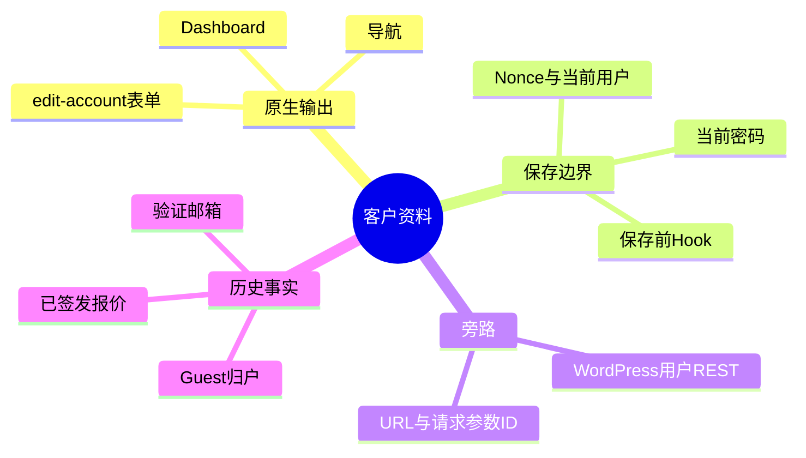
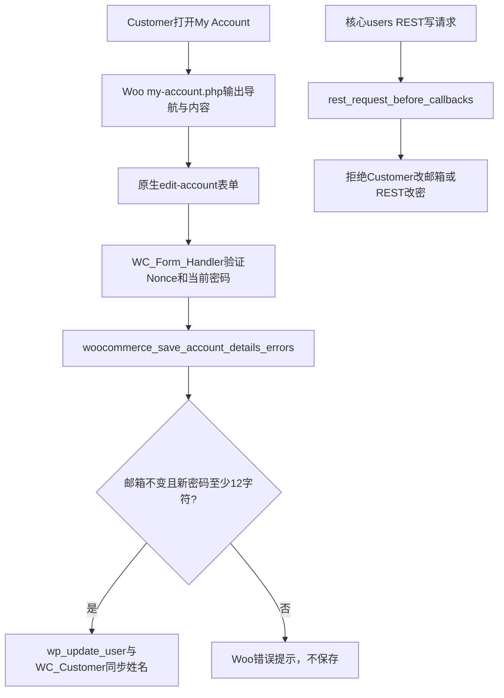

# Day81 WordPress实战：账户资料与登录邮箱边界

## 相关笔记

- 学习索引：[[WordPress实战笔记索引]]
- 对应项目笔记：[[../Day81-账户仪表盘与资料策略]]
- 前置学习笔记：[[Day79-WooCommerce账户身份与订单归属]]、[[Day80-WooCommerce密码重置与防枚举]]
- 后续学习笔记：[[Day82-WooCommerce默认地址与订单快照]]

## 今日学习成果

- [x] 能区分登录邮箱、Billing email与显示名，说明它们各自影响的业务事实。
- [x] 能从Woo原生资料表单追到Nonce、当前密码、`wp_update_user()`与DentAll保存前Hook。
- [x] 已在隔离Local复演原生表单9项、REST旁路10项、四宽213/213，并完成独立终审；个人费曼自测仍待。

## 真实项目场景

D79允许客户验证邮箱后归属同邮箱的历史Guest订单；D81若把登录邮箱当普通文本字段随意编辑，会跳过新邮箱控制权和历史归属复核。本篇只讨论已确认的第一版策略：Customer不能自助改登录邮箱，姓名/显示名可通过原生表单保存，改密继续走当前密码校验。D83订单中心、员工人工纠错和目标环境缓存另验。

## 先建立整体模型

**一句话模型：** WooCommerce表单是客户操作柜台，WordPress用户邮箱是身份证明，已经归属的订单是历史记录；柜台可以修改称呼，改身份证明必须另有核验流程。

记忆宫殿：客户进入商场服务台（My Account），姓名牌（显示名）可在本人签名后更换；登录邮箱像保管柜钥匙，换钥匙需要证明新钥匙归属，不能只把新地址写在申请表。对应技术事实：服务台是Woo模板与`WC_Form_Handler`，本人签名是Nonce和当前会话，钥匙是`WP_User::user_email`与Woo验证状态，历史记录是Woo Order的Customer ID及Guest归户结果。比喻不代表Nonce可证明新邮箱控制权；Nonce只证明请求来自当前会话。



## 请求与生命周期调用链



触发顺序来自本机Woo 11 `class-wc-form-handler.php` 与WordPress 7.1 `class-wp-rest-server.php`源码。`rest_pre_insert_user`不能在此返回`WP_Error`：当前WordPress更新控制器随后直接给过滤结果设置`ID`；本项目使用可中止请求的`rest_request_before_callbacks`。隔离Local另验证了body/query的ID可覆盖URL ID，守卫不能只比较路径里的数字。

## 核心概念卡与项目实战代码

| 概念 | 准确定义 | 常见误区与验证 |
|---|---|---|
| 登录邮箱 | WordPress用户的`user_email`，参与登录、重置和Woo验证邮箱合同 | 不等于可随意更改的联系邮箱；对比资料保存前后用户字段 |
| Billing email | `WC_Customer`默认账单联系地址及未来订单预填来源 | 不自动变成账户登录邮箱；按D82单独测试 |
| Nonce | 请求来源与时效检查 | 不证明当前密码、新邮箱控制权或Customer权限 |
| `readonly` | 浏览器显示和正常提交行为 | 可伪造POST，因此服务端Hook与REST守卫不可省 |

真实代码节选，源自`app/public/wp-content/plugins/dentall-core/includes/customer-account.php`：

```php
if ( isset( $user->user_email ) && $user->user_email !== $current_user->user_email ) {
	$errors->add( 'dentall_account_email_locked', __( 'Your account email address cannot be changed here.', 'dentall-core' ) );
}
```

这是Woo保存前的业务规则；输入清洗、Nonce、当前用户和最终`wp_update_user()`仍由原生处理器负责。子主题`inc/setup.php`只按登录态账户页加载样式，并只在Customer资料端点加载小型只读提示脚本；Storefront父主题与Woo模板均未复制。移除此PHP检查时，伪造POST可绕过只读状态，改变用户邮箱。

## 职责边界与安全、数据、站点影响

| 层级或检查面 | 本次事实 |
|---|---|
| WordPress/WooCommerce | 用户与密码散列、模板、Nonce、当前密码、CRUD与原生错误负责各自部分；核心用户REST另有写入口 |
| `dentall-core` | 只实现Customer邮箱锁定、12字符底线与核心REST守卫；不重造用户或邮件系统 |
| 子主题/浏览器 | 一套语义DOM、Mobile First CSS和`readonly`提示；脚本不是安全边界 |
| 数据/URL/SEO | 无Schema和公共URL；资料成功保存可能同步默认Billing姓名，既有订单不追写；账户SEO策略不变 |
| 缓存/部署 | 登录账户页必须绕过共享整页缓存；仅隔离Local，目标环境缓存与真实客户端待验证 |

## 动手练习与排错顺序

1. **只读观察：** 查Woo `form-edit-account.php`、`WC_Form_Handler::save_account_details()`和WordPress用户REST更新控制器，确认每条路径的身份与保存点。
2. **Local最小改动：** 在专用TEST Customer提交姓名变更，再分别尝试邮箱伪造POST、11/12字符改密与`/wp/v2/users/me`；撤销时删除隔离库，不能用生产客户练习。
3. **故障推演：** 若登录邮箱意外变化，先查用户变更审计和REST请求，再查是否发生Guest归户、已签发报价失效；不要直接把邮箱改回并宣称订单自动恢复。

| 症状 | 先查 | 最小验证 |
|---|---|---|
| 输入框只读但邮箱仍被改 | 服务端Hook和REST入口 | 伪造POST与REST各一例 |
| 正常改密失败 | 当前密码、Nonce、12字符规则 | 11/12字符与正确/错误当前密码组合 |
| 账户显示其他客户信息 | 当前会话、Cache-Control和页面缓存 | A/B/Guest分别访问同一路由 |
| 账户页手机Header购物车突然展开 | DevTools检查`.woocommerce`是否被账户Grid规则误命中 | 把布局选择器限定到`.entry-content > .woocommerce`后复查390px |

## 掌握标准与费曼测试

当前掌握度为初识，用户个人费曼自测未进行。合格时应能解释：①为何`readonly`不足以保护邮箱；②Nonce和当前密码的区别；③表单与REST为何都要守；④Billing email为何不等于登录邮箱；⑤管理员人工纠错为何先核验新邮箱与历史Guest归属。每题需给出通俗解释、准确API及隔离Local证据，未验证答案不评分。

## 间隔复习记录

| 节点 | 计划日期 | 状态 | 复查主题 |
|---|---|---|---|
| D+1 | 2026-10-08 | 待复习 | 表单与REST双入口 |
| D+3 | 2026-10-10 | 待复习 | 邮箱身份与Billing联系字段 |
| D+7 | 2026-10-14 | 待复习 | Guest归户与报价边界 |
| D+14 | 2026-10-21 | 待复习 | 目标环境缓存证据 |

## 收尾总结与迁移

真正理解的主干是“界面、请求来源、旧密码和邮箱控制权各自证明不同事情”。另一Woo主题仍应复用其原生表单和公开Hook，再复核版本与DOM；Shopify或其他平台的账户邮箱验证、客户REST和订单归属机制均待官方资料与实测确认。本篇可复演代码和测试命令见项目笔记，不能以纯PHP替身断言冒充完整HTTP验收。

## 可复用核心思想

- 跨平台不变量：身份字段变化必须评估新控制权证明、历史关联、通知与撤销；前端只读永远不等于服务端授权。
- WordPress/WooCommerce当前实现：Woo表单保存前Hook与WordPress核心用户REST各有独立入口，验证与限制应在各自真实写路径落地。
- Shopify或其他平台：仍要查具体账户API与验证生命周期，不能直接移植WordPress用户字段或Woo Guest归户规则，待验证。
