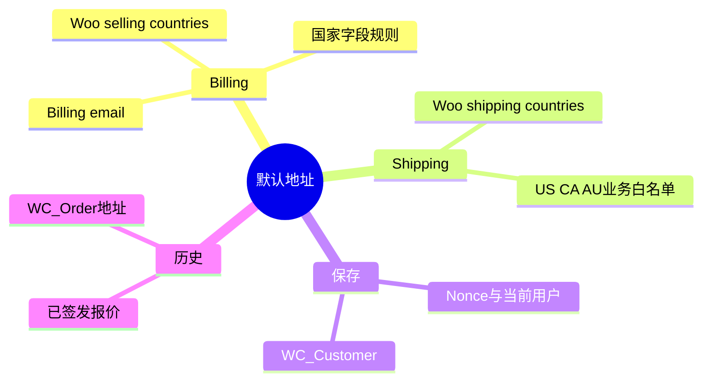
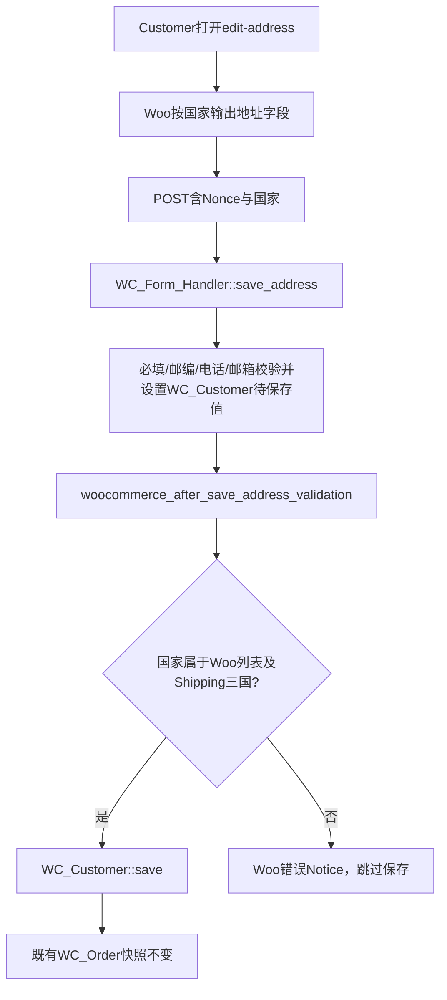

# Day82 WordPress实战：默认地址与订单快照

## 相关笔记

- 学习索引：[[WordPress实战笔记索引]]
- 对应项目笔记：[[../Day82-默认账单与配送地址]]
- 前置学习笔记：[[Day81-WooCommerce账户资料与登录邮箱边界]]、[[Day73-WooCommerce报价字段与客户身份边界]]
- 后续学习笔记：[[Day83-WooCommerce再次购买与购物车会话边界]]（D83动态验收待恢复）

## 今日学习成果

- [x] 能区分客户默认Billing/Shipping地址与既有Order地址快照。
- [x] 能追踪Woo原生国家字段列表、地址保存前Hook和`WC_Customer`持久化。
- [x] 已在隔离Local复演合法/伪造国家、跨用户与旧订单/已签发报价不变量，完成四宽213/213；个人费曼自测仍待。

## 真实项目场景

客户在账户页维护未来结账预填地址，DentAll只向US/CA/AU配送，Billing国家不受这组三国限制。原生Woo地址表单显示允许国家，但保存处理器没有再核对伪造POST的国家成员资格；D82只补这处业务边界，并证明改默认地址不追写既有订单或已签发报价。

## 先建立整体模型

**一句话模型：** 客户地址簿是以后填写订单的草稿来源，订单地址是成交时封存的凭据；改地址簿不能改旧凭据。

记忆宫殿：服务台保存客户通讯录（`WC_Customer`默认Billing/Shipping），新合同取当时地址形成复印件（`WC_Order`地址），之后通讯录改动不应涂改旧合同。国家下拉像前台可见选项，但伪造请求相当于绕过下拉直接递纸条；服务器仍需核对国家。比喻不能代替Woo实际保存路径；最终以`WC_Customer`和`WC_Order` CRUD前后快照验证。



## 请求与生命周期调用链



## 核心概念卡与真实代码

| 概念 | 准确定义 | 常见误区与验证 |
|---|---|---|
| 默认Billing | 客户未来结账预填的账单资料 | Billing email可以不同于登录邮箱；分别读取用户与客户对象 |
| 默认Shipping | 客户未来配送预填资料 | 下拉可见值不等于服务器一定校验；伪造GB请求测试 |
| Order快照 | 订单创建/签发时自己的Billing、Shipping、金额与报价事实 | 不从当前客户默认地址实时投影；保存地址前后比较订单CRUD |

真实代码节选，源自`app/public/wp-content/plugins/dentall-core/includes/customer-account.php`：

```php
$countries = 'shipping' === $address_type
	? WC()->countries->get_shipping_countries()
	: WC()->countries->get_allowed_countries();
```

Shipping随后还要与既有`DENTALL_SHIPPING_QUOTE_ALLOWED_COUNTRIES`常量相交。Woo 11原生`woocommerce_form_field()`也使用对应国家列表生成下拉，因此客户端与服务器共享同一配置来源；但“Billing国家不限于三国”仍依赖目标环境selling countries覆盖全部国家。

## 职责边界与Hook详解

| 层级或机制 | 本日职责与边界 |
|---|---|
| WordPress | 当前登录用户、Nonce基础API；不改核心文件 |
| WooCommerce | 原生地址模板、国家字段、必填/格式Notice、`WC_Customer`与Order CRUD；其My Account保存流程不核对伪造国家成员 |
| Storefront/DentAll主题 | 一套语义DOM加地址卡与表单CSS；不保存地址、不复制模板 |
| `dentall-core` | `woocommerce_after_save_address_validation`在Customer保存前加国家成员检查；不写SQL或订单 |
| Checkout/其他入口 | 不经过本次My Account Hook，按自身原生及D73合同验证，不能外推本Hook覆盖所有入口 |

原生My Account对伪造州省下拉值没有成员校验；本日范围只补国家合同，不宣称州省代码全面白名单。若后续实际出现质量问题，先查表单/结账服务器校验，再决定是否另设统一规则。

## 安全、数据与站点影响

| 检查面 | 本次结论与证据边界 |
|---|---|
| 输入/权限/Nonce | Woo先清洗表单并验证Nonce和当前登录用户；Core再核对Customer目标ID和国家 |
| 输出 | 新错误使用Woo Notice及翻译函数；地址显示继续由Woo模板转义 |
| 数据 | 只更新客户默认地址；旧订单六类字段在CRUD前后不变。另经D75回调签发TEST报价，默认Billing→GB、Shipping→CA后5/5通过，旧报价地址、金额/Shipping、签名、Token、到期和可付款状态不变；未实际发信或付款 |
| URL/SEO/缓存 | 不增公共URL或SEO规则；账户页仍应私有且绕过共享整页缓存，目标环境未复验 |
| 支付/物流/部署 | 配送国家业务范围不变，真实运费/支付不触碰；仅隔离Local，未部署 |

## 动手练习与排错顺序

1. **只读观察：** 查Woo `form-edit-address.php`、`WC_Form_Handler::save_address()`与`woocommerce_form_field()`；分别列出Billing、Shipping国家来源。
2. **Local最小改动：** 在专用TEST客户上保存US/CA/AU Shipping与境外Billing，再伪造GB Shipping；记录成功/错误Notice、客户CRUD值和订单快照，结束后删除隔离库。
3. **故障推演：** 若旧订单地址随默认地址变化，先确认读取的是`WC_Order`还是当前`WC_Customer`，再查是否有自定义同步Hook；不要直接改订单补救未经审计的历史事实。

| 症状 | 先查 | 最小验证 |
|---|---|---|
| Billing少某国家 | Woo selling countries设置 | 原生下拉与`get_allowed_countries()` |
| Shipping存入GB | 保存前国家Hook和既有三国常量 | 伪造POST后读`WC_Customer` |
| A改动B地址 | 当前会话、Nonce、目标ID | A/B独立会话与CRUD快照 |
| 旧报价失效 | 订单签名/Customer ID与当前默认地址是否混用 | 只读比对旧单与报价元数据 |

## 掌握标准与费曼测试

当前掌握度为初识，用户本人尚未费曼自测。应能解释：①默认地址和订单快照的区别；②Billing/Shipping国家来源为何不同；③为什么下拉不能防伪造POST；④Nonce、目标ID和CRUD各解决什么；⑤为什么本Hook不能代表Checkout全部入口。回答需通俗比喻、准确Woo API和隔离Local证据三者一致。

## 间隔复习记录

| 节点 | 计划日期 | 状态 | 复查主题 |
|---|---|---|---|
| D+1 | 2026-10-08 | 待复习 | 客户默认值与订单快照 |
| D+3 | 2026-10-10 | 待复习 | 两套国家配置 |
| D+7 | 2026-10-14 | 待复习 | 伪造POST和服务器Notice |
| D+14 | 2026-10-21 | 待复习 | 结账与目标环境设置 |

## 收尾总结与迁移

真正理解的主干是“未来预填值和既有交易事实分别保存、分别验收”。其他Woo站点可复用原生模板与CRUD思路，但需核对实际国家设置和插件过滤器；Shopify或其他平台的客户地址、订单地址、编辑API和快照机制须另行核实，待验证。隔离Local动态证据与回滚边界见对应项目笔记。

## 可复用核心思想

- 跨平台不变量：默认资料服务未来交易，历史订单是独立快照；两者不能因相同字段名而自动联动。
- WordPress/WooCommerce当前实现：Woo原生地址表单和`WC_Customer`处理常规字段，站点规则只在保存前补国家成员约束，订单用CRUD核对不变量。
- Shopify或其他平台：先查官方客户地址和订单地址的具体数据与权限机制，再设计测试；不能假设与Woo Hook一一对应，待验证。
