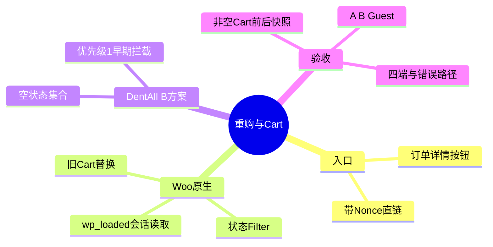
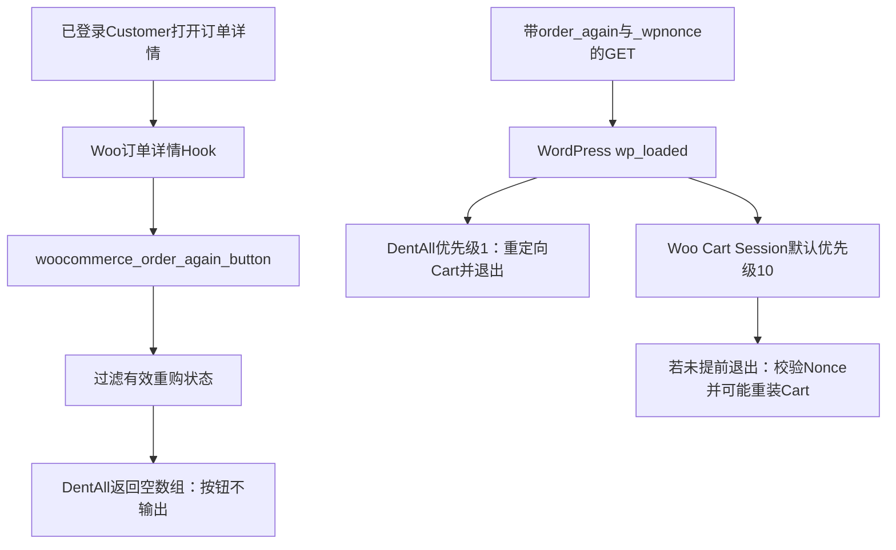

# Day83 WordPress实战：再次购买与购物车会话边界

## 相关笔记

- 学习索引：[[WordPress实战笔记索引]]
- 对应项目笔记：[[../Day83-订单中心与再次购买暂缓]]
- 前置学习笔记：[[Day82-WooCommerce默认地址与订单快照]]、[[Day79-WooCommerce账户身份与订单归属]]
- 后续学习笔记：D84完成真实收尾后回填
- 关联流程：[[Day75-WooCommerce报价过期与订单生命周期]]

## 今日学习成果

- [x] 能从Woo 11源码指出按钮输出和Cart重装分别使用的Hook。
- [x] 能解释为什么仅让订单状态Filter返回空数组，仍不足以证明非空Cart保持不变。
- [x] 能用隔离Woo CRUD订单核对原生订单查询、分页、状态金额及A/B详情归属，并说明Guest入口守卫与底层能力的区别。
- [ ] 能在隔离Local用真实HTTP、Cookie和非空Cart完成前后快照；PHP服务启动被自动审批阻断，待恢复。

## 真实项目场景与整体模型

DentAll的客户可能已把商品放进Cart并取得人工运费报价。Woo 11原生“Order again”在满足条件后可把旧订单商品装入Cart，默认行为还会清空原Cart。用户批准第一版暂缓这项能力，因此必须同时处理原生按钮和仍可访问的带Nonce直链；D83原生订单列表与详情及D84非付款链仍要各自完成动态验收。

**一句话模型：** 订单页不展示入口只能阻止正常点击；要保护已装商品，还须在Woo处理重购查询并改写Cart会话之前拦截请求，最后用真实会话快照验证。

记忆宫殿：商店橱窗的“按上次清单装篮”招牌对应订单详情的按钮；收银台后台收到旧清单对应`order_again`请求；顾客手里的篮子对应Woo Cart会话。拆掉招牌不会让旧清单失效，后台仍可能按清单重装篮子。真实机制分别是`woocommerce_order_again_button()`、查询参数、`WC_Cart_Session::get_cart_from_session()`；比喻不说明实际权限或执行顺序，必须回到源码与HTTP证据。



主干是“显示判断”和“会话写入”属于不同阶段；两层候选代码必须由真实Cart状态串起来验证。

## 请求与生命周期调用链



Woo 11源码中，`wc-template-functions.php`的`woocommerce_order_again_button()`先过滤可重购状态，再决定是否输出按钮。`class-wc-cart-session.php`的`get_cart_from_session()`从Session取原Cart；若同时有`order_again`、`_wpnonce`、已登录且Nonce有效，就调用`populate_cart_from_order()`，并标记会话需要更新。该函数默认通过`woocommerce_empty_cart_when_order_again`清空原Cart。即使状态Filter返回空数组，处理器也已进入重购分支；源码中的提前返回不能替代“原Cart在后续会话保存后仍不变”的实测证据。

## 核心概念卡与真实代码

| 概念 | 准确定义 | DentAll中的边界 |
|---|---|---|
| 状态Filter | Woo决定订单是否可输出重购入口及是否可从订单装Cart时调用的过滤器 | 返回`[]`是候选隐藏和资格限制，不等于会话保护已验收 |
| `wp_loaded`优先级 | WordPress同一Action内数字较小的回调先运行 | DentAll优先级1先于Woo Cart Session默认10；仅在代码注册顺序与真实请求均成立时实现提前退出 |
| Cart会话 | Woo按当前客户端会话保存商品、数量等Cart事实 | 真实Cookie与请求前后比较才可证明没有被覆盖 |
| Nonce与归属 | Woo原生重购分支先检查Nonce，订单加载还要检查`order_again`能力 | Nonce不代替权限；B方案不是新授权模型 |

真实代码节选，源自`app/public/wp-content/plugins/dentall-core/includes/customer-account.php`：

```php
function dentall_core_disable_order_again() {
	return array();
}
add_filter( 'woocommerce_valid_order_statuses_for_order_again', 'dentall_core_disable_order_again' );

function dentall_core_redirect_order_again_request() {
	if (
		! function_exists( 'wc_get_cart_url' )
		|| ! isset( $_GET['order_again'], $_GET['_wpnonce'] )
		|| ! is_user_logged_in()
	) {
		return;
	}

	wp_safe_redirect( wc_get_cart_url() );
	exit;
}
add_action( 'wp_loaded', 'dentall_core_redirect_order_again_request', 1 );
```

第一段复用Woo公开Filter，不覆写Woo订单模板；第二段只命中Woo原生重购请求形状并提前结束当前请求。不能把`wp_safe_redirect()`理解成已经保存或保护Cart；该行为还需真实HTTP验证。`dentall-core/dentall-core.php`同步把版本更新为0.7.1。

## 运行证据与职责边界

| 层级 | 已有证据 | 尚不能证明 |
|---|---|---|
| 代码与Woo源码 | PHP语法、`git diff --check`通过；Woo 11源码可追到按钮Filter、Cart Session与默认清空分支 | 特定网站真实Cookie与重定向结果 |
| 既有合同 | D79 16/16、D80 28/28、D81/D82 26/26通过 | D83订单详情、Cart不变量或四端布局 |
| 隔离WP-CLI | Core/Woo active，Filter为`[]`，DentAll拦截Hook优先级1 | HTTP请求、Session持久化、浏览器与A/B/Guest |
| 隔离Woo CRUD | TEST客户A/B各1，订单A13/B2/Guest1共16张；原生查询、10+3分页、状态/金额、错误ID/key、A/B互看拒绝、完成订单按钮输出抑制通过；夹具全部清理、残留0 | HTTP入口、Cart、四端与目标HPOS。Woo底层`view_order`对未登录ID 0的Guest订单返回true，但My Account入口CLI调用先显示登录表单；真实请求仍待验 |
| 独立审查 | 代码无开放P0～P2，安全无开放P0～P3 | 交易动态验收 |

隔离副本`.codex-tmp/d83-b-isolated`及专属数据库保留，测试邮件由隔离`pre_wp_mail`短路，MySQL已停且19183/18183无监听。自动审批拒绝启动`php -S 127.0.0.1:18183`，仅回报`blocked by policy`；没有HTTP、Cart前后、订单页和四端证据。不能把这个限制写成插件故障，也不能据此宣称B方案已经满足动态验收。

| 层级 | 本主题职责 |
|---|---|
| WordPress Core | 加载Hook、当前登录态、Nonce与安全重定向API；不改核心 |
| WooCommerce | 原生订单详情/能力检查、重购按钮、Cart Session和订单CRUD；现阶段不修改插件文件 |
| Storefront与子主题 | 承接原生HTML和既有账户样式；不承载跨主题的Cart安全规则 |
| `dentall-core` | 第一版站点级重购暂缓规则；不创建第二套商品或订单模型 |
| 浏览器与会话 | 用同一客户端Cookie复演请求及Cart前后；CLI不能替代 |

## 安全、数据、SEO与部署边界

- **输入与权限：** 候选拦截只检查两个查询键、Woo函数及已登录态，不读取或写入传入订单ID；Woo原生路径自身验证Nonce及`order_again`能力。B方案不新增订单读取权限。
- **数据与交易：** 无持久化字段或订单写入。Cart为会话事实，前后不变量待HTTP验证。商品价、运费报价、税、库存、支付及`order-pay`均未改。
- **URL、SEO与缓存：** 不新增公共页面、Slug或Schema；拟对命中请求重定向Cart。实际响应状态、缓存头和目标站点私有缓存策略未测。
- **性能与回滚：** 仅两个Hook，无新增前端资源、Cron或远程请求；没有负载测量，不能称性能零影响。回滚候选Hook后必须再测试原生重购与Cart行为，不能把代码撤销等同于用户会话恢复。

## 动手练习与排错顺序

1. **只读观察已完成：** 查Woo 11的`woocommerce_order_again_button()`、`WC_Cart_Session::get_cart_from_session()`和`populate_cart_from_order()`，记录Filter、Nonce、会话写入与默认清空的先后。
2. **隔离Local动态练习待完成：** 启动获准的独立HTTP服务；用TEST Customer在非空Cart中记录商品键、数量和金额，再访问完成订单重购直链及无效ID/Nonce变体；比较同一Cookie下前后Cart，并核对状态码和Location。不要在共享Local或真实交易环境复演。
3. **故障推演：** 若按钮没出现但Cart变化，先抓请求URL与登录Cookie，再核对`wp_loaded`回调优先级和实际重定向，最后读Woo会话保存路径；只看HTML是否隐藏会误判。

| 症状 | 首先检查 | 最小验证 |
|---|---|---|
| 订单详情还显示重购 | Filter是否加载、其他插件是否后置修改状态 | 隔离WP-CLI读取最终Filter，再看目标订单HTML |
| 点击旧链接后Cart被替换 | 请求是否同时含两个参数、拦截是否先于Session | 同一Cookie的Cart前后快照与响应链 |
| 订单A/B可互看 | 原生订单归属与`view-order`能力 | 两个TEST客户及Guest分别访问 |
| CLI通过但浏览器失败 | CLI无真实HTTP Session或环境代码不同步 | 先核对版本，再抓HTTP请求和服务器日志 |
| Guest底层能力显示可看Guest订单 | Woo按用户ID 0匹配订单归属，但My Account入口先检查登录态 | 用真实未登录HTTP访问Guest订单详情，确认只见登录页、无订单信息；并检查其他可达入口 |

## 掌握标准与费曼测试

当前掌握度为初识；用户本人尚未费曼自测，动态练习也未完成。合上笔记后应能回答：

1. 用购物篮比喻解释为什么移除“Order again”按钮不能保护既有Cart，并对应回两个真实Hook。
2. 在Woo 11源码中指出原Cart何时读出、Nonce何时检查、默认清空发生在哪里。
3. 为什么状态Filter返回`[]`后，仍不能凭CLI断言原Cart保持？
4. `wp_loaded`优先级1与10是什么关系？`wp_safe_redirect()`能证明什么，不能证明什么？
5. 怎样用Customer A/B、Guest和同一Cookie证明订单归属与Cart不变量？
6. 若未来恢复安全重购，应先确认哪些业务行为和回滚边界？

## 间隔复习与下一步

| 节点 | 计划日期 | 状态 | 复查主题 |
|---|---|---|---|
| D+1 | 2026-10-09 | 待复习 | 按钮Filter与会话Hook |
| D+3 | 2026-10-11 | 待复习 | Nonce、能力和早期拦截 |
| D+7 | 2026-10-15 | 待复习 | 非空Cart前后快照 |
| D+14 | 2026-10-22 | 待复习 | 安全重购业务规则 |

下次遇到相似问题，向AI提供Woo版本、真实Hook代码、完整请求形状、Cookie隔离方式、Cart前后快照及目标行为，请其区分源码事实、CLI检查和HTTP待验项。订单或Cart行为仍以Local复演与Woo公开API为准。D83-P2由开发者继续持有；恢复HTTP后再评估安全重购方案和工时。

## 可复用核心思想

- 跨平台不变量：展示入口和服务端状态修改要分别控制；会改变用户已有状态的功能，须用同一会话的前后事实与错误路径验收。
- WordPress/WooCommerce当前实现：Woo 11通过状态Filter输出重购按钮，又在`wp_loaded`的Cart Session中处理直链；DentAll暂用早期Hook阻断，当前仅静态与CLI证据。
- Shopify或其他平台：需重新核实重购API是否替换或合并现有Cart、如何鉴权及会话保存；具体对应机制待验证。
