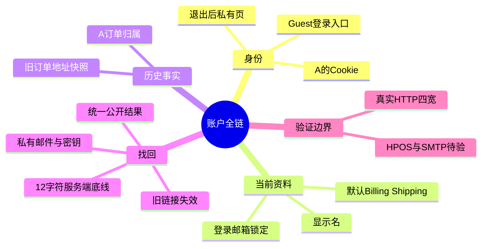
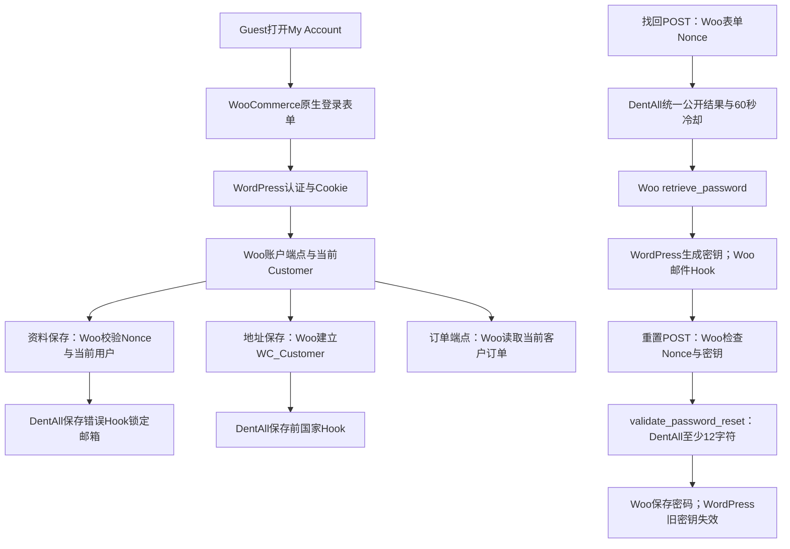

# Day84 WordPress实战：账户链与重置密钥

## 相关笔记

- 学习索引：[[WordPress实战笔记索引]]
- 对应项目笔记：[[../Day84-账户全链路回归]]
- 前置学习笔记：[[Day83-WooCommerce再次购买与购物车会话边界]]、[[Day81-WooCommerce账户资料与登录邮箱边界]]、[[Day82-WooCommerce默认地址与订单快照]]
- 关联身份机制：[[Day79-WooCommerce账户身份与订单归属]]、[[Day80-WooCommerce密码重置与防枚举]]
- 后续学习笔记：无；出现直接相关的Day后双向回填

## 今日学习成果与真实场景

项目已取得以下可复演证据；尚未由用户独立讲解或完成费曼自测，因此掌握度保持“初识”。

1. 能沿同一TEST客户的HTTP会话追踪登录、资料、默认地址、历史订单、退出和找回密码，不把五个单页测试误当成完整账户链。
2. 能解释已知/未知账号在公开找回页给相同结果，但只有存在账户且未被冷却的请求生成重置密钥并进入私有邮件链。
3. 能指出`validate_password_reset`发生在WooCommerce校验密钥之后、真正保存新密码之前，且旧链接失效需换一个匿名浏览器会话实测。

D83在隔离Local完成了订单中心和不覆盖现有Cart的B方案，D81/D82已有资料与地址增量。D84把它们接成一条**非付款**旅程：匿名不能看A订单；A登录、改显示名和默认Billing/Shipping；旧订单地址不变；退出后私有页要求登录；找回和重置之后用新密码登录。运行代码无新增，测试对象和临时邮件捕获已清理。

## 先建立整体模型

**一句话模型：** 账户页只呈现当前客户的入口，WooCommerce表单与WordPress身份/密钥机制决定谁能写什么，历史订单保留成交时快照；因此要用同一身份跨页面、跨会话验证数据和访问边界。

记忆宫殿：把账户想成酒店前台。房卡是登录会话，前台资料卡是当前`WC_Customer`默认地址，已签收的住宿账单是`WC_Order`快照，补办房卡的私密取件码是密码重置密钥。前台改资料卡不会追写旧账单；拿到新房卡后旧取件码不能继续使用。这个比喻只帮助记住责任，不能证明实际登录态、Nonce、密钥有效期或订单归属；它们必须由源码和HTTP测试确认。

| 记忆对象 | 真实技术对象 | 关键边界 |
|---|---|---|
| 房卡 | WordPress认证Cookie与当前用户 | 页面显示不是服务端权限证据；退出后要重新请求私有URL |
| 前台资料卡 | WooCommerce `WC_Customer`默认Billing/Shipping及WP用户资料 | 登录邮箱是身份字段，DentAll第一版不开放自助更换 |
| 已签收账单 | `WC_Order`中的客户ID、账单/配送地址与金额快照 | 修改默认地址不回写历史订单或报价 |
| 补卡取件码 | WordPress `get_password_reset_key()`生成、`check_password_reset_key()`校验的密钥 | 公开反馈不泄露账户存在性；密钥只由核心机制验证与失效 |

## 思维导图



主干是“身份→当前资料→历史订单→凭据恢复”；每次写入后都要再次读取对应对象，而不是只看成功提示。

## 请求与生命周期调用链



触发从浏览器的原生My Account端点和表单开始。WooCommerce `WC_Form_Handler`先处理表单Nonce、当前用户及字段，再触发项目Hook；DentAll仅补站点规则。找回流程中，DentAll在`wp_loaded`优先级19调用Woo的`WC_Shortcode_My_Account::retrieve_password()`，其内部调用WordPress `get_password_reset_key()`并触发Woo邮件通知。重置POST由Woo先检查Nonce与`check_password_reset_key()`，随后在`validate_password_reset`交给DentAll做长度底线；无错误才调用Woo `reset_password()`。源文件分别是隔离Woo 11的`includes/class-wc-form-handler.php`、`includes/shortcodes/class-wc-shortcode-my-account.php`及WordPress 7.1 `wp-includes/user.php`。

## 核心概念卡与真实项目代码

| 概念 | 准确定义 | DentAll证据与常见误区 |
|---|---|---|
| 公开结果归一 | 已知/未知身份在找回页收到相同的公开说明 | 两类TEST请求页面一致；不能据此推断两者都发信 |
| 重置密钥 | WordPress为指定用户生成并保存可校验的临时凭据 | Woo调用核心生成/检查函数；本项目不自建Token表 |
| 默认地址 | `WC_Customer`供未来表单预填的当前资料 | D84分别保存Billing与Shipping；旧`WC_Order`快照不变 |
| 订单归属 | 订单端点依据当前登录客户限定私有视图 | Guest不能查看A详情；必须测真实HTTP，不能只看底层`view_order`结果 |
| 会话边界 | Cookie代表某次浏览器身份状态 | 旧链接用新的匿名Context复试，防止沿用重置后的自动登录状态产生假阳性 |

真实代码节选自`app/public/wp-content/plugins/dentall-core/includes/customer-account.php`，只摘取注册入口：

```php
add_action( 'woocommerce_save_account_details_errors', 'dentall_core_validate_customer_account_details', 10, 2 );
add_action( 'woocommerce_after_save_address_validation', 'dentall_core_validate_customer_address_country', 10, 4 );
add_action( 'wp_loaded', 'dentall_core_process_customer_lost_password', 19 );
add_action( 'validate_password_reset', 'dentall_core_validate_customer_reset_password', 10, 1 );
```

第一条接在Woo资料保存前的错误集合上，客户邮箱变化会被拒绝；第二条在地址写入前检查目标客户与国家，Shipping另套已确认三国范围；第三条处理有效找回POST并把公开结果重定向为同一说明；第四条在Woo保存密码前对原始密码按UTF-8长度要求至少12字符。这里没有自建密钥、订单查询或邮件发送器。移除对应Hook会改变站点规则，但Woo原生Nonce、身份和密钥职责仍在；不能靠删除Hook“回滚”已经写入的客户资料。

## 运行证据与准确边界

| 层级 | 已观察结果 | 不可外推 |
|---|---|---|
| 真实HTTP与Cookie | Guest→A登录→资料→地址→订单→退出→找回/重置→新密码登录的非付款链复演；匿名不能看A订单，旧订单地址不随默认地址变化 | 真实付款页、网关、已签发报价完整生命周期 |
| 私有邮件 | 仅A的TEST重置通知在Web根外捕获；已知/未知公开页一致 | 真实SMTP、收件、退信或邮件客户端呈现 |
| 密码边界 | 11字符拒绝、12字符成功；旧链接在新匿名Context失效 | 其他WP/Woo版本或目标安全插件组合 |
| 四端 | 初轮五类页面×390/768/1024/1440共20图，溢出与重复ID为0；独立目视无P1，390订单页邮箱确认提示顺序当时为P2，后续已按下节修复 | 实体设备与读屏、目标缓存 |
| 自动报告 | `d84-browser-result.json`原始`status=fail`、169/170；唯一Console错误由HTTP日志定位为隔离站`/favicon.ico`404，Page error/request failed为0，另有私有裁定文档 | 不能写成170/170或“Console=0”，目标站点要重新检查 |
| 清理 | Woo CRUD删除D84的1单/1商品及继承的A客户，私有邮件与凭据清除；只读残留订单0、Customer0、D84秘密文件0。另行核对并停止专用PHP/MySQL进程，18183/19183均无监听 | 数据清理与进程停服是两项独立证据；隔离目录和空测试库保留 |

测试在独立TEST数据库执行，HPOS为off。初轮账户链运行代码未新增，后续邮箱提示顺序补丁另见下节；可复演方法是先建立唯一TEST客户/订单，先记录订单地址快照，再按原生表单修改默认地址并读回`WC_Order`，最后清理夹具和会话。不要在共享Local或Production复用私有脚本与凭据。

## 职责、安全与站点影响

| 层级 | 负责什么 | 本次边界 |
|---|---|---|
| WordPress Core | 认证Cookie、用户、重置密钥生成/校验/失效 | 不改核心或自建Token存储 |
| WooCommerce | My Account端点、表单Nonce、客户/订单CRUD、邮件通知Hook | 不绕过CRUD，也不把默认地址当旧订单事实 |
| Storefront与子主题 | 原生账户结构及四端样式 | 390提示顺序已在后续合成候选修复；不承载跨主题身份规则 |
| `dentall-core` | 登录邮箱、地址国家、公开找回结果及12字符规则 | 不重写Woo登录、订单或邮件系统 |
| 浏览器/隔离库 | Cookie、表单、截图、对象快照与错误日志证据 | HPOS off、支付/真实邮件未测，不能外推目标站点 |

Nonce防止表单伪造，但不代替“当前客户能否写本人资料/订单”的检查。D84的资料与地址写入通过Woo原生处理器及项目Hook；商品与订单TEST夹具通过Woo CRUD。找回密钥与邮件内容不写入Git或公开页面。账户URL没有新增公开路由或SEO输出；账户和订单属于私有页，目标缓存隔离仍须在Staging复验。没有测量目标请求性能，不宣称无性能影响；支付、税费、物流与订单金额没有被本轮修改。

## 动手练习与排错顺序

1. **只读观察：** 在隔离副本用匿名窗口打开A订单详情，再登录A重复请求。预期前者要求登录、后者看到本人订单；检查Network最终URL/状态、当前Cookie和页面内容，不用单独的`view_order`能力值替代HTTP证据。
2. **Local最小验证：** 对一张唯一TEST订单先记Billing/Shipping快照，再用原生My Account分别保存默认地址，读回`WC_Customer`与`WC_Order`。预期客户默认值更新、旧订单不变；用Woo CRUD删除TEST对象并核对残留。此练习只限隔离Local。
3. **故障推演：** 若11字符密码竟被保存，先看`WC_Form_Handler`是否触发`validate_password_reset`、Core插件是否加载，再看表单Nonce/密钥路径；不要首先修改模板里的`minlength`，因为前端限制不能替代服务端底线。

| 现象 | 先查什么 | 为什么 |
|---|---|---|
| 已知/未知找回页文字不同 | 同一有效Nonce与请求形状、DentAll Hook是否加载、Woo notice | 排除测试输入或表单分支差异后才能判断防枚举回归 |
| 旧订单显示新默认地址 | 分别读取`WC_Order`与`WC_Customer`对象，确认页面是否用错数据源 | 展示错读和持久化改写是两类不同故障 |
| 旧重置链接仍可用 | 在新的匿名Context重试、记录密钥检查路径，不使用重置后的登录会话 | Woo重置后可能改变会话；同一Context会误判 |
| Console出现1条错误 | 先看请求URL、HTTP状态和PHP服务日志，再分类业务资源或favicon | D84原始报告最后一项失败只能按真实来源裁定，不能直接消去 |

## 后续学习：通知的视觉与语义顺序

WooCommerce 11的邮箱验证控制器在Orders端点调用`wc_print_notice()`，原始HTML把操作链接放在说明之前；Storefront的浮动样式又使390px按钮视觉上先出现。只靠CSS调换位置，屏幕阅读器仍会先读操作，键盘焦点仍按原HTML前进。真实实现用`woocommerce_add_notice`过滤器仅识别此链接格式与账户Orders上下文，再输出“说明`span`→操作链接”；Woo的`wc_kses_notice()`继续净化通知HTML。新增的子主题Grid只负责视觉布局，不参与邮箱验证或订单权限。若Woo升级改变通知字符串，过滤器原样返回；升级回归要先检查源格式、再看四宽与键盘。

后续隔离HTTP证据：390/768/1024/1440px的DOM首项均为说明，390px视觉顺序一致、CTA四宽均44px且无横向溢出；Tab可到达并显示2px轮廓。点击后冷却期是纯文字，私有TEST邮件只增加1封；已验证客户不再出现提示。非付款账户链再次覆盖20个四宽页面和前169项断言，原始末项仍因测试站favicon 404失败。实际屏幕阅读器、Staging HPOS、真实邮件与目标缓存尚未验收。

迁移判断：任何平台的交互说明应在源语义顺序中先于操作，而不只在截图里看起来正确；具体通知Hook、HTML净化、焦点样式与缓存方式需按当前平台核对，不能照搬Woo过滤器到Shopify。

## 费曼测试题与掌握标准

请先合上笔记回答；每题都要给出通俗解释、准确术语和本项目证据。以下问题尚待用户自测，不代填成绩。

1. 为什么改客户默认地址以后，旧订单地址不应该自动改变？怎样分别读取两个对象证明？
2. 酒店房卡、资料卡、旧账单和补卡码分别对应哪些WordPress/WooCommerce对象？比喻在什么地方失效？
3. 从找回表单POST到新密码保存，按顺序说出Nonce、DentAll公开反馈、密钥生成/校验、`validate_password_reset`各自位置。
4. 已知和未知邮箱收到一样的公开提示，是否意味着都发了邮件？D84用什么私有证据区分？
5. 为什么旧重置链接要在新匿名浏览器会话中复试？同一会话可能误判什么？
6. 原始浏览器报告`status=fail`而业务链裁定通过时，应向同事如何准确说明169/170、favicon 404与目标环境风险？
7. 如果换成另一个Woo主题或Shopify，哪些身份/快照原则保持不变，哪些API、Hook和缓存机制必须重新查证？
8. 为什么本次提示必须先修HTML顺序再调CSS？WooCommerce哪个过滤器允许最小改动，怎样证明其他通知不受影响？

当前掌握度：**初识**。提升前应能不看笔记画出调用链、指出真实文件/Hook、解释一个失败路径，并亲自在隔离Local复演和回滚。自测未完成，不填写虚构分数。

## 间隔复习记录

| 节点 | 计划日期 | 状态 | 下次重点 |
|---|---|---|---|
| D+1 | 2026-10-09 | 待做 | 默画身份、默认地址、旧订单三对象边界 |
| D+3 | 2026-10-11 | 待做 | 讲清找回与重置两个POST的不同Hook和密钥位置 |
| D+7 | 2026-10-15 | 待做 | 不看代码解释169/170裁定与404来源 |
| D+14 | 2026-10-22 | 待做 | 在新TEST环境设计最小跨会话验收与清理 |

## 收尾、提问与迁移

本日最容易混淆的是公开找回反馈与私有邮件、客户当前默认地址与旧订单快照、成功页面与真实持久化，以及业务链通过与自动报告全绿。遇到问题先提供版本、页面、角色、最短操作路径、Woo/DentAll Hook、对象读回和HTTP/Console日志；删去密码、Cookie、Nonce、密钥及客户资料后再向AI询问。可用提示词：

```text
环境：WordPress/WooCommerce/PHP/主题/Core版本及Local或Staging；目标：账户链中的哪一步；真实入口：表单、Hook或源码；证据：请求状态、对象读回、日志；边界：不可触碰的客户、支付与邮件。请先区分已确认事实、推断和待验证项，再给最小只读检查、Local复演与回滚步骤。
```

换Storefront子主题时先核对覆盖与Hook优先级；换经典主题或区块主题时重新确认账户模板和资源加载，但身份/订单权限仍须由服务端验证。换独立插件时先看生命周期与职责边界，勿复制DentAll路径。Shopify等平台的客户、订单与密码重置API待查官方能力并实测，不能假设有WordPress同名Hook或相同密钥存储。

## 可复用核心思想

### 跨平台不变量

当前资料、历史交易与凭据是三种不同事实；账户验收必须跨匿名/登录、写入/读回和旧/新会话，并以私有副作用验证公开反馈之外的真实结果。

### WordPress/WooCommerce当前实现

在WordPress 7.1/WooCommerce 11.0.0的隔离Local，My Account原生表单和Woo CRUD承担账户/订单主链，WordPress核心承担密钥生成、校验与失效；`dentall-core`通过既有Hook补邮箱锁定、国家限制、公开结果归一和12字符底线。HPOS off与阻断邮件决定了证据边界。

### Shopify或其他平台的对应机制

可迁移的是身份授权、默认资料与订单快照分离、重置链接单次性及跨会话验证；具体账号API、邮件链和私有页缓存策略待目标平台验证，不纳入DentAll第一版实现。
