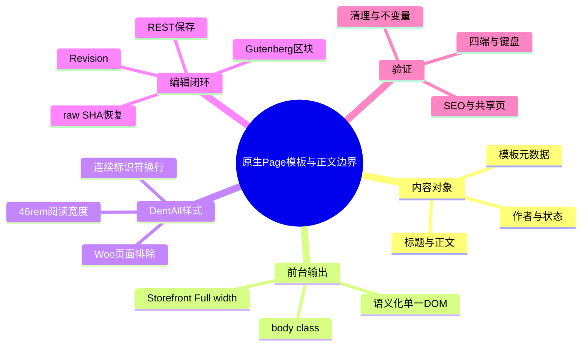
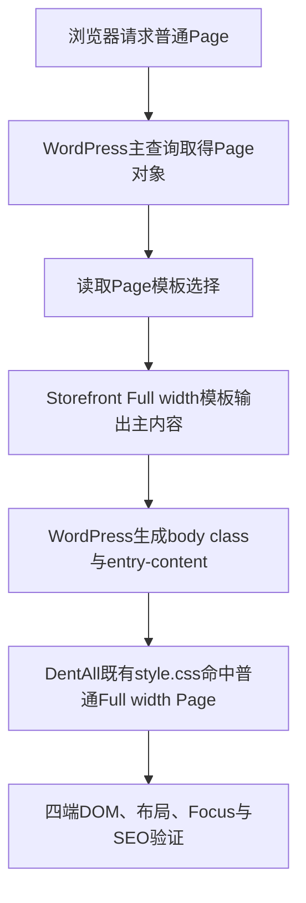
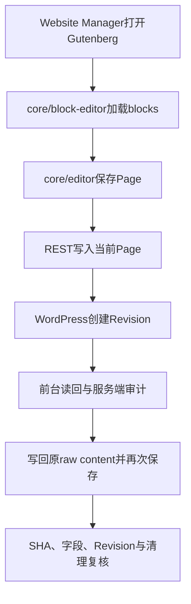

# Day85 WordPress实战：原生Page模板与正文样式边界

## 相关笔记

- 学习索引：[[WordPress实战笔记索引]]
- 对应项目笔记：[[../Day85-通用内容页模板与编辑回归|Day85-通用内容页模板与编辑回归]]
- 前置同主题学习：[[Day28-基础控件状态与CSS级联]]
- 后续学习笔记：Day86形成真实学习笔记后回填

## 今日学习成果

- [x] 我能解释Page数据、Storefront Full width模板和DentAll子主题CSS分别负责什么，并说明为什么D85不需要新建Page模板。
- [x] 我能从模板body class追到`style.css`的局部选择器，判断46rem阅读宽度与安全换行为什么不会覆盖WooCommerce Page。
- [x] 我能区分Gutenberg区块语义、规范序列化字符串和数据库raw content，并用REST、前台、修订与SHA-256完成保存和精确恢复验证。

## 真实项目场景

### 今天解决了什么问题

D85要为About、政策和普通长文提供可维护的前台骨架。Storefront已经有原生Page与Full width模板，DentAll也已有标题、链接、按钮、表单、容器和Focus Token；真正缺口只有宽屏正文过长和连续标识符可能撑开内容区。如果因为“内容页”三个字就复制模板、增加CSS资源或建立通用框架，会把一个展示问题扩大为新的维护层。

### 学习范围

- 本篇要掌握：Page模板选择、父子主题职责、body class作用域、正文measure、连续文本换行、Gutenberg保存与修订恢复。
- 本篇明确不展开：正式About/政策文案、博客列表、表单、法律内容、真实设备辅助技术、Staging和Production发布。
- 项目中的真实样式入口：Storefront的`Storefront::child_scripts()`自动把`app/public/wp-content/themes/dentall/style.css`注册为`storefront-child-style`；`app/public/wp-content/themes/dentall/inc/setup.php`只加载`site-shell.css`等额外资源，本日没有修改它。
- 验证版本与环境：WordPress 7.1、WooCommerce 11.0.0、Storefront 4.6.2、DentAll 0.43.0、PHP 8.2.29，仅隔离Local。

## 先建立整体模型

### 一句话模型

WordPress保存“这是什么内容”，Storefront决定“用什么Page结构输出”，DentAll只补“怎样在四端可读”，Gutenberg和修订系统负责“怎样安全编辑并恢复”。

### 记忆宫殿：图书馆阅读室

把一张Page想成一本书：数据库保存书的正文和书名；Storefront Full width模板是无侧栏阅读室；DentAll CSS决定书桌宽度和长单词怎样折行；Gutenberg是编辑台；Revision是每次正式保存留下的历史版本。更换书桌宽度不应重写整本书，也不应改造图书馆建筑。

### 比喻对应回真实机制

| 记忆对象 | 真实技术对象 | 不能混淆的边界 |
|---|---|---|
| 一本书 | `page`类型的Post对象 | 内容事实不属于模板或CSS |
| 无侧栏阅读室 | Storefront `template-fullwidth.php` | Full width表示移除侧栏，不等于正文无限宽最易阅读 |
| 书桌宽度 | 子主题普通Page的`max-width` | 不应覆盖首页、商品、Cart等不同布局 |
| 编辑台 | Gutenberg `core/block-editor`与`core/editor` | 浏览器显示状态不能替代服务端保存结果 |
| 历史版本 | WordPress Revision/autosave | Revision不是整库备份，也不自动恢复模板、作者等所有字段 |

## 思维导图



最重要的主干是：先复用平台输出，再让子主题只修实测展示缺口，最后用服务端数据和共享页面回归证明边界。

## 请求与生命周期调用链

### 前台读取



### 后台编辑



- 触发条件：普通原生Page选择Storefront Full width模板；后台用户具备编辑该Page的Capability。
- 加载入口：父主题Page模板与子主题既有`style.css`；没有D85专属资源请求。
- 输入数据：Page标题、正文blocks、作者、状态、Slug、模板元数据。
- 输出或副作用：前台HTML/CSS；后台正式保存会修改Page并创建Revision，Preview使用autosave。
- 可观察证据：body class、Computed Style、REST正文、前台文本、Revision列表、数据库SHA-256和最终不变量。

## 核心概念卡

| 概念 | 准确定义 | DentAll真实例子 | 常见误区 | 如何验证 |
|---|---|---|---|---|
| 原生Page | WordPress内置`page`内容类型 | short、long、empty三类TEST样本 | 为每类文案新建CPT | 后台类型、REST与模板输出 |
| Page Template | 单个Page选择的展示模板 | Storefront Full width | 把模板当作正文数据源 | 模板字段、body class、无侧栏DOM |
| 阅读宽度 | 长文正文适合阅读的行宽限制 | 普通Page文章最大46rem | Full width就让文字占满容器 | 1024/1440计算宽度与截图 |
| 固有最小宽度 | 内容在Flex/Grid等布局中拒绝继续收缩的下限 | 连续标识符可能撑开内容区 | 只看外层`overflow:hidden` | `scrollWidth`、长token与Computed Style |
| Gutenberg规范序列化 | 将blocks重新输出为规范区块标记 | 嵌套列表的空白与排版会被规范化 | 语义相同就认为字节SHA相同 | 比较raw SHA与规范序列化SHA |
| Revision | 正式保存形成的Post历史版本 | 标记保存与原文恢复各产生一条 | Revision等于完整数据库备份 | 服务端修订计数、内容哈希与作者 |

## 项目实战代码

### 涉及文件

- `app/public/wp-content/themes/dentall/style.css`：主题元数据、既有Token及D85两个普通Page局部规则。
- Storefront的`Storefront::child_scripts()`：自动加载子主题主`style.css`；仅作父主题加载机制核对，没有修改第三方文件。
- `app/public/wp-content/themes/dentall/inc/setup.php`：加载`site-shell.css`等额外或条件资源；本日确认无需新增资源或条件分支，运行差分为0。
- Storefront父主题的Full width Page模板：输出既有Page结构；仅作运行依赖读取，没有修改第三方文件。

### 从入口开始追踪

1. Website Manager在Page属性中选择现有Full width模板。
2. WordPress保存模板元数据，前台模板查找交给Storefront处理。
3. Storefront输出主内容并让WordPress生成`.page-template-template-fullwidth`等body class。
4. DentAll的`style.css`依靠body class、Page文章类型和Woo排除条件命中目标页面。
5. 浏览器以同一套DOM在四个宽度渐进布局；本日没有按设备复制页面。

### 关键代码片段

以下为`style.css`中的D85真实最小规则：

```css
.page-template-template-fullwidth:not(.woocommerce-page) .site-main > article.type-page {
	max-width: 46rem;
	margin-inline: auto;
}

.page-template-template-fullwidth:not(.woocommerce-page) .entry-content {
	min-width: 0;
	overflow-wrap: anywhere;
}
```

| 代码 | 表面动作 | WordPress中的真实作用 | 为什么这样写 |
|---|---|---|---|
| `.page-template-template-fullwidth` | 选择一种body class | 只在选择Full width模板时生效 | 不为所有Page强加长文布局 |
| `:not(.woocommerce-page)` | 排除Woo页面 | 保护Cart等使用Page容器的Woo入口 | 内容页规则不能改变交易页面布局 |
| `article.type-page` | 锁定Page文章 | 不命中Post、Product或归档 | 用平台语义限定职责 |
| `max-width: 46rem` | 缩窄正文列 | 解决宽屏每行字符过多 | 使用相对字体单位，随根字体缩放 |
| `overflow-wrap: anywhere` | 允许长串断行 | 连续标识符参与最小宽度计算 | 避免页面级横向滚动而不裁掉内容 |

### 为什么没有新建CSS文件

最终运行差分只有`style.css`的13行插入、1行删除，其中包含版本升至0.43.0这一项主题元数据、2个规则块和4条CSS声明。规则与基础正文Token同生命周期，且所有普通Page本来就由Storefront自动加载子主题主样式；新建资源会额外增加文件、版本、enqueue条件和请求，却没有独立测试或替换价值。减法审查因此移除了内容页专属资源候选，最终新增运行文件、函数、资源和模板均为0。

### 运行证据

- 代表样本：short、long、empty三类TEST Page；正式内容没有进入运行时。
- 综合回归：四端及共享页面616/616，Gutenberg编辑67/67。
- 编辑结果：临时标记保存后可由REST和前台读回；最终轮修订4→6，原文SHA-256精确恢复。
- Review：P0/P1/P2/P3均为0。
- 证据限制：只证明当前隔离Local版本与代表样本，不证明真实设备、屏幕阅读器、Staging、Production或正式内容。

## Gutenberg原文与规范序列化

### 为什么两个SHA-256都可能“正确”

Page的数据库raw content包含区块注释、HTML和原始空白。Gutenberg加载后把它解析成blocks，再序列化时会按当前版本规则规范嵌套列表等标记。D85中原始raw SHA-256与规范序列化SHA-256不同，但区块数量与语义一致。

因此本日采用两种判定：

1. **编辑器语义判定**：`serialize(getBlocks())`必须等于`serialize(parse(serverRaw))`，证明编辑器加载了同一组blocks。
2. **精确恢复判定**：最终服务端raw content必须回到测试前SHA-256，证明测试没有把规范化差异永久写入当前Page。

### 保存与恢复顺序

1. 通过REST `context=edit`读取服务端raw content并记录SHA-256。
2. 用`core/block-editor`在正文末尾插入明确TEST段落。
3. 用`core/editor`正式保存，以REST正文和前台读回确认标记确实落盘。
4. 通过编辑器数据层写回原raw content并再次保存。
5. 重新加载编辑器，验证clean状态；再由服务端审计正文SHA、字段、Revision和菜单/SEO不变量。
6. 无论浏览器中途成功或失败，finally恢复和隔离服务端审计都必须执行；浏览器失败时另有只针对当前隔离Page的原文兜底。

测试过程中曾发现“保存后立即要求修订总数增加”会被autosave替换语义误导。最终判断改为：保存成功看REST正文和前台读回，完整修订增量看流程结束后的服务端审计。这是测试Oracle修正，不是放宽产品验收。

## 职责边界

| 层级 | 本主题中负责什么 | 不应该负责什么 |
|---|---|---|
| WordPress Core | Page数据、模板字段、body class、REST、autosave和Revision | 不修改核心文件，不把Revision当整库备份 |
| WooCommerce | 标识Woo页面并维持既有商城结构 | 不让普通内容页规则改写交易流程 |
| Storefront父主题 | 提供Full width模板和Page HTML骨架 | 不直接修改父主题文件 |
| DentAll子主题 | 复用Token，限制普通Page阅读宽度与长串换行 | 不复制Page模板，不承载正式内容事实 |
| `dentall-core` | 本日无职责和运行差分 | 不为纯展示CSS增加业务模块 |
| 数据库 | 保存隔离TEST Page、autosave和Revision | 不把隔离TEST对象迁移为正式数据 |
| 浏览器 | 验证DOM、布局、键盘、资源和编辑交互 | 不以页面看起来正确代替服务端数据审计 |

## Hook、API与模板机制详解

| 项目 | 说明 |
|---|---|
| 机制类型 | Page Template、body class、既有Style Enqueue、Gutenberg Data Store、REST、Revision |
| 模板入口 | Storefront现有Full width Page模板 |
| 模板选择数据 | WordPress保存的Page模板字段；D85没有新建字段 |
| CSS注册位置 | 子主题既有主样式加载；本日没有新增enqueue |
| CSS影响范围 | Full width、非WooCommerce、`article.type-page`及其`.entry-content` |
| 编辑入口 | `core/block-editor`管理blocks，`core/editor`保存当前Page |
| 服务端验证入口 | Page REST edit context、前台请求、WordPress Revision和最终数据库审计 |
| 移除方式 | 回退`style.css`的D85两个规则块及主题版本；无需删除模板或资源注册 |

## 安全、数据与站点影响

| 检查面 | 本次结论 | 证据或待验证项 |
|---|---|---|
| 输入清洗与验证 | 运行代码没有新增输入入口 | Gutenberg仍使用WordPress原生保存链 |
| Capability | Website Manager唯一角色为`dentall_website_manager`，可编辑目标Page且无`manage_options` | 服务端硬审计与浏览器用户ID一致 |
| Nonce | 使用WordPress后台与REST原生Nonce | Nonce不替代Capability；未记录Nonce值 |
| 输出转义 | 没有新增PHP输出 | 继续由WordPress/Storefront输出正文 |
| 数据库写入 | 仅隔离Local的TEST Page、autosave和Revision；最终夹具及账号删除 | 共享Local八项不变量一致 |
| URL与SEO | 未创建正式URL，不改Yoast、robots、Canonical、Schema、Sitemap或菜单 | Production索引与Canonical待非Local验证 |
| 缓存 | 主题版本升至0.43.0；本日没有部署或清非Local缓存 | 上线时再验证真实缓存键与资源刷新 |
| 支付、物流与订单 | 不进入交易流程；订单和退款保持0 | Action Scheduler pending=5、session基线=1 |
| 部署与回滚 | 未提交、合并、推送或部署；回滚只需撤销单个CSS文件差分 | Staging/Production另行授权 |

## 动手练习

### 练习一：只读观察模板边界

- 目标：判断页面为何命中D85规则。
- 操作：在DevTools检查`body`是否有Full width模板类、是否有`.woocommerce-page`，再定位`.site-main > article.type-page`。
- 通过标准：能从实际DOM解释命中或不命中，而不是只背选择器。

### 练习二：DevTools临时验证阅读宽度

- 目标：理解`rem`正文宽度与外层容器的关系。
- 操作：只在DevTools临时切换文章`max-width`，观察1024与1440px的每行字符和标题换行；刷新后确认临时改动消失。
- 通过标准：能说明应改正文局部规则还是全局容器Token，并且不把DevTools改动当源码交付。

### 练习三：故障推演

- 场景：后台保存后正文语义相同，但SHA-256改变。
- 排查：比较服务端raw、`parse()`后的blocks与重新`serialize()`结果；确认是规范化、真实内容变化还是测试恢复失败。
- 通过标准：能分别给出语义验证和字节级恢复验证，且任何失败都先恢复隔离Page。

## 常见误区与排错顺序

1. 先确认对象真的是原生Page，并读取它选择的模板；不要从截图猜模板。
2. 再检查父主题是否已经输出正确DOM和无侧栏结构；能复用就不覆盖模板。
3. 检查body class、选择器命中和Computed Style，区分容器宽度与正文阅读宽度。
4. 用长标题、长段落、连续标识符和空正文验证真实缺口，不为假设状态加规则。
5. 回归首页和WooCommerce共享Page，确认作用域和资源没有泄漏。
6. 编辑测试先核对角色、Capability和隔离数据库，再执行保存。
7. 保存结果看REST与前台；恢复结果看raw SHA、字段、Revision和最终不变量。
8. 最后删除TEST对象、账号并停止隔离服务；不能只看浏览器窗口已关闭。

## 掌握标准

- 能画出“Page数据→模板→DOM/body class→子主题CSS→浏览器”的完整链路。
- 能说明Full width模板与可读正文宽度不是同一个概念。
- 能解释为什么本次规则放在`style.css`，以及何时才值得拆独立资源。
- 能用真实DOM证明WooCommerce Page没有被普通Page规则覆盖。
- 能解释Gutenberg规范序列化与数据库raw content的差别。
- 能设计保存、前台读回、修订、恢复和清理的有界测试。

## 费曼测试题

1. 为什么已经使用Full width模板，还要限制文章最大宽度？
2. `:not(.woocommerce-page)`解决了什么问题，为什么仍需共享页面回归？
3. `overflow-wrap: anywhere`与简单隐藏横向溢出有什么本质区别？
4. 为什么不为两个CSS规则新建`content-page.css`？
5. 为什么Gutenberg序列化SHA不同不一定意味着内容损坏？
6. 保存成功、修订成功和精确恢复分别应看哪些证据？

### 我的费曼答案与纠正

- Full width负责页面骨架无侧栏，46rem负责长文阅读行长，两者职责不同。
- Woo排除条件缩小选择器作用域；共享页面回归用于发现DOM、级联或资源加载中选择器推理没有覆盖的实际影响。
- `anywhere`让长串参与换行与固有尺寸计算，内容仍可读；隐藏溢出只遮住问题。
- 两个规则与主样式同生命周期，独立文件会增加请求和enqueue分支，没有替换或独立测试价值。
- 解析为blocks再规范序列化可能改变空白和嵌套标记，但区块语义仍相同；若要求字节级恢复，必须以服务端raw SHA另验。
- 保存看REST正文与前台读回，修订看最终服务端Revision，恢复看raw SHA、字段、不变量和当前标记消失。

### 自测评分

- 当前掌握度保留“初识”。本篇答案来自当日实测，但仍需在D+1不看笔记复述并用DevTools重新定位一次后再评分。

## 间隔复习记录

| 复习节点 | 计划日期 | 完成 | 暴露的问题 | 修正位置 |
|---|---|---|---|---|
| D+1 | 2026-09-22 | [ ] | 待复述后填写 | 待填写 |
| D+3 | 2026-09-24 | [ ] | 待复述后填写 | 待填写 |
| D+7 | 2026-09-28 | [ ] | 待复述后填写 | 待填写 |
| D+14 | 2026-10-05 | [ ] | 待复述后填写 | 待填写 |

## 收尾总结

- 我今天真正理解了：模板结构、正文可读性和编辑数据是三个层次，最小实现要让每层只承担自己的职责。
- 我仍然容易混淆：区块语义一致与数据库原始字节一致；以后先声明验收需要哪一种一致性。
- 下次遇到类似问题，我会先检查：平台是否已经有可复用模板、真实缺口是否能由一处低权重局部规则解决，以及编辑测试能否完整恢复。
- 下一篇直接相关学习笔记：Day86开始并产生真实验证后再链接，不提前写成已完成。

## 后续如何向AI高效提问

```text
环境：WordPress、父/子主题版本与Local/Staging范围
目标：复用现有Page模板，解决已测得的正文布局缺口
真实证据：模板字段、body class、DOM、Computed Style、四端几何和共享页面回归
当前差分：文件、规则块、声明和资源数量
编辑证据：角色、REST正文、前台读回、Revision、原文SHA与清理结果
边界：不改核心、不新增正式内容、不触碰非Local

请先区分数据、模板、样式和编辑生命周期，再提出最小方案；把事实、推断、验证与回滚分开。
```

## 变种应用到其他项目

| 新场景 | 保持不变的原则 | 可能变化的实现 | 必须重新确认 | 最小验证 |
|---|---|---|---|---|
| 另一个Storefront子主题 | 先复用父主题Page模板，再补真实缺口 | Token、内容宽度、插件级联 | 版本、body class、模板覆盖 | 代表Page四端与共享Woo页 |
| 其他经典WordPress主题 | 数据、模板、样式分层 | 模板名、Hook和DOM类名 | 父主题公开扩展点 | 模板查找、DOM和Computed Style |
| WordPress区块主题 | 单一语义内容与最小样式边界 | Site Editor、`theme.json`、区块模板 | 当前版本的模板层级 | 前台、编辑器和Global Styles |
| 独立插件 | 只有跨主题长期能力才进入插件 | enqueue、模块生命周期 | 是否真有跨主题需求 | 启停、资源和数据不变量 |
| Shopify或其他平台 | 内容、模板、主题样式和版本历史仍需分责 | Liquid、Section、Theme Editor等机制待验证 | 官方模板与发布模型 | 使用目标平台官方资料和隔离主题复演 |

## 可复用核心思想

### 跨平台不变量

内容对象、展示模板、视觉规则和编辑历史应分层负责。先证明平台默认能力的缺口，再补最小实现；验证既要覆盖目标页面，也要覆盖共享骨架，恢复标准必须区分语义一致和字节一致。

### WordPress/WooCommerce当前实现

在本次隔离Local版本中，WordPress原生Page和Revision承载数据，Storefront Full width模板输出无侧栏结构，DentAll 0.43.0只用主样式中的两个局部规则限制普通Page阅读宽度与长串换行。Gutenberg保存由`core/block-editor`、`core/editor`与REST协作完成；WooCommerce Page由body class排除并通过共享页面回归复核。

### Shopify或其他平台的对应机制

其他平台通常也有内容记录、主题模板、样式资源和版本/预览机制，但字段、模板查找、编辑器序列化与恢复API不会与WordPress一一对应。Shopify具体对应仍待官方资料与独立主题环境验证，本篇只迁移“先复用、再最小修补、最后跨页面与数据恢复验证”的方法，不扩大DentAll实施范围。
