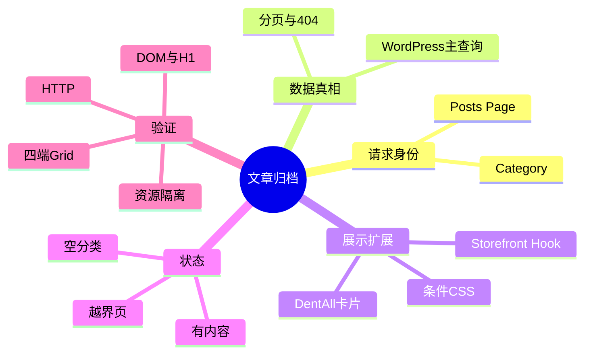
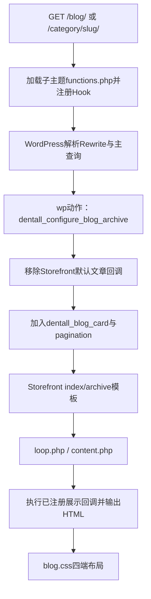

# Day86 WordPress实战：文章主查询与归档Hook边界

> 2026-10-06整合补充：本篇原实现证据来自2026-09-22独立D86源分支（主题0.42.1/Core 0.2.8）。最新主线已含D85、D79和D80，合成源码`12274cd`（主题0.46.0/Core 0.6.0）已重新完成Local回归；源分支证据和新证据分开记录。GitHub与Staging代码部署、完整文件/版本和Blog现场验收完成，覆盖Blog/分类四端、手机/桌面目视、键盘Focus及标准URL。交易缓存与有效报价完整验收未关闭；B后日志已查看，对象缓存notice另列兼容性P2，不据此开放付款或标整批交易Done。详见[[../Day86-D74与D86整合发布记录]]与[[../../PROJECT_STATE|项目当前状态]]。

## 相关笔记

- 学习索引：[[WordPress实战笔记索引]]
- 对应项目笔记：[[../Day86-博客列表分类分页与空状态]]
- 合成验收与发布记录：[[../Day86-D74与D86整合发布记录]]
- 前置学习笔记：无直接编号依赖；D19内容模型是项目事实来源，但本篇只讲前台请求链
- 后续学习笔记：[[Day87-文章详情署名与SEO输出边界]]（沿单篇模板与Yoast输出边界继续；隔离Local技术验证完成，临时副本删除受自动审批拦截）

## 今日学习成果

- [x] 我能解释为什么Blog分页必须复用WordPress主查询，而不是在模板里再建一个查询。
- [x] 我能沿`functions.php → wp → storefront_loop_post → dentall_blog_card()`追踪文章卡片输出。
- [x] 我能在隔离Local用状态码、DOM、样式资源和四端布局验证正常、空和越界状态。

## 真实项目场景

### 今天解决了什么问题

Storefront默认文章循环会输出标题、后台作者、评论、全文/更多链接及taxonomy信息。DentAll需要简洁的列表卡片，但又不能破坏WordPress已经正确处理的主查询、页码、分类、404和SEO上下文，因此只替换展示Hook，不复制整套模板和查询。

### 学习范围

- 本篇要掌握：主查询、经典主题模板层级、Action替换、条件enqueue和分页状态。
- 本篇明确不展开：单篇文章、作者Schema、REST、区块主题模板、Production缓存和SEO放行。
- 项目真实入口：`app/public/wp-content/themes/dentall/inc/blog.php`、Storefront `index.php/archive.php → loop.php → content.php`。
- 验证范围：隔离Local；不写共享Local、Staging或Production。

## 先建立整体模型

### 一句话模型

先让WordPress决定“这页有哪些文章和第几页”，再让子主题决定“每篇文章怎样显示”。

### 记忆宫殿或实体比喻

把归档请求想成图书馆取书：WordPress馆员按URL取出正确的一车书并贴好页码；Storefront提供陈列架；DentAll只更换每本书的展示卡和陈列样式。若DentAll再派一个馆员重新取书，就可能出现页码和书车不一致。

### 比喻对应回真实机制

| 记忆对象 | 真实技术对象 | 不能混淆的边界 |
|---|---|---|
| 馆员和书车 | WordPress主查询`$wp_query` | 它决定posts、max pages和404，不是CSS职责 |
| 陈列架 | Storefront模板与`storefront_loop_post` | 父主题可替换展示点，但不应直接修改其核心文件 |
| 展示卡 | `dentall_blog_card()` | 只输出当前文章，不重新查询整组文章 |
| 页码牌 | `the_posts_pagination()` | 读取当前主查询，不负责决定文章内容 |

## 思维导图



最重要的主干是：请求身份决定主查询，主查询决定循环和分页，子主题只改变展示。

## 请求与生命周期调用链



- 触发条件：`is_home()`或`is_category()`。
- 加载入口：子主题`functions.php` require Blog模块。
- 执行顺序：模块注册Hook；`wp`阶段在条件标签可用后替换父主题回调；模板循环时输出卡片。
- 输入数据：WordPress当前Post对象、Posts Page设置、分类和分页状态。
- 输出副作用：只输出HTML和条件加载CSS；不写数据库、不发远程请求。
- 可观察证据：body class、唯一H1、卡片数量、分页URL、404状态、资源URL。

## 核心概念卡

| 概念 | 准确定义 | DentAll真实例子 | 常见误区 | 如何验证 |
|---|---|---|---|---|
| 主查询 | WordPress为当前请求建立的主要`WP_Query` | `/blog/page/2/`自动得到第2页Post集合 | 模板内再建查询却仍期待核心分页正确 | 比较卡片数、当前页和404 |
| 条件标签 | 描述当前主请求身份的函数 | `is_home()`是Posts Page，不等于网站首页 | 把`is_home()`当静态Front Page | 检查Reading设置与body class |
| Action替换 | 在合适生命周期移除父回调再加入子回调 | `storefront_loop_post` | 优先级/时机不一致导致移除失败 | `has_action()`或页面DOM |
| 条件enqueue | 只在需要页面登记前端资源 | Blog/分类加载`blog.css` | 全站加载页面专用CSS | 检查`document.styleSheets` |

## 项目实战代码

### 涉及文件

- `app/public/wp-content/themes/dentall/inc/blog.php`：归档作用域、Hook与HTML。
- `app/public/wp-content/themes/dentall/assets/css/blog.css`：一套DOM的Mobile First增强。
- `app/public/wp-content/themes/dentall/inc/storefront-hooks.php`：站点Logo不再承担Posts Page H1。

### 从入口开始追踪

1. `functions.php`加载`inc/blog.php`。
2. 主查询完成后触发`wp`；优先级20时父主题已注册回调且条件标签可用，DentAll移除默认文章Header/Content/Taxonomy和默认分页。
3. 进入父主题模板后，`wp_head`阶段触发`wp_enqueue_scripts`，仅在Blog归档登记CSS；这晚于`wp`，早于正文循环输出。
4. Storefront循环每个`article.hentry`时调用`dentall_blog_card()`。
5. 循环结束调用核心`the_posts_pagination()`，读取同一个主查询。

### 关键代码片段

源自`inc/blog.php`，展示最小Hook替换边界：

```php
if ( ! dentall_is_blog_archive() ) {
	return;
}

remove_action( 'storefront_loop_post', 'storefront_post_content', 30 );
add_action( 'storefront_loop_post', 'dentall_blog_card', 10 );
```

| 代码 | 表面动作 | WordPress中的真实作用 | 为什么这样写 |
|---|---|---|---|
| 条件提前返回 | 限定页面 | 防止影响单篇、搜索和其他归档 | 缩小公共Hook风险面 |
| `remove_action` | 移除父输出 | 保留父模板外壳但取消全文流 | 避免模板复制 |
| `add_action` | 注册子输出 | 在当前Post上下文生成卡片 | 不创建第二查询 |

### 运行证据

- 页面：`/blog/`、第2页、文章分类、空分类和第99页。
- 正常结果：每页4张，四端1/2/3/3列，有图与缺图共存，分页目标至少44px。
- 边界结果：空分类200且有`no-results`；越界分页404且有`error404`。
- 能证明：当前代码、版本、隔离数据和Chrome组合下的主查询/展示合同成立。
- 不能证明：正式内容质量、真实读屏器、Production Canonical、CDN缓存和非Local兼容。

## 职责边界

| 层级 | 本主题中负责什么 | 不应该负责什么 |
|---|---|---|
| WordPress Core | URL解析、Post主查询、分页、条件标签和404 | 不修改核心文件 |
| WooCommerce | 本页无文章查询职责；只参与全站壳层 | 不把Post归档伪装成Product归档 |
| Storefront父主题 | 模板框架和循环Hook | 不直接修改父主题源码 |
| DentAll子主题 | 卡片、H1、条件资源和响应式样式 | 不承载后台作者治理或跨主题业务数据 |
| `dentall-core` | 本次无职责 | 不放纯展示代码 |
| 数据库与媒体 | 保存Post、分类、摘要、特色图 | 不把隔离TEST数据当正式内容 |
| 浏览器 | 解析DOM/CSS、Focus和响应式布局 | 不决定服务端主查询或状态码 |

## Hook、API或模板机制详解

| 项目 | 说明 |
|---|---|
| 机制类型 | Action、Template Hierarchy、Enqueue |
| 名称或入口 | `wp`、`storefront_loop_before`、`storefront_loop_post`、`storefront_loop_after` |
| 注册位置 | `inc/blog.php` |
| 优先级 | 配置在`wp` 20；卡片10；分页10；标题5 |
| 回调输入 | 主要通过当前主查询和全局Post上下文读取 |
| 返回 | Action回调不返回修改值，直接登记资源或输出HTML |
| 副作用 | 前台输出和CSS队列；无数据写入 |
| 影响范围 | Posts Page和Category前台请求 |
| 移除方式 | 删除模块require或对应`remove_action`/`add_action`注册，并刷新页面验证父主题默认输出恢复 |

## 安全、数据与站点影响

| 检查面 | 本次结论 | 证据或待验证项 |
|---|---|---|
| 输入清洗与验证 | 无自定义输入 | URL由WordPress解析 |
| Capability / Nonce | 不适用 | 无后台动作或写操作 |
| 输出转义 | URL、属性、标题、日期、摘要均按上下文转义；分类列表经`wp_kses_post` | PHP静态审查 |
| 数据库写入 | 运行代码无 | TEST fixture只在隔离副本 |
| URL与SEO | URL不变；唯一H1与页码标题通过 | Production Canonical/robots待D92 |
| 缓存 | 条件CSS带主题版本 | 2026-10-06主题0.46.0/Core 0.6.0已部署；一次Breeze清缓存后标准Blog/分类输出新版通过，未改策略；交易页整页缓存与对象缓存兼容性P2分开核实，公开归档通过不能外推交易隔离 |
| 支付、物流与订单 | 不适用 | 无交易代码 |
| 部署与回滚 | D86增量没有数据迁移；回退须针对本批次明确文件清单，不覆盖主线已有能力 | 2026-10-06基线已含D85；GitHub与Staging代码部署及Blog现场验收完成，交易缓存/有效报价完整验收未关闭；A下载覆盖predeploy目录，恢复副本边界以发布记录为准 |

## 动手练习

### 练习一：只读观察

- 目标：识别当前页是否使用Blog主查询。
- 操作：在浏览器查看body class、H1、卡片数、分页`aria-current`和响应状态。
- 预期：Blog/Category有`dentall-blog-archive`，其他页面没有。
- 实际证据：四端脚本与8条路由通过。

### 练习二：Local最小改动

- 改动：在DevTools临时调整`.site-main` gap。
- 风险边界：只改浏览器临时状态，不改数据库和非Local。
- 验证：四个宽度检查列数与溢出。
- 回滚：刷新页面即可；若写回源码则用Git diff精确还原该声明。

### 练习三：故障推演

- 假设症状：分页有数字但点击区域小。
- 可能原因：CSS假设了错误的`ul/li`结构。
- 第一项检查：Elements查看实际`.navigation.pagination` DOM。
- 为什么先查它：选择器不匹配时继续调尺寸值没有意义；D86首轮正是通过此顺序定位并修复。

## 常见误区与排错顺序

| 现象或误区 | 可能原因 | 推荐检查顺序 | 最小验证方法 |
|---|---|---|---|
| Blog没有唯一H1 | Logo被当H1或Posts Page标题未输出 | H1列表→Header品牌标记→内容Hook | `document.querySelectorAll('h1')` |
| 页码不正确 | 第二查询或每页数不一致 | 状态码→主查询→DOM current→URL | 第1/2/99页对照 |
| CSS泄漏到Shop | enqueue条件过宽 | stylesheet列表→body class→PHP条件 | Shop检查无`blog.css` |
| 空分类标题重复 | 自定义Header与父空态同时输出 | `have_posts()`→`content-none.php` | 空分类统计H1 |

## 掌握标准

- [ ] 不看笔记，能在2分钟内讲清整体因果链。
- [x] 能指出项目中的真实入口文件、Hook或模板。
- [x] 能区分WordPress核心、父主题和子主题职责。
- [x] 能说明正常、空分类和越界404路径。
- [x] 能在隔离Local完成最小验证并说明回滚。
- [x] 能判断对数据、URL、SEO、缓存和交易的影响。

当前掌握度：初识，待用户本人完成费曼自测后更新。

## 费曼测试题

1. 为什么在`home.php`里再创建一个`WP_Query`容易让分页和404失真？
2. `is_home()`与网站首页是什么关系，DentAll当前Reading设置下各指向哪里？
3. 从`/blog/page/2/`请求开始，谁决定文章集合，谁决定卡片HTML，谁决定CSS列数？
4. 为什么要在`wp`阶段移除Storefront回调，而不是修改父主题`content.php`？
5. 空分类为什么不输出自定义Blog Header，它如何保持唯一H1？
6. 条件enqueue能降低什么风险，又不能证明什么性能结论？
7. 换成区块主题或Shopify时，哪些原则可迁移，哪些Hook必须重新验证？

### 我的费曼答案与纠正

待用户本人作答；任何0分题回到本篇调用链、概念卡和排错章节复习。

### 自测评分

总分：待填写 / 14。存在0分题时不提升掌握度。

## 间隔复习记录

| 复习节点 | 计划日期 | 完成 | 暴露的问题 | 修正位置 |
|---|---|---|---|---|
| D+1 | 2026-09-23 | [ ] | 待填写 | 待填写 |
| D+3 | 2026-09-25 | [ ] | 待填写 | 待填写 |
| D+7 | 2026-09-29 | [ ] | 待填写 | 待填写 |
| D+14 | 2026-10-06 | [ ] | 待填写 | 待填写 |

## 收尾总结

- 我今天真正理解了：主查询与展示Hook可以分层，最小改动不等于复制模板。
- 我仍然容易混淆：`is_home()`、`is_front_page()`和普通Archive的请求身份。
- 下次遇到类似问题，我会先检查：真实模板链、实际DOM和是否存在第二查询。
- 下一篇直接相关学习笔记：[[Day87-文章详情署名与SEO输出边界]]；单篇公开署名与 SEO 输出接续本篇归档 Hook 边界。

## 后续如何向AI高效提问

可提供：WordPress/父主题版本、Reading设置、目标URL、当前模板链、相关Hook、实际DOM、状态码、主查询页数、不能触碰的数据与部署边界，并要求把事实、推断和待验证项分开。

## 变种应用到其他项目

| 新场景 | 保持不变的原则 | 可能变化的实现 | 必须重新确认 | 最小验证 |
|---|---|---|---|---|
| 另一个Storefront子主题 | 单一主查询、条件资源、唯一H1 | 品牌Token和卡片字段 | Storefront版本与已挂回调 | 正常/空/404三路 |
| 其他经典主题 | 主查询与模板职责分离 | Hook名称或模板覆盖 | 主题扩展点 | 模板链＋分页 |
| WordPress区块主题 | 单一数据真相和语义层级 | Query Loop块、模板HTML、`theme.json` | 当前核心版本 | Site Editor与前台对照 |
| 独立插件 | 不重复查询与严格作用域 | 插件加载和主题兼容层 | 是否跨主题长期存在 | 切换主题验证 |
| Shopify | 列表/分页/空态原则 | Liquid blog模板和分页对象 | 主题与平台官方API，待验证 | 预览主题多页检查 |

## 可复用核心思想

### 跨平台不变量

路由、数据集合、分页状态和展示布局应分层；一个页面只有一个权威数据集合，正常、空和越界状态必须共享同一规则来源。

### WordPress/WooCommerce当前实现

WordPress 7.0.4主查询负责Post集合与页码，Storefront 4.6.2提供经典模板和循环Action，DentAll 0.42.1只在`is_home()`/`is_category()`范围替换输出并条件加载CSS。

### Shopify或其他平台的对应机制

相似目标通常由平台Blog模板、集合对象和分页组件承担，但具体Liquid对象、SEO标签和主题扩展点尚未在DentAll验证，必须标记为待验证，且不进入第一版实施范围。
