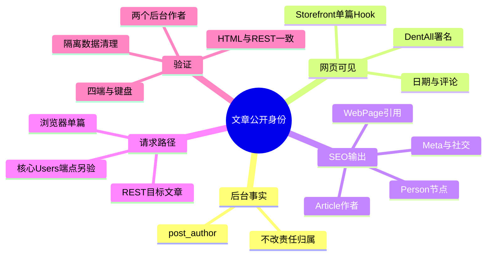
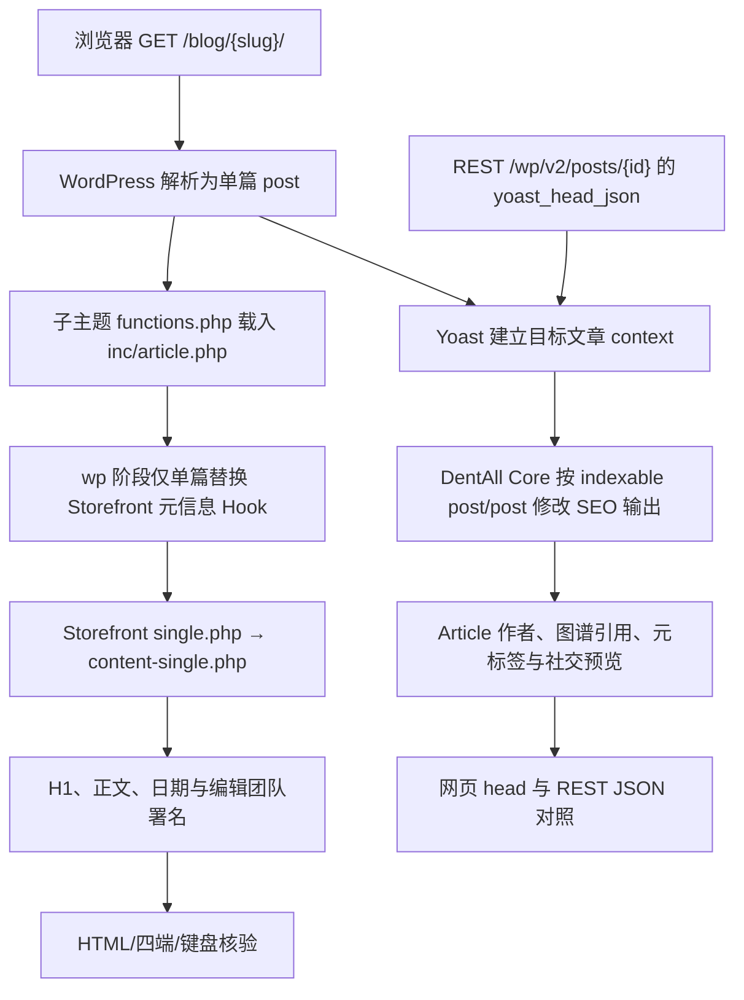

# Day87 WordPress实战：文章详情署名与SEO输出边界

## 相关笔记

- 学习索引：[[WordPress实战笔记索引]]
- 对应项目笔记：[[../Day87-文章详情与公开署名]]
- 前置学习笔记：[[Day86-文章主查询与归档Hook边界]]
- 同主题项目决策：[[../../DECISIONS|ADR-017]]
- 后续学习笔记：有直接依赖的学习笔记形成后再补

## 今日学习成果

- [x] 能沿 Storefront 单篇模板与 Hook 找到后台作者名称原本出现的位置。
- [x] 能解释可见署名、`post_author`、Yoast Article `author`、社交元标签是不同输出面，必须逐项核对。
- [x] 能按两篇不同后台作者样本，分别核对 HTML、Yoast REST、四端布局、键盘与编辑保存后的前台读回。
- [x] 能核对隔离服务关停、TEST文章删除与临时副本残留；预览与 autosave 路径仍待验证。

## 真实项目场景

### 今天解决了什么问题

DentAll 的后台 `post_author` 继续记录实际编辑责任，但 ADR-017 要求前台文章统一显示 `DentAll Editorial Team`。Storefront 默认单篇元信息会公开后台作者并链接至已关闭的作者归档；Yoast 28.2 默认 Article 图谱和部分元标签也可能读取同一后台账号。只改页面上的文字，会留下网页源代码或 REST SEO 预览中的身份不一致。

### 学习范围

- 本篇掌握：Storefront 单篇 Hook 替换、Yoast 目标文章上下文、Schema 图谱节点及 HTML/REST 两条 SEO 输出路径。
- 本篇不展开：新作者内容类型、作者归档、自动相关文章、目录、社交分享按钮、真实内容发布、非 Local 上线。
- 真实入口：`app/public/wp-content/themes/dentall/functions.php`、`inc/article.php`、`style.css`，以及 `app/public/wp-content/plugins/dentall-core/includes/seo-compatibility.php`。
- 依赖源码核对：Storefront 4.6.2 的 `single.php`、`content-single.php`、`inc/storefront-template-hooks.php`、`inc/storefront-template-functions.php`；Yoast SEO 28.2 的 `src/generators/schema/article.php`、`author.php`、`src/generators/schema-generator.php` 与 `src/routes/yoast-head-rest-field.php`。这些第三方文件只读。

## 先建立整体模型

### 一句话模型

文章只有一个后台归属事实，但模板、Schema 和元标签有多条公开出口；公开身份统一时，要在本次约定的每条出口使用同一编辑团队名称。WordPress 核心 REST 的用户资源另有披露边界，不能由 Yoast 输出一致推断为匿名。

### 记忆宫殿与真实映射

把文章想成出版社的一篇稿件：稿件档案保留实际经办编辑；杂志版面印编辑部署名；配送给检索和分享平台的资料卡也印同一署名。换版面上的署名不会自动改资料卡，修改资料卡也不应抹掉档案里的责任人。

| 记忆对象 | 真实技术对象 | 边界 |
|---|---|---|
| 稿件档案 | WordPress Post 的 `post_author` | 后台责任归属，不因公开署名改变 |
| 杂志版面 | Storefront 单篇模板与 DentAll 子主题 byline | 负责可见 HTML，不负责 Yoast Schema |
| 检索资料卡 | Yoast Article、Author、WebPage 图谱 | JSON-LD 是独立输出，需检查节点和引用 |
| 分享资料卡 | Yoast `author`、Open Graph、Twitter、Slack 输出 | 可见 HTML 正确不能证明分享输出正确 |
| 同一目标稿件 | Yoast `Meta_Tags_Context` 的 indexable 类型 | REST 按文章 ID 生成时不能只看当前浏览器主查询 |

比喻的限制：WordPress 不会自动把“公开署名”存成统一权威字段；当前项目只在约定的输出点呈现固定编辑团队身份，日后若业务要求逐篇署名，需要重新确认数据模型。

## 思维导图



主干是：先区分后台事实和公开输出，再按目标文章上下文统一所有公开出口。

## 请求与生命周期调用链



- `wp` Action 发生在主查询已建立后；子主题只在 `is_singular( 'post' )` 时移除 Storefront 的 `storefront_post_meta`，并在标题后的 Hook 放置公开署名。
- `single.php` 仍由 Storefront 提供，`content-single.php` 仍调用 `storefront_single_post` 和 `storefront_single_post_bottom`；H1、正文、特色图、相邻文章导航及评论沿父主题原路径输出。
- Yoast 的 REST 字段按目标 Post ID 生成 `yoast_head` 与 `yoast_head_json`。这个路径不应依赖当前请求的 `is_singular()`；Core 过滤器据 `$context->indexable->object_type/object_sub_type` 判断目标是否为原生 Post。
- 署名与 SEO 过滤器不会改写 `post_author`、Post 内容或 SEO 数据库配置；编辑器可逆测试另行保存并恢复标题，已复核两篇后台 `author` ID 不变。隔离服务已关停、TEST文章已删除；临时WordPress/数据库副本因自动审批拦截仍保留。

## 核心概念卡

| 概念 | 准确定义 | DentAll 真实例子 | 最小验证 |
|---|---|---|---|
| Action | 在执行点调用回调，主要产生副作用或输出 | `wp` 阶段调整 `storefront_post_header_before/after` | 检查单篇 DOM，归档应不受影响 |
| Filter | 接收并返回待输出的数据 | `wpseo_schema_article` 改 Article 的 `author` | 解析 JSON-LD 的 Article 节点 |
| 图谱节点与引用 | JSON-LD 中有 `@id` 的对象及其他节点对它的引用 | 移除后台 `Person` 时也检查 WebPage `author` | 解析全图谱，查悬空引用和后台姓名 |
| 目标上下文 | Yoast 当前生成 SEO 数据所针对的对象 | REST 可按 Post ID 生成，和浏览器主查询不同 | 对比网页 head 与 REST `yoast_head_json` |
| 公开署名 | 面向读者的编辑团队身份 | `DentAll Editorial Team` | 同时检查可见 byline、Schema 和元标签 |

## 项目实战代码

### 文件职责与真实片段

`inc/article.php` 中的 Hook 替换节选：

```php
if ( ! is_singular( 'post' ) ) {
	return;
}
remove_action( 'storefront_post_header_before', 'storefront_post_meta', 10 );
add_action( 'storefront_post_header_after', 'dentall_article_byline', 10 );
```

移除动作必须在 Storefront 注册默认回调之后、模板执行之前发生；`wp` 阶段满足这一时序。`dentall_article_byline()`使用 WordPress 日期 API、国际化函数和按上下文转义，只在评论开放或已有评论时保留评论入口。它不输出作者归档链接。

`seo-compatibility.php` 中的目标判断与 Article 作者节选：

```php
return isset( $context->indexable->object_type, $context->indexable->object_sub_type )
	&& 'post' === $context->indexable->object_type
	&& 'post' === $context->indexable->object_sub_type;

$data['author'] = array(
	'@type' => 'Organization',
	'@id'   => trailingslashit( $site_url ) . '#editorial-team',
	'name'  => __( 'DentAll Editorial Team', 'dentall-core' ),
);
```

第一段判断 Yoast 正在生成哪种对象的 SEO 输出；第二段把 Article 的作者声明为固定编辑团队身份。Core 同时在单篇目标上下文移除后台作者 `Person` 节点与 WebPage 对它的引用，并处理 `author` 元标签、Open Graph/Twitter 个人账号及 Slack 的 `Written by` 字段。Yoast 原有 Article 日期、图片、publisher 和其他图谱部分由插件继续生成；不要把上述节选误读成重建整张 Schema。

`style.css` 当前局部规则把 `.single-post .site-main` 限制为 46rem 阅读行宽，署名用可换行 Flex 排列；没有复制四套文章 DOM。它只属于展示层，不能修正错误 Schema。

### 运行证据与未验边界

- **作者输出**：两篇后台作者不同的 TEST Post，网页 HTTP 与 Yoast REST 均为 200；可见 byline、`meta name="author"` 和 Slack `Written by` 使用编辑团队署名。Article `author` 为编辑团队 `Organization`，后台作者 `Person` 节点为 0，WebPage 无悬空作者引用。公开 SEO 输出与后台 `post_author` 分离。
- **社交负分支**：隔离 Local 原有品牌 Twitter site/creator 均为 `@dentall`；临时触发`site_represents=false` 的负分支后，WebPage仍无悬空作者引用，随后恢复原配置。这只证明当前 Yoast 配置与代表样本的输出。
- **正文与响应式**：390/768/1024/1440px 的正文实测宽度为 350/704/736/736px；长文、表格、270 字符连续串、缺图和有图状态无页面横向溢出。特色图测试可逆并已恢复；空正文与不存在的文章 URL 分别核验，后者维持 404。
- **交互与编辑**：键盘检查覆盖 Skip Link、正文内链、Next 文章与评论入口，焦点轮廓为 3px。Website Manager 在 Gutenberg 临时修改并保存TEST标题，公开页面读回成功，再恢复原题；两篇 Post 的后台 `author` ID 未变。
- **已实测的范围限制**：匿名请求 `/wp-json/wp/v2/users/2` 与 `/wp-json/wp/v2/users/3` 均返回 HTTP 200，响应包含后台显示名和作者归档链接。D87 的“REST 一致”仅指目标 Post 的 Yoast `yoast_head` / `yoast_head_json` 公开署名，不代表 WordPress 核心 Users 端点或 Post 的原生 `author` ID 已隐藏；本次没有治理这些端点，已登记 RSK-057/P2，后续另行确认治理范围和方案。
- **清理与仍待验**：两篇TEST Post已删除，一次性凭据文件已清空，隔离HTTP/MySQL服务与17871/17872监听均为0。自动审批两次拒绝递归`Remove-Item`删除Git忽略目录中的临时`public`和`mysql-data`，仅返回`blocked by policy`、未给更具体原因；副本留在`.codex-tmp/d87-local/`，未绕过拒绝。Blog/Page四端已回归；商品页、预览/autosave、Staging、Production、真实设备和公开索引仍未验。上述已通过项仅能证明隔离Local的代表样本。

## 职责与安全边界

| 层级 | 本次职责 | 不跨越的边界 |
|---|---|---|
| WordPress Core | Post、`post_author`、主查询、日期、评论、REST | 不改核心或后台作者事实 |
| Storefront | 单篇结构、H1、正文、导航和评论 Hook | 不改父主题文件 |
| DentAll 子主题 | 可见 byline 和单篇局部布局 | 不承载跨主题 SEO 规则 |
| `dentall-core` | 公开作者的 Yoast SEO 输出一致性 | 不重写整个插件图谱或数据模型 |
| Yoast SEO | 生成 Title、Meta、Schema、社交与 REST SEO 字段 | 插件停用后这些输出契约需重新评估 |
| WooCommerce | 本次无文章业务逻辑职责 | 不触碰商品、订单、支付、物流 |

新增 byline 的动态日期、评论链接和文本分别按属性、URL、HTML 文本上下文转义；本次没有新表单、权限入口、Nonce、SQL 或数据库写入逻辑。作者相关 SEO 输出会变，文章 URL、作者归档关闭策略、缓存配置、支付和物流配置不由本次代码修改。后台作者 ID 仍属于 Post 原生数据，匿名 Users 端点披露属独立安全边界；不能将“前台不显示作者归档链接”理解为“作者身份无法从其他公开接口取得”。部署后的缓存刷新与真实 SEO 输出必须在目标环境另验，不能把隔离 Local 的结果当作线上结论。

## 动手练习与排错

1. **只读观察**：在 Storefront 源码按 `single.php → content-single.php → storefront_post_header → storefront_post_meta` 追踪 H1、元信息、正文和底部导航；对照 DentAll `wp` Hook 后，解释哪一处改变公开署名。
2. **隔离 Local 最小改动**：两篇 TEST Post 分别归属不同后台用户，读取页面源代码和 REST `yoast_head_json`，逐项检查公开作者；Website Manager 完成 Gutenberg 标题保存、公开读回与原题恢复，后台 `author` ID 不变。特色图测试已恢复，TEST文章和服务已清理；临时副本删除受自动审批拦截。
3. **故障推演**：若网页 byline 正确而 REST 仍有后台作者，先确认目标对象的 `context->indexable`，再检查各过滤器是否接收到所需上下文，最后比较 HTML 与 REST 的 Yoast 字段。不要先改 `post_author`，否则会掩盖公开层缺口并改变后台责任归属。

| 现象 | 优先检查 | 原因 |
|---|---|---|
| 单篇仍显示后台作者链接 | `wp` 回调是否执行；Storefront 默认 Action 是否仍挂载；模板是否改变 | 可见输出属于主题 Hook |
| Article 正确但 JSON-LD 还有后台 Person | Author 图谱过滤器、WebPage 引用及整个 `@graph` | 只改 Article 子节点不足以删除另一节点 |
| 网页正确而 REST 不一致 | 是否误用 `is_singular()`、Yoast 目标上下文和 REST 字段 | REST 按对象生成 SEO 输出 |
| 社交卡片出现个人账号 | `meta author`、Open Graph、Twitter、Slack 分别核对 | 这些由不同 presenter/过滤器生成 |
| 样式在商品页泄漏 | `.single-post` 作用域和共享页面回归 | 视觉规则不能仅靠单篇截图验收 |

## 掌握标准与费曼测试

- [ ] 不看源码，能复述后台作者与公开署名为什么应分离。
- [ ] 能指出 Storefront Hook 替换时机和 Yoast context 判断的不同用途。
- [ ] 能读完整 JSON-LD 图谱，而不只读 Article 的一行 `author`。
- [ ] 能用同一篇文章对照 HTML 与 REST，并说明证据边界。
- [ ] 能说明回滚哪些文件与怎样复核 TEST 数据。

1. 为什么改 `post_author` 不是满足公开编辑团队署名的最小方案？
2. Storefront 的单篇 H1、正文、导航和评论分别由谁输出？本次替换了哪一个回调？
3. 为什么移除后台 `Person` 节点时，还要检查 WebPage 中的引用？
4. 为什么浏览器的 `is_singular( 'post' )` 不能作为 REST SEO 输出的唯一判断？
5. Article、`meta name=author` 与社交卡片分别在哪些层生成，怎样证明它们一致？
6. 把功能迁到另一款主题或 SEO 插件时，哪些原则可复用，哪些 Hook 必须重新查证？
7. 为什么 `yoast_head_json` 不出现后台作者，仍不能说后台作者身份已经对匿名用户隐藏？

当前未进行本人闭卷费曼自测，掌握度保留“初识”；闭卷复述后再填写答案与评分。

| 复习节点 | 计划日期 | 完成 | 暴露的问题 |
|---|---|---|---|
| D+1 | 2026-10-08 | [ ] | 待填写 |
| D+3 | 2026-10-10 | [ ] | 待填写 |
| D+7 | 2026-10-14 | [ ] | 待填写 |
| D+14 | 2026-10-21 | [ ] | 待填写 |

## 收尾与迁移

下次遇到类似问题，先列出后台真实数据与所有公开出口，再分别找到平台提供的最小扩展点。向 AI 提问时给出 WordPress、父主题和 Yoast 版本、目标 Post ID、HTML/REST 的实际差异、相关 Hook、可否修改数据以及隔离环境边界，要求它把已确认事实和待验证推断分开。

| 新场景 | 可迁移原则 | 必须重新查证 |
|---|---|---|
| 其他 Storefront 子主题 | 后台责任事实与公开身份分离；HTML/REST 对照 | 已挂载的回调、优先级、现有模板覆盖 |
| 其他经典 WordPress 主题 | 找到单篇模板与公开作者的最小扩展点 | 主题 Hook、DOM 和样式作用域 |
| WordPress 区块主题 | 数据事实、可见输出、机器可读输出仍需一致 | 区块模板、渲染过滤器与主题配置 |
| 其他 SEO 插件 | 枚举 Article、元标签、社交和 REST 出口 | 插件 API、Schema 结构和停用行为 |
| Shopify 或其他平台 | 编辑责任与公开品牌署名可能是不同概念 | 模板、结构化数据和预览接口的具体机制待验证 |

## 可复用核心思想

### 跨平台不变量

一份内容的内部责任人与公开身份可以不同；约定范围内面向读者、搜索和分享的出口应传达同一经过确认的身份。验收还要单独枚举平台原生公开接口：模板与 SEO 输出一致，并不证明后台账号不会通过其他接口披露。

### WordPress/WooCommerce 当前实现

在当前隔离 Local 分支中，原生 Post 的 `post_author` 保持不变；Storefront 单篇 Hook 由子主题替换公开 byline；`dentall-core` 通过 Yoast 目标 Post 上下文处理 Article、Author、WebPage、元标签和社交输出。两篇不同后台作者的网页/REST、图谱、社交、四端、键盘与 Gutenberg 保存读回已验证。匿名核心 Users REST 返回后台显示名与作者归档链接的限制已列 RSK-057/P2；本次未改 Post 的原生 `author` ID 或 Users 端点。WooCommerce 不参与文章署名。隔离服务与TEST文章已清理，但临时副本留存；预览/autosave和非Local结果不能由本篇推定。

### Shopify 或其他平台的对应机制

只迁移“内部归属和公开身份分层、所有出口一致、网页与接口双路径验证”的原则。Shopify 的作者字段、Liquid 模板、结构化数据和预览接口与 WordPress 的具体映射尚未验证，不纳入 DentAll 第一版实施范围。
