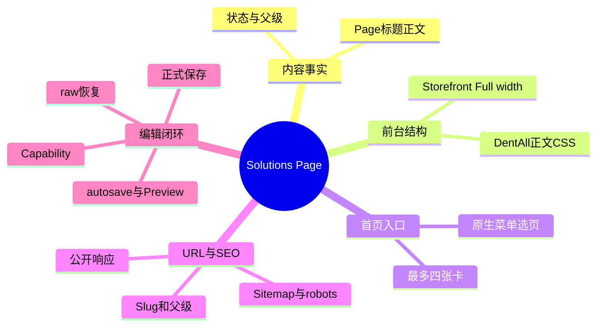
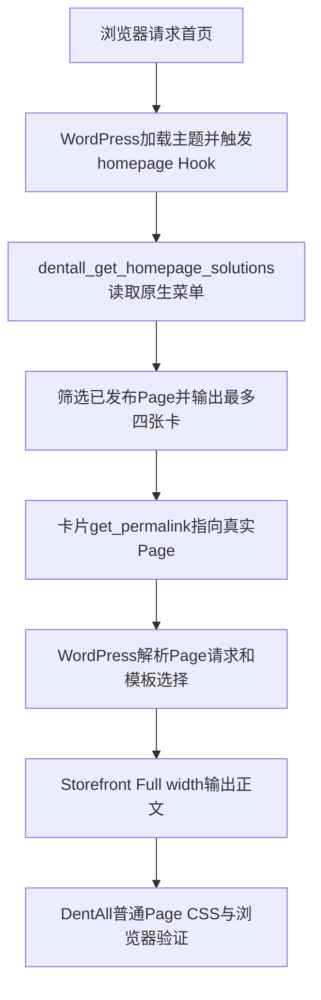

# Day88 WordPress实战：Page内容与URL边界

## 相关笔记

- 学习索引：[[WordPress实战笔记索引]]
- 对应项目笔记：[[../Day88-Solutions原生Page前台验证|Day88-Solutions原生Page前台验证]]
- 首页数据映射：[[Day40-菜单驱动的Page映射与原生摘要]]
- 通用Page模板：[[Day85-原生Page模板与正文样式边界]]
- 后续直接相关学习笔记：形成真实验证后再链接

## 今日学习成果

- [x] 能沿真实源码指出Page对象、首页菜单选择、Storefront Full width模板与子主题正文CSS的职责。
- [x] 能用隔离Local结果区分“根级Page可显示”和“`/solutions/{slug}/`层级已建立”。
- [x] 能区分Gutenberg临时预览、正式保存、原始区块字节与WordPress API精确恢复；不把不同验收层混为一谈。

## 真实项目场景

DentAll第一版用少量Solutions内容引导选购。D40已让首页从原生菜单取得Page卡片，D85已提供通用Page阅读骨架。D88要回答的是真实前台详情与编辑路径是否还需要新模板或字段，以及候选聚合URL是否已存在。两张隔离TEST Page表明现有技术骨架可用，业务层级和正式内容仍需另行决定。

- 本篇范围：Page输出、菜单映射、父子层级与URL、预览/保存和SEO证据。
- 不展开：正式商品关联规则、素材授权、聚合页设计、Staging发布或支付流程。
- 真实入口：`app/public/wp-content/themes/dentall/inc/homepage.php`、`app/public/wp-content/themes/dentall/style.css`、Storefront原生`template-fullwidth.php`、WordPress Page/Gutenberg。
- 版本与环境：见YAML；隔离Local快照仅证明本轮测试时的状态。

## 先建立整体模型

### 一句话模型

Page存内容与父子关系，主题按所选模板输出详情；首页菜单只挑选卡片，不能替Page创建父级或正式URL。

### 记忆宫殿：图书馆

每本书是一个Page；书架目录是首页菜单；阅读室是Storefront Full width；书的所在楼层和编号是父Page与Slug；印刷校样是登录预览，正式入库是保存。把书放进目录，不会自动替它建一个新楼层。

| 记忆对象 | 真实技术对象 | 比喻失效处 |
|---|---|---|
| 书 | WordPress `page`对象的标题、正文、状态、父级和Slug | 同一Page可以有修订与预览，不是固定纸本 |
| 书架目录 | `homepage_solutions`菜单及`dentall_get_homepage_solutions()` | 菜单只选择/排序，不改Page层级 |
| 阅读室 | Storefront `template-fullwidth.php`＋子主题正文样式 | 模板不决定正式文案或业务分类 |
| 楼层与编号 | `post_parent`、Slug、`get_permalink()` | WordPress还可能执行重定向，必须检查实际响应 |
| 校样与入库 | Gutenberg autosave/Preview与正式`savePost()` | 预览与公开Page不是同一个发布状态 |

## 思维导图



主干是“Page内容与层级 → 模板输出 → 实际URL/SEO响应”；菜单入口与编辑预览分别连接这条链，不能替代它。

## 请求与生命周期调用链



- 触发：匿名访问首页并点卡片，或Website Manager在后台编辑Page。
- 输入：菜单位置及条目、Page字段、模板元数据、浏览器请求路径。
- 输出：卡片链接或Page HTML；编辑保存另产生隔离副本中的Page写入。
- 验证：本轮四宽DOM/截图、HTTP状态、robots/Sitemap、REST raw与公开读回。

## 核心概念卡

| 概念 | 准确定义 | D88证据与易错点 |
|---|---|---|
| Page父级 | `post_parent`决定Page层级关系 | 两张TEST Page的父级为0，均在根路径；菜单绑定不会自动产生`/solutions/`父Page |
| Full width | Storefront提供的无侧栏Page模板 | TEST页单一`main`/H1且无侧栏，四宽正文350/704/736/736px；不表示所有历史Page已切模板 |
| 卡片事实源 | 标题、手工摘要、特色图和固定链接来自Page | 本轮历史四卡缺图仍text-only；菜单仅筛选/排序 |
| raw content | 服务端保存的区块标记原始字符串 | Gutenberg可能规范化程序生成的标记；语义相同不保证SHA相同 |
| noindex | 当前隔离环境的索引限制 | 测试页未进Sitemap；不证明正式URL的Production SEO表现 |

## 项目实战代码

### 涉及文件与职责

| 文件 | 职责 | D88变化 |
|---|---|---|
| `app/public/wp-content/themes/dentall/inc/homepage.php` | 注册`homepage_solutions`，选择/过滤Page，输出卡片 | 0 |
| `app/public/wp-content/themes/dentall/style.css` | 限定普通Full width Page正文宽度与长字符串换行 | 0 |
| Storefront `template-fullwidth.php` | 输出无侧栏的原生Page结构 | 父主题未修改 |

### 从入口开始追踪

1. `homepage.php`注册`homepage_solutions`菜单位置，并在`homepage` Hook上输出Solutions区块。
2. `dentall_get_homepage_solutions()`通过`get_nav_menu_locations()`和`wp_get_nav_menu_items()`收集菜单中的Page ID；`get_posts()`只取已发布、无密码Page并按菜单顺序返回，最多四项。
3. 卡片调用`get_permalink( $solution )`输出该Page当前真实链接；页面请求由WordPress解析，所选Storefront模板输出结构。
4. `style.css`第470行附近的普通Full width Page选择器限制46rem正文；WooCommerce页面不命中。若删除菜单绑定，首页区块为空；若删除正文规则，D85已记录的宽屏行长和长token缺口会重现。

`homepage.php`中最小真实片段：

```php
$locations = get_nav_menu_locations();
$menu_id   = isset( $locations['homepage_solutions'] ) ? absint( $locations['homepage_solutions'] ) : 0;

if ( ! $menu_id ) {
	return array();
}
```

`get_nav_menu_locations()`读取后台菜单绑定；`absint()`把菜单ID规范为非负整数；未绑定时返回空列表。它不创建父Page、Slug或归档路由。

### 运行证据

- 独立无头Chrome验证22组页面视口，均HTTP 200且无页面级横向溢出、失败请求和重复ID；详情与空Page在390/768/1024/1440px均无侧栏。
- `/solutions/`在隔离副本是404；访问伪造的`/solutions/test-d88-solution-detail/`收到301并转到根级TEST Page。这是WordPress对已有Slug的猜测重定向，不是已建立父子关系。
- 页面级全站隔离robots为`noindex, nofollow, noarchive`，TEST Page不在Page Sitemap。没有在此环境观察到Canonical，不能外推正式SEO。
- Gutenberg数据层证明autosave预览与公开页隔离、正式保存可读回；可见Preview按钮的直接点击路径未完成。编辑器尝试精确恢复raw后SHA不同，最终只通过WordPress API恢复夹具原文字节，随后TEST Page已删除。

## 职责边界

| 层级 | 本主题职责 | 边界 |
|---|---|---|
| WordPress Core | Page、菜单、固定链接解析、权限、修订和REST | 不改核心文件；菜单不替代Page层级 |
| WooCommerce | 目标商品页与交易规则 | Page中的普通链接不创建商品关系或改变订单 |
| Storefront | Full width Page结构 | 不修改父主题 |
| DentAll子主题 | 首页卡片映射与Page阅读样式 | 不存正式内容事实 |
| `dentall-core` | 本轮没有新增职责 | 不为展示问题增加模块 |
| 数据与浏览器 | TEST数据用于验证，DOM/网络用于观察 | 显示成功不等于正式业务审核或服务端raw一致 |

## Hook、API与模板机制

| 入口 | 输入与输出 | 本轮关键边界 |
|---|---|---|
| `homepage` Action | 首页请求时调用`dentall_homepage_solutions()`输出区块 | 只影响首页卡片；0项不输出 |
| `get_posts()` | 菜单Page ID列表→已发布Page对象 | `post__in`保持菜单顺序；非Page、草稿等不能占位 |
| `get_permalink()` | Page对象→当前链接 | 返回根级TEST链接，不创造候选聚合页 |
| Full width模板选择 | Page的模板元数据→无侧栏结构 | 历史四张Page仍为默认模板，本轮未切换 |
| Gutenberg保存 | 后台有权限用户→autosave或正式Page更新 | nonce与capability由WordPress编辑流程负责；数据层调用不等于可见按钮实测 |

## 安全、数据与站点影响

| 检查面 | 结论 |
|---|---|
| 输入、Capability、Nonce | 未新增自定义输入处理；隔离Website Manager可编辑/发布Page而无菜单编辑能力；沿用WordPress后台校验，nonce不能代替权限 |
| 输出转义 | 未改既有卡片输出；源码使用`esc_url()`和`esc_html()`；正式文案仍需业务审核 |
| 数据 | 隔离副本两张TEST Page与一名临时用户已删除；历史四张Page未改 |
| URL/SEO | 候选聚合/子路径未建；无正式Slug、Canonical、Schema或Sitemap配置变更 |
| 缓存 | 未改资源、缓存配置或清缓存；真实缓存和CWV未测 |
| 支付、物流、订单 | 本轮没有订单、报价、库存或支付动作 |
| 部署与回滚 | 仅隔离Local；运行代码0变更，删除TEST数据并停服务即恢复测试边界；未发布 |

## 动手练习与排错顺序

1. **只读观察：** 在Local查看原生菜单绑定、Page父级和模板字段，再对比首页卡片`href`、详情HTTP状态与`body`模板类；D88证据显示菜单卡片存在而`/solutions/`仍404。
2. **最小改动：** 仅在隔离Local新建明确TEST Page，选Full width，输入长段落、列表和图片；四宽测量正文及溢出，完成后删TEST Page。不要将TEST Slug或文案发布为正式内容。
3. **故障推演：** 若卡片出现但子路径404，先查Page父级/Slug与实际`get_permalink()`，再看重定向和Sitemap，最后才考虑模板或重写规则；CSS无法修复Page层级。

| 症状 | 优先检查 | 原因 |
|---|---|---|
| 首页少卡片 | 菜单位置、Page发布/密码状态、标题与链接 | 过滤会跳过无效Page，不能把缺卡当成详情模板错误 |
| 页面有侧栏 | Page模板字段、`body`模板类 | Full width由Page模板选择，正文CSS不会移除侧栏 |
| 看见预览标记却公开页未变 | autosave与正式保存状态、REST raw、匿名请求 | 预览是登录态草稿视图，不等于公开发布 |
| raw哈希不同 | Gutenberg序列化、REST raw、原始夹具哈希 | 区块语义相同不保证原始字节相同 |

## 掌握标准与费曼测试

掌握度暂为**初识**；以下题目留给开发者合上笔记自测，不把自动整理的答案算作本人已掌握。

1. 用两分钟解释为什么首页卡片有链接，`/solutions/`仍可能是404。
2. “书、目录、阅读室、楼层、校样”分别对应什么？哪个比喻最容易误导？
3. 从首页请求到详情Page的实际调用与模板选择顺序是什么？
4. `get_nav_menu_locations()`这段代码删去未绑定检查会有什么可观察风险？
5. 为什么Gutenberg保存后正文看起来一样，raw SHA仍可能不同？
6. 若正式Page的子路径不符合预期，先收集哪三项证据，为什么？
7. 迁移到其他主题或Shopify时，哪些职责判断不变，哪些API必须重新查证？

自测记录：待开发者复述后填入每题“通过/含糊/答错”和0～2分，总分上限14；当前不虚填成绩。D+1、D+3、D+7、D+14复习节点待实际执行后登记。

## 收尾总结与提问方法

- 已证实：现有Page＋Full width＋D85样式可承载D88代表内容；菜单卡片与详情Page是两个入口；候选聚合URL尚不存在。
- 易混淆点：WordPress对不存在子路径的301猜测、Gutenberg区块语义与raw字节、登录预览与公开保存。
- 下次先查：Page父级/模板/状态、实际HTTP跳转与robots/Sitemap，再判断是否真有代码缺口。
- 向AI提问可提供“WordPress/主题版本＋Page父级和模板＋实际请求/跳转＋菜单绑定＋REST raw或截图＋不碰正式内容/支付/部署的边界”，要求区分事实、推断及最小验证。敏感账号、Cookie和Nonce不得粘贴。
- 另一个经典主题可能有不同Full width模板；区块主题可能以Site Editor和`theme.json`承担结构样式；独立插件只应承载跨主题且独立生命周期的规则。变种练习先核对目标版本的模板查找和URL机制，再建立一张无业务事实的TEST Page复演。

## 可复用核心思想

### 跨平台不变量

内容对象、导航选择、展示模板、URL层级和发布状态属于不同责任层；验收要分别检查存储、实际HTTP响应与浏览器呈现，不能用其中一层替另一层作证。

### WordPress/WooCommerce当前实现

本项目在隔离Local中用原生Page、菜单API、`get_permalink()`、Storefront Full width和子主题正文CSS完成技术路径。WooCommerce仍独立管理商品和交易；Gutenberg预览、正式保存与raw字节需用不同证据验证。

### Shopify或其他平台的对应机制

内容、导航、模板、URL和发布状态的职责分离可迁移；Shopify具体对象、页面层级、编辑器序列化、预览、SEO和权限机制**待验证**，本轮未在该平台操作。
