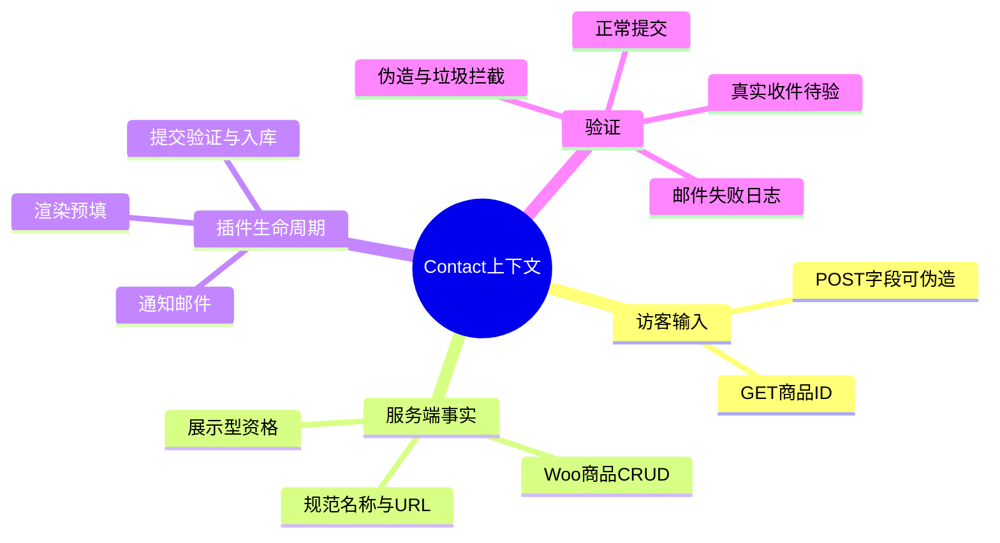
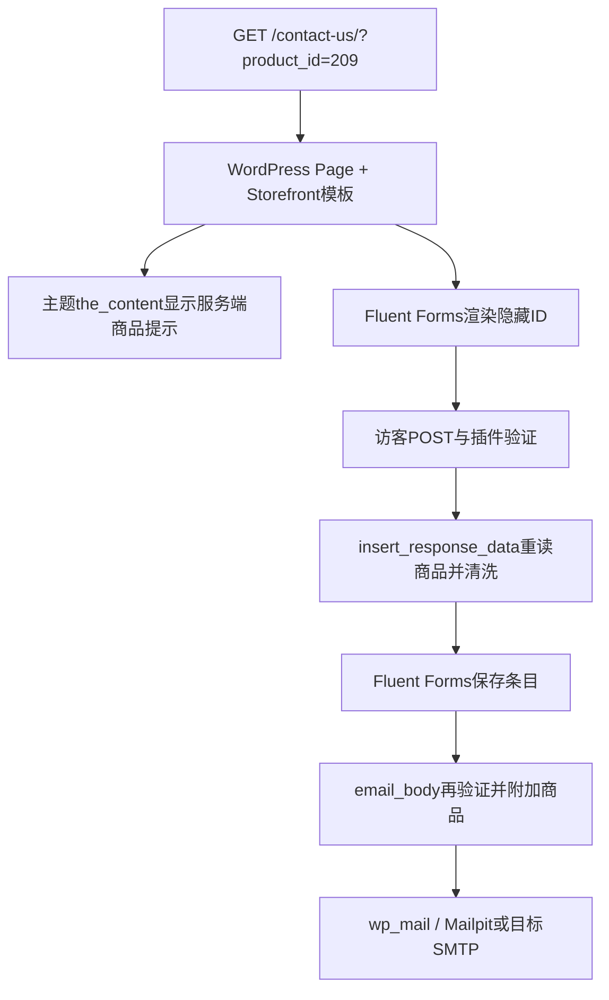

# Day89 WordPress实战：表单服务端上下文与通知边界

## 相关笔记

- 学习索引：[[WordPress实战笔记索引]]
- 对应项目笔记：[[../Day89-Contact表单与商品上下文|Day89-Contact表单与商品上下文]]
- 前一页机制：[[Day88-Page内容与URL边界]]
- 后续合成抽样：[[Day90-内容样本集成与发布门槛]]

## 今日学习成果与真实项目场景

- [x] 能从GET查询参数一路追到商品验证、表单预填、入库数据和邮件，并说清每次重读的原因。
- [x] 能区分“条目已保存”“通知邮件已交给本地捕获器”“真实收件人已收到”三个不同证据层。
- [x] 能定位Fluent Forms全局Token设置与Contact专用Honeypot Hook的作用范围，避免出现隐藏Token字段却没有生成端点的半启用状态。

DentAll的展示型商品允许访客从商品页进入Contact。URL里的`product_id`是浏览器提供的线索，访客能修改。若把隐藏字段中的商品名称、URL或来源标记当事实，通知邮件可能指向伪造商品。D89因此在插件保存条目和生成邮件的两个节点，从WooCommerce商品对象重建上下文；正式业务收件与隐私流程尚未确认。

## 先建立整体模型

### 一句话模型与记忆宫殿

把Contact想成仓库收件台：访客递来的包裹标签写着商品编号；收件员用官方货架目录核对编号和商品资格，再把核验结果录入台账；通知员发邮件前再查一次目录。这里“访客标签”是GET/POST参数，“官方目录”是WooCommerce Product CRUD，“台账”是Fluent Forms条目，“通知员”是邮件Hook。比喻只说明信任顺序：WordPress Page与插件有自己的加载/验证/数据库生命周期，并非真的由同一个收件员串行控制。

| 记忆对象 | 真实机制 | 容易混淆的边界 |
|---|---|---|
| 包裹标签 | `$_GET['product_id']`、提交的隐藏字段 | 隐藏输入仍可被访客修改 |
| 货架目录 | `wc_get_product()`、状态、可见性、`dentall_sales_mode` | 商品展示名/链接必须从当前商品对象取得 |
| 台账 | Fluent Forms submission及插件自有表 | 保存成功不证明邮件送达或有人处理 |
| 通知员 | `fluentform/email_body`与`wp_mail()` | 邮件Hook不能污染前台确认提示 |



## 请求与生命周期调用链



主题入口`inc/contact.php`只处理Page可见提示与CSS；Core入口`dentall-core.php`加载`includes/contact.php`，让商品规则不依赖当前主题。插件读取配置的Form ID，因此导入到另一环境必须重新填写`dentall_contact_form_id`；URL、Form ID、商品ID均不能从Local硬编码到正式站点。

## 核心概念卡与项目实战代码

| 概念 | 准确定义与DentAll证据 | 常见误区及验证 |
|---|---|---|
| 隐藏字段 | 浏览器DOM中的输入，D89仅带商品ID | 并非可信；可用DevTools改为标准商品44再提交，入库无商品上下文 |
| 服务端权威数据 | WooCommerce CRUD返回的当前Product及状态/销售模式 | 客户端名称与URL没有资格覆盖它；伪造字段在`insert_response_data`被删除 |
| 邮件专属Hook | `fluentform/email_body`只过滤通知正文 | `submission_message_parse`也会处理前台确认，D89曾据此修正 |
| 全局Token | Fluent Forms全局开关决定Token生成AJAX端点是否注册 | 单靠表单级过滤器强开会有字段却无端点；隔离Local复现后移除该过滤器 |

`app/public/wp-content/plugins/dentall-core/includes/contact.php`中的关键真实代码节选：

```php
$product = dentall_core_get_contact_product( $data['dentall_product_id'] ?? null );
unset( $data['dentall_product_id'], $data['dentall_product_name'], $data['dentall_product_url'], $data['dentall_source'], $data['source'] );
if ( $product ) {
	$data['dentall_product_id']   = $product['id'];
	$data['dentall_product_name'] = $product['name'];
	$data['dentall_product_url']  = $product['url'];
	$data['dentall_source']       = 'custom_product';
}
```

第一行把ID当候选；`unset()`剔除访客伪造的派生事实；最后仅在商品仍合格时写入服务端值。商品资格还检查`publish`、`is_visible()`和`display_only`。通知邮件独立重读，防止表单模板依赖可伪造的隐藏名称/URL。前台可用Chrome DevTools检查DOM、Network中的Token AJAX与提交响应；实际可信事实以服务器条目和邮件正文为准。

## 职责、Hook与数据边界

| 层级/入口 | 本次职责 | 不应承担的职责 |
|---|---|---|
| WordPress Page/Storefront | 保存Contact正文、输出Page结构 | 不直接管理提交、通知或商品资格 |
| WooCommerce | Product CRUD、状态与销售模式 | 不创建重复商品CPT，不直接改订单或库存 |
| 子主题`inc/contact.php` | 页面提示、条件加载CSS | 不决定跨主题的商品可信事实 |
| `dentall-core/includes/contact.php` | 商品验证、入库清洗、邮件上下文、Canonical | 不复制通用表单数据库/后台/SMTP |
| Fluent Forms | 字段验证、Token/Honeypot、条目、通知 | 不能凭隐藏字段确认商品名、URL或业务收件责任 |

关键Filter：`fluentform/rendering_field_data_input_hidden`只为配置Form预填ID；`fluentform/insert_response_data`须返回清洗后的数组，运行于入库前；`fluentform/email_body`须返回邮件字符串，运行于通知准备时；`fluentform/honeypot_status`只针对配置Form返回开启。全局Token还须在插件设置启用，因为生成AJAX路由在插件初始化时按全局值注册。`wpseo_canonical`只针对Contact原Page返回规范链接；隔离站点全局noindex，公开输出仍待Staging验。

## 安全、数据与站点影响

| 检查面 | 当前证据与限制 |
|---|---|
| 输入/输出 | 非正整数、非公开、不可见或非展示型Product不附上下文；商品名用`esc_html()`、URL用`esc_url()`，访客内容由表单插件处理 |
| Capability/Nonce | 匿名联系提交不具备登录能力；插件负责Token与垃圾拦截。Nonce不能代替后台条目查看Capability，人员权限仍须业务确认 |
| 持久化 | Fluent Forms保存姓名、邮箱、留言、商品ID及服务器派生字段，还保存browser、device、source_url；Contact的IP/国家为空。留存和隐私告知待确认 |
| 邮件 | Mailpit TEST收件成功；故障注入使插件记录`Email sending failed`而条目保留。真实SMTP投递、告警和处理责任未验 |
| URL/SEO/缓存 | 查询参数不应生成独立索引页面；Core返回Contact规范链接，公开Canonical及缓存按查询参数隔离仍待目标环境测 |
| 性能/部署 | Contact加载表单前端资源、Token AJAX并增加插件数据表/日志；未测量前后性能。导入草稿、通知关闭是回滚安全起点，停用插件不会删除条目 |
| 支付/物流 | 本轮不触碰价格、库存、购物车、订单、支付或物流 |

## 动手练习与排错顺序

1. **只读观察：** 在隔离Contact分别访问无参数、`?product_id=209`和标准商品44；看提示与隐藏ID，再只读核对条目中的服务端字段。预期只有209具有规范上下文。
2. **Local最小改动：** 在浏览器DevTools把隐藏ID/名称/URL改成伪造值提交；只改隔离TEST表单，核对条目和Mailpit不含伪造URL。回滚删除TEST条目或恢复隔离快照。
3. **故障推演：** 若提交永远被Token拒绝，先看Network是否成功取得Token，再核插件全局Token设置和AJAX路由；若条目已保存但没人收到邮件，先看插件通知配置和失败日志，再核SMTP与TEST收件。先分清失败发生在验证、存储还是通知阶段。

## 掌握标准与费曼测试

- [ ] 能解释为什么隐藏商品名/URL不能当事实，并指出Core实际清洗位置。
- [ ] 能从GET、渲染、POST、入库到邮件画出调用顺序。
- [ ] 能区分Honeypot、Token、后台Capability、真实SMTP各自解决的问题。
- [ ] 能在Local重现一个成功和一个失败路径，并说明数据/URL/缓存/隐私影响。

费曼自测留给开发者本人，当前未填分数或伪称掌握：

1. 用“收件台”比喻讲清商品ID为何只能当线索，并把每个对象对应回真实API。
2. 删除`unset()`后，伪造的名称/URL可能在哪些输出中出现？怎样用TEST验证？
3. 为什么`fluentform/email_body`比同时处理前台确认的Hook适合这次通知？
4. Token字段出现但生成AJAX端点不存在时，应先查哪个插件设置？
5. 条目保存成功、Mailpit收到邮件、真实员工处理消息各需什么不同证据？
6. 换成其他主题或平台时，哪些信任原则不变，哪些Hook/权限/留存机制要重查？

| 复习节点 | 计划日期 | 完成 | 待纠正内容 |
|---|---|---|---|
| D+1 | 2026-10-09 | [ ] | 待自测 |
| D+3 | 2026-10-11 | [ ] | 待自测 |
| D+7 | 2026-10-15 | [ ] | 待自测 |
| D+14 | 2026-10-22 | [ ] | 待自测 |

## 变种应用与后续提问

同为WordPress而更换主题时，先找Page模板和CSS加载入口，Core商品验证仍可复用；若换插件，必须核对其入库前和邮件专属Hook、权限与卸载行为。若迁移Shopify或其他平台，仍要把浏览器输入视为不可信、从商品权威源重建上下文，但具体表单/邮件/权限/留存机制**待验证**，不能假定存在同名Hook。

向AI提问时提供WordPress/WooCommerce/Fluent Forms版本、表单ID、最小Hook代码、浏览器Network状态、插件日志、条目字段和目标环境；移除真实邮箱、客户资料与密钥，要求区分已测证据和推断。

## 可复用核心思想

### 跨平台不变量

外部输入只能提示“去查哪条记录”，不能决定记录的业务属性；存储、通知和人员处理属于三个独立成功条件，应分别观测和回滚。

### WordPress/WooCommerce当前实现

在本隔离版本中，WooCommerce CRUD提供商品事实，Core在Fluent Forms入库和通知Hook处重验，主题只负责Page提示；插件全局Token设置和环境Form ID属于部署契约。

### Shopify或其他平台的对应机制

目标平台的商品API、表单扩展点、邮件和隐私/权限机制待验证；不能把WordPress Hook或Fluent Forms默认存储行为当通用规范。
