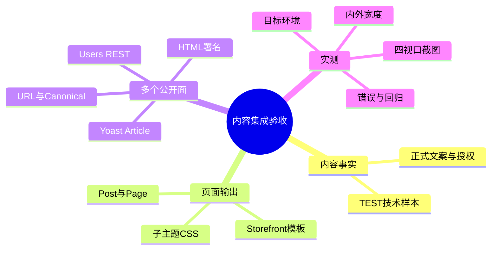
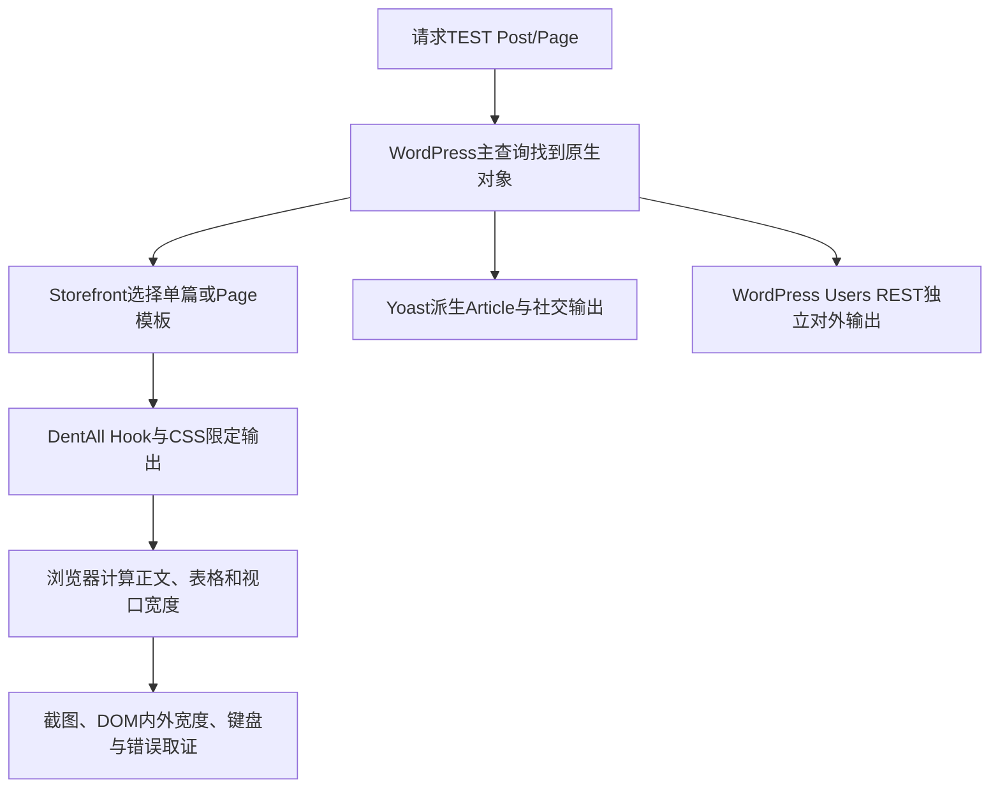

# Day90 WordPress实战：内容样本集成与发布门槛

## 相关笔记

- 学习索引：[[WordPress实战笔记索引]]
- 对应项目笔记：[[../Day90-内容样本与集成抽样|Day90-内容样本与集成抽样]]
- 前一工作日：[[Day89-表单服务端上下文与通知边界]]
- 原生Page布局：[[Day85-原生Page模板与正文样式边界]]
- 单篇署名与SEO：[[Day87-文章详情署名与SEO输出边界]]

## 今日学习成果与真实项目场景

- [x] 能解释为什么页面`scrollWidth`正常仍可能有被裁切的表格，并用内部宽度与截图双重取证。
- [x] 能用一个真实长文样本，在浏览器临时试验CSS、回源码做最小修复，再用四宽和相邻Page/Blog回归。
- [x] 能区分TEST技术抽样、正式内容与素材审核、跨环境URL/SEO/缓存、完整M7四种验收层级。

D90把D81/D82、D87/D88与D89候选放到同一隔离站点，用两篇不同后台作者Post、长/空Page和已有FAQ/Contact/Solutions测合成结果。初轮页面总宽都正常，但390px长Post的表格实际为3489px，被350px正文裁切。只有读元素内部尺寸和看截图，才能发现“页面没横滚却看不到内容”的问题。

## 先建立整体模型

### 一句话模型与记忆宫殿

把页面验收想成检查书刊：数据库里的Post/Page是稿件，Storefront模板是排版机器，子主题CSS决定纸张上的行列，浏览器截图是实际印张；只量整张纸宽，发现不了表格文字被装订边裁掉。Yoast是另一份对外目录，WordPress Users REST则是独立公开名录，不能用纸面署名推断所有名录都已改好。这个比喻不代替真实机制：WordPress对象、模板、CSS布局计算和REST各有独立生命周期。

| 记忆对象 | 真实机制 | 失效边界 |
|---|---|---|
| 稿件 | WordPress原生`post`/`page`与`post_author` | TEST稿件不自动成为正式发布内容 |
| 排版机器 | Storefront模板与子主题Hook | 模板不决定正式URL或内容授权 |
| 行列宽度 | CSS最小内容宽、`overflow-wrap`、`table-layout` | 页面总`scrollWidth`不能证明子元素未被裁 |
| 对外目录 | Yoast Article作者与原生Users REST | 两个输出面需要各自测试 |



## 请求与生命周期调用链



加载入口为子主题`functions.php`与`style.css`、Core的`includes/seo-compatibility.php`。浏览器只反映当前隔离数据库和样式；正式URL、缓存与索引需在目标环境重新测。D90隔离库`/%postname%/`让`/blog/{slug}/`301至根级文章，因此即使文章内容200，也不能把D19路由合同记为通过。

## 核心概念卡与真实代码

| 概念 | 准确定义与真实例子 | 常见误区/验证 |
|---|---|---|
| 元素内部溢出 | 子元素`scrollWidth > clientWidth`，即使祖先把它裁住 | 只测`documentElement.scrollWidth`会漏报；D90表格初值3489px对正文350px |
| `overflow-wrap:anywhere` | 允许连续字符串在需要时断开，并参与最小宽计算 | 与只在绘制阶段断词不同；浏览器注入后表格宽从3489收敛至350px |
| `table-layout:fixed` | 表格按可用宽度分配列，内容在单元格内换行 | 只证明本次两列TEST视觉；更多列或复杂表格仍须真实样本 |
| 公开身份表面 | HTML byline、Yoast Article和Users REST是不同输出 | D90前两者是团队，Users REST仍暴露后台名（RSK-057） |
| 技术/业务完成 | TEST代码验证与正式内容审核、素材授权分层 | 两篇TEST Post不等于正式3篇文章＋1个Page |

`app/public/wp-content/themes/dentall/style.css`真实代码节选：

```css
.page-template-template-fullwidth:not(.woocommerce-page) .entry-content,
.single-post .entry-content {
	min-width: 0;
	overflow-wrap: anywhere;
}

.single-post .entry-content table {
	table-layout: fixed;
}
```

第一组复用D85普通Page已经验证的断词与最小宽规则，只给单篇Post增加选择器；第二组针对本次两列表格首列被长串挤成逐字竖排的真实缺口。它不更改内容事实、全站表格或Woo商品参数表。Chrome DevTools先临时修改并看宽度/截图，回到子主题源码后再复测；浏览器临时样式不能替代版本化修复。

## 职责、Hook与验证边界

| 层级 | 本主题职责 | 本次可见限制 |
|---|---|---|
| WordPress原生Post/Page | 内容、作者、状态、父级与Slug | D90对象都是TEST；URL由站点permalink配置决定 |
| Storefront | 单篇/Page模板与HTML骨架 | 不修改父主题；D90有唯一H1/main |
| DentAll子主题 | 文章公开byline和局部阅读CSS | 不改变真实`post_author`或业务文案 |
| `dentall-core`与Yoast | 普通Article的团队作者及SEO输出 | 不自动治理原生Users REST |
| WooCommerce/PayPal | 商品、Cart和目标支付流程 | 隔离阻断外呼，Product/Cart仅布局烟测 |
| 浏览器 | 实际DOM、CSS布局、请求与错误 | 无实体设备、读屏或正式缓存层 |

本次没有Woo CRUD写入、订单/库存/支付变更、后台Capability扩大或新Nonce逻辑。只改主题CSS；URL、Title、Meta、Schema、robots、Sitemap与缓存配置未改，SEO风险来自目标环境尚未验证和既有REST公开表面，而非该CSS。隔离Site仍noindex；Staging/Production部署前必须重查D19路由、Canonical、Users REST、缓存及内容授权。

## 动手练习、排错顺序与证据

1. **只读观察：** 打开隔离长Post的390px视口，分别在DevTools量`documentElement.scrollWidth`、`.entry-content.clientWidth/scrollWidth`及`table.getBoundingClientRect().width`。修复前外层390、正文350、表格3489；修复后正文/表格350。另看截图，确认没有被裁和逐字竖排。
2. **Local最小改动：** 在DevTools临时切换`overflow-wrap:anywhere`和`table-layout:fixed`，比较两者各解决什么，再在源码找到对应规则并用四宽回归；若撤销，仅恢复这一处CSS差分即可。
3. **故障推演：** 如果文章HTML团队署名通过，但原生Users REST仍显示后台名，先确定泄露接口、消费者与正式身份需求，再决定服务端治理；不要靠改CSS、只藏作者归档或改真实`post_author`假装全站解决。

独立抽样初轮48次、修复后16次四宽回归和最终版本8/8烟测与截图均在D90隔离证据目录；TEST Post作者ID2/3、HTML/Yoast一致、Person节点0。Product/Cart的PayPal token在隔离外呼拦截下返回500，不能据布局烟测宣称交易链路通过。最终候选主题0.49.0资源与Core0.9.0插件状态已在隔离版实际加载；没有性能前后测量。

## 掌握标准、费曼自测与复习

- [ ] 能解释页面无横向滚动却仍裁切表格的原因，并指出至少两个内部尺寸读数。
- [ ] 能讲出D85 Page规则为何可复用于D87 Post，及为何还需一条表格列宽规则。
- [ ] 能分别指出WordPress作者事实、HTML byline、Yoast Article和Users REST的检查入口。
- [ ] 能说清TEST样本、正式内容/素材、URL/缓存/SEO、M7的不同完成条件。

费曼题先由开发者作答，当前不虚填分数：

1. 用“书刊检查”解释D90表格为何被裁，并对应回浏览器真实尺寸。
2. 只加`overflow-wrap:anywhere`后为什么外溢已修，但首列仍逐字竖排？
3. `table-layout:fixed`解决了什么？它为何不能替代真实多列表格验收？
4. 两篇文章的后台作者不同，为何页面/Yoast可相同？为何Users REST仍是风险？
5. 为什么`/blog/{slug}/`在隔离库301就不能宣称D19 URL通过？
6. 正式M7还缺哪些业务和非Local证据，PayPal隔离500应怎样定性？

| 复习节点 | 计划日期 | 完成 | 待纠正内容 |
|---|---|---|---|
| D+1 | 2026-10-09 | [ ] | 待自测 |
| D+3 | 2026-10-11 | [ ] | 待自测 |
| D+7 | 2026-10-15 | [ ] | 待自测 |
| D+14 | 2026-10-22 | [ ] | 待自测 |

## 变种应用与后续提问

另一个经典WordPress主题可能使用不同模板/类名，区块主题可能通过`theme.json`和区块样式管理布局；需先定位真实DOM与样式来源。Shopify或其他平台同样应核内部溢出、正式内容、公开身份和URL/缓存，但平台内容模型、模板与SEO接口**待验证**，不能机械套用WordPress Hook。

向AI提问时提供实际HTML结构、计算样式、内外`clientWidth/scrollWidth`、四宽截图、主题/插件/WordPress版本与URL响应，并要求区分源码问题、隔离环境差异、正式业务缺口；不提交真实客户资料或密钥。

## 可复用核心思想

### 跨平台不变量

组件内部尺寸和真实视觉结果共同决定可读性；技术样本只证明所测结构，不会自动完成正式内容、授权素材、URL和业务流程。

### WordPress/WooCommerce当前实现

原生Post/Page、Storefront模板、子主题CSS、Yoast与Users REST分别输出不同事实；D90在同一隔离版本把这些表面分开复核，用已有D85规则和一条文章表格规则最小修复。

### Shopify或其他平台的对应机制

可迁移的是分层证据与内外尺寸检查；主题扩展点、权限、URL/Canonical与发布工作流须重新查证，当前没有实施Shopify。
