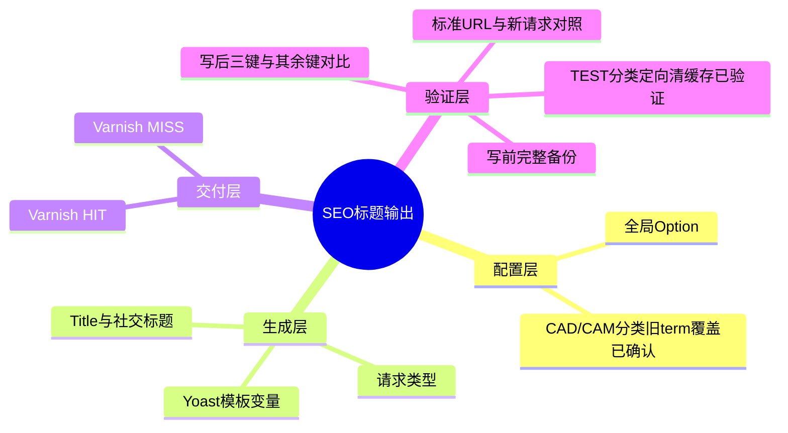
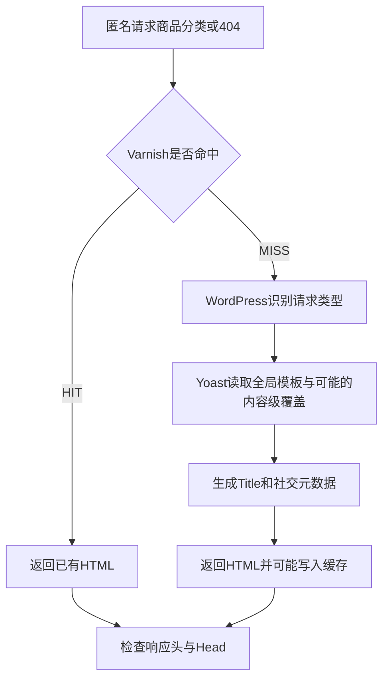

# Day91 WordPress实战：Yoast模板与缓存分层验证

## 相关笔记

- 学习索引：[[WordPress实战笔记索引]]
- 对应项目笔记：[[../Day91-SEO元数据模板与Staging验证|Day91-SEO元数据模板与Staging验证]]
- 前置学习笔记：[[Day48-WooCommerce分类描述与SEO模板边界]]
- 后续学习笔记：D92索引与Canonical审计形成后回填
- 项目事实：[[../../URL_SEO_MAP|URL与SEO映射]]

## 今日学习成果

- [x] 区分Yoast全局模板、单个分类的内容级覆盖和实际HTTP响应。
- [x] 用写前备份、写后全键比较确认本次只改变三个模板键。
- [x] 对标准TEST分类URL定向清理并复验`MISS → HIT`两次一致；其他页面仍需复核。

## 真实项目场景

### 今天解决了什么问题

Staging商品分类和404页面曾输出旧的中文或异常标题。Day91在获授权的范围内，仅更新Yoast `wpseo_titles`的三个键。标准TEST分类URL最初仍命中Varnish旧页面；定向清理后，两次匿名请求已返回同一英文标题。CAD/CAM Materials分类即使为新响应也仍有中文“归档”，只读检查确认其term级旧标题覆盖。缓存旧副本与内容级覆盖是两种不同原因，不能把配置写入成功等同于所有页面已经显示新输出。

### 学习范围

- 本篇要掌握：全局Option、term级覆盖、Yoast模板变量、整页缓存、备份与差异验证。
- 本篇不展开：分类正式文案、索引策略变更、全站缓存清理、Production发布。
- 真实入口：Staging WordPress的`wpseo_titles` Option、Cloudways Varnish、商品分类与404匿名HTTP响应。
- 本轮没有修改WordPress、WooCommerce、Storefront、Yoast或DentAll运行文件；具体插件版本未在本轮重新核对。

## 先建立整体模型

### 一句话模型

WordPress保存Yoast的默认标题模板，Yoast按请求与可能存在的term覆盖生成Head，页面缓存再决定访客收到的是新生成的HTML还是旧副本。

### 记忆宫殿或实体比喻

把全局模板想成印刷厂的通用版式，某个分类的独立标题像该页的特制版，Varnish像仓库里已经装箱的成品。修改通用版式后，新印出的页面可能正确，仓库中的旧箱子却仍会送达；特制版也不会自动改成通用版式。

| 记忆对象 | 真实技术对象 | 比喻的边界 |
|---|---|---|
| 通用版式 | `wpseo_titles`内的Yoast模板键 | Option不是已渲染的HTML |
| 特制版 | 商品分类term保存的Yoast内容级标题 | CAD/CAM Materials term_id=32的旧标题覆盖已读回；本轮未获修改授权 |
| 仓库成品 | Varnish缓存的整页响应 | `HIT`只说明命中缓存，不能证明数据库配置仍旧 |
| 新印页面 | 缓存`MISS`后生成的HTML | 仍可能使用term覆盖或其他规则，不能单凭`MISS`断定全局模板生效 |

## 思维导图



主干是“配置、生成、交付”三层；每层都要用对应证据判断。

## 请求与生命周期调用链



- 触发条件：匿名访问商品分类或不存在的URL。
- 输入：`wpseo_titles`三个模板键、当前请求与可能的term覆盖。
- 可观察输出：HTTP缓存状态、`<title>`和社交标题；robots与Canonical需单独核对。
- 副作用：配置更新写入Option；只读HTTP验证不写商品或页面内容。

## 核心概念卡

| 概念 | 准确定义 | DentAll证据与边界 |
|---|---|---|
| 全局模板 | Yoast在相应类型页面使用的默认标题格式 | 三键写后读回正确；不能覆盖已保存的内容级标题 |
| 内容级覆盖 | 特定term自行保存的SEO字段 | CAD/CAM的`wpseo_taxonomy_meta`中`wpseo_title`确含“归档”，另读term meta标题为空；未修改 |
| 页面缓存 | 缓存层保存并重放HTML响应 | 标准TEST分类先为旧`HIT`；定向清理后新`MISS`及后续`HIT`标题一致 |

## 项目实战代码与命令

### 涉及文件与数据

- 仓库运行文件：本次无变更。
- WordPress数据库：`wpseo_titles` Option；写前完整JSON备份位于服务器非Web目录，项目笔记记录恢复位置与校验结果，不将备份内容提交Git。
- Staging页面：`/product-category/test-d12-products/`、CAD/CAM Materials分类和一个不存在的URL。

### 从入口开始追踪

1. Cloudways应用文件夹确认后，进入对应`public_html`，先核对站点`home`与`blog_public=0`。
2. 读取三个Yoast键及完整Option备份；备份共175键。
3. 通过WordPress Option API只改变获授权的三个键。
4. 写后比较确认三键符合目标，其余172键未变，autoload仍为`auto`。
5. 匿名请求页面；标准TEST分类URL旧`HIT`经Breeze定向清理后，新`MISS`与再次`HIT`均核对实际Head。

### 真实命令与模板值

下列只读命令在目标Staging站点运行；模板值为本次已写入并读回的真实值，不是要在其他站点直接执行的脚本：

```sh
wp option pluck wpseo_titles title-tax-product_cat
wp option pluck wpseo_titles social-title-tax-product_cat
wp option pluck wpseo_titles title-404-wpseo
```

| 键 | 本次值 | 用途 |
|---|---|---|
| `title-tax-product_cat` | `%%term_title%% %%page%% %%sep%% %%sitename%%` | 商品分类默认HTML标题 |
| `social-title-tax-product_cat` | `%%term_title%%` | 商品分类默认社交标题 |
| `title-404-wpseo` | `Page not found %%sep%% %%sitename%%` | 404默认标题 |

### 运行证据

- 写前完整Option JSON备份有效，175键；写后三键正确、其余172键未变，autoload为`auto`。
- 新的404与商品分类匿名请求已显示目标英文标题。
- 标准TEST分类URL先返回旧标题且Varnish `HIT`。已核实Varnish主机`127.0.0.1`启用，使用有范围闸门的`breeze_varnish_purge_cache($u,true)`请求仅清理该URL，WP-CLI返回“purge requested”。
- 清理后第一次请求：HTTP 200，`<title>`与OG Title均为`TEST D12 Products - DentAll`，robots为`noindex, nofollow`，无Canonical，`X-Cache: MISS`、`Age: 0`；第二次同一标准URL：HTTP 200、标题相同，`X-Cache: HIT`、`Age: 13`。这证明该URL的新旧缓存路径一致，不代表其他分类已修复。
- CAD/CAM Materials分类在新响应中仍出现中文“归档”；只读WP-CLI确认`product_cat` term_id=32的`wpseo_taxonomy_meta`中`wpseo_title`为`%%term_title%% 归档 %%page%% %%sep%% %%sitename%%`，另读term meta标题为空。现场命令打印的`legacy_title`只是输出别名，不是字段名。本轮未获修改该覆盖值的授权。

## 职责边界

| 层级 | 本主题职责 | 当前边界 |
|---|---|---|
| WordPress Core | 保存Option、识别请求并加载插件 | 不修改核心文件或直接改内部表 |
| WooCommerce | 提供商品分类taxonomy与归档上下文 | 不决定Yoast标题模板 |
| Yoast SEO | 读取模板及内容级设置，输出SEO Head | 全局模板不能保证每个term都无覆盖 |
| Cloudways Varnish | 缓存并交付整页HTML | 配置写入不会自动证明所有旧URL已刷新 |
| DentAll子主题与Core | 保留既有展示及SEO兼容边界 | 本轮不新增运行逻辑 |

## API机制与站点影响

| 检查面 | 本次结论 |
|---|---|
| Option API | 使用WordPress API更新`wpseo_titles`数组中的三个键，写后按完整备份比较；不是直接SQL改表 |
| 权限与凭据 | 通过已登录的Cloudways Master SSH终端操作；笔记不保存口令、私钥或数据库凭据 |
| 数据 | 仅Staging站点一项Option的三个子键改变；未改商品、文章、订单或用户 |
| URL、SEO | Slug、路由和索引开关未改；标题输出需逐URL验证，robots与Canonical独立核对 |
| 缓存 | 标准TEST分类已执行单URL定向清理，并以新`MISS → HIT`核对；未全站清理，其他页面仍需单独复核 |
| 支付、物流、部署 | 不涉及，Production未改；回滚应从备份精确恢复原三键，避免覆盖之后他人对其余键的合法更新 |

## 动手练习与排错

1. **只读观察，已执行：** 读回三个Option键，并对照标准分类URL清理前旧`HIT`、清理后新`MISS`及再次`HIT`的标题与Head；另读回CAD/CAM term级旧标题。
2. **隔离Local模拟，未执行：** 若练习模板变化，先备份Option与记录原值，仅改TEST分类，验证后精确恢复；不得把此练习记为Day91实测。
3. **故障推演：** 若其他分类清理缓存后仍有旧标题，先看是否真为`MISS`，再只读检查term级Yoast字段，最后核对实际Head；不要重复改全局模板或盲目全站清缓存。

| 现象 | 优先检查 | 当前判断 |
|---|---|---|
| 全局键已变，标准URL仍旧 | Option读回 → 响应`HIT/MISS` → 定向缓存后再测 | TEST分类旧`HIT`已通过单URL清理，后续`MISS/HIT`一致 |
| 新响应仍有旧标题 | 请求term → 内容级Yoast字段 → Head生成规则 | CAD/CAM的term级旧标题已确认，但本轮不改 |

## 掌握标准与费曼测试

当前掌握度：初识，尚未由开发者独立完成费曼自测。以下五题待回答，每题须同时给出通俗解释、准确机制与DentAll证据。

1. 为什么三个Option键读回正确，标准TEST分类访客仍可能看到旧标题？
2. Varnish `MISS`为何也不能保证分类采用全局模板？
3. `wpseo_titles`完整备份为何要放在Webroot外，并比较其余172键？
4. CAD/CAM的分类级`wpseo_title`已确认；如何判断它与全局模板、另读term meta之间的覆盖关系？
5. 若需回滚，为什么只恢复三键比写回整个Option更稳妥？

自测评分：待做，满分10分；有0分题时不提升掌握度。计划于D+1、D+3、D+7、D+14复习；当前均未执行。

## 收尾总结与高效提问

已确认配置层三键精确变化，标准TEST分类单URL清理后新`MISS`与再次`HIT`的Title、OG Title一致，CAD/CAM另有term级旧标题覆盖。其他受影响页面仍需复核；该term覆盖未获修改授权。遇到类似问题，先提供目标环境、URL、Option读回、HTTP `HIT/MISS`、Head片段和已尝试步骤，再询问最小的验证或修复路径；不要附带凭据。

## 变种应用到其他项目

其他WordPress站点也应分开检查全局模板、内容级覆盖与缓存交付，但所用SEO插件、term字段和缓存入口必须按实际版本重查。Shopify或其他平台也可能有全局与页面级SEO设置、边缘缓存，但本篇未验证其具体字段和失效机制，记为待验证，不纳入DentAll实施范围。

## 可复用核心思想

### 跨平台不变量

配置正确、生成正确和用户收到正确页面是三个不同结论。修改有范围的设置时先留可恢复基线，再用差异证明未伤及其他设置；缓存与内容级覆盖需分别定位。

### WordPress/WooCommerce当前实现

本次在Cloudways Staging通过WordPress Option API改变Yoast `wpseo_titles`三个键。商品分类仍由WooCommerce taxonomy承载；Yoast生成Head，Varnish可能交付旧HTML。其他172键、autoload和站点内容保持不变已按本轮证据核对。

### Shopify或其他平台的对应机制

仅能迁移“默认SEO设置、页面级覆盖、缓存交付分层验收”的判断方法；具体API、字段、权限及清缓存机制待按目标平台验证。
