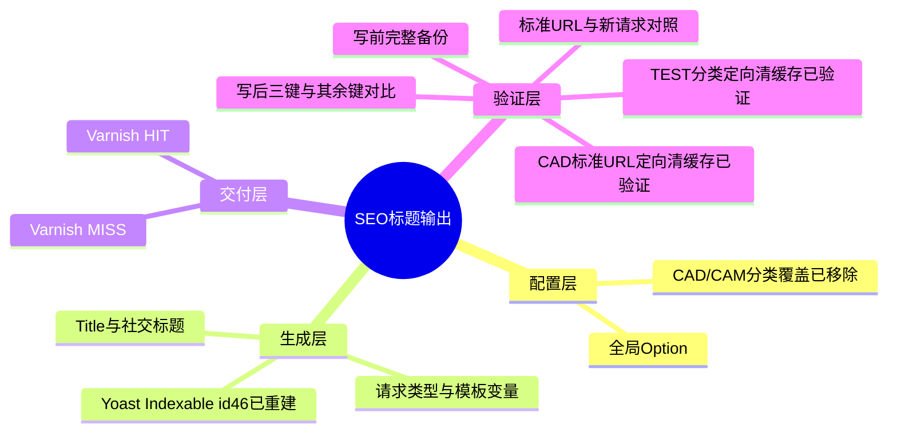
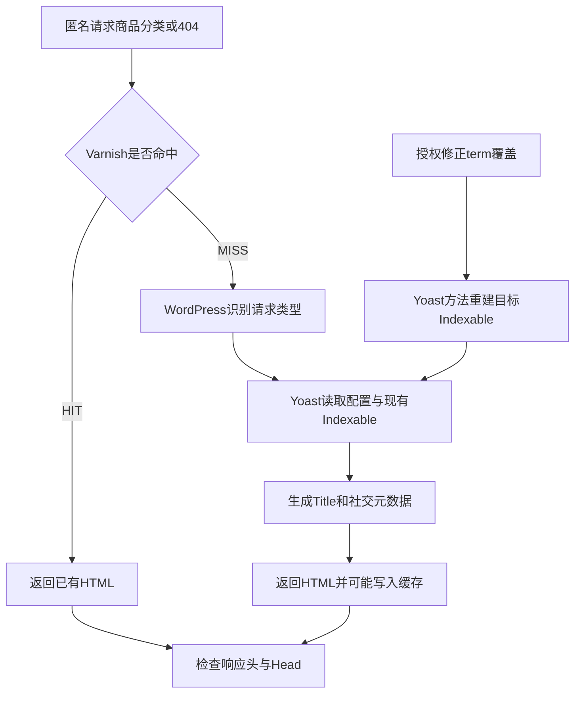

# Day91 WordPress实战：Yoast模板与缓存分层验证

## 相关笔记

- 学习索引：[[WordPress实战笔记索引]]
- 对应项目笔记：[[../Day91-SEO元数据模板与Staging验证|Day91-SEO元数据模板与Staging验证]]
- 前置学习笔记：[[Day48-WooCommerce分类描述与SEO模板边界]]
- 后续学习笔记：D92索引与Canonical审计形成后回填
- 项目事实：[[../../URL_SEO_MAP|URL与SEO映射]]

## 今日学习成果

- [x] 区分Yoast全局模板、分类覆盖、Indexable记录与实际HTTP响应。
- [x] 用写前备份、写后差异核对确认全局三键和CAD/CAM单项覆盖的精确变化。
- [x] 对标准TEST与CAD/CAM分类URL分别定向清理并复验`MISS → HIT`两次一致；其他页面仍需复核。

## 真实项目场景

### 今天解决了什么问题

Staging商品分类和404页面曾输出旧的中文或异常标题。Day91先按授权更新Yoast `wpseo_titles`的三个键，标准TEST分类URL定向清缓存后两次请求均为英文标题。用户随后单独授权修正CAD/CAM Materials（`product_cat` term 32）的唯一标题覆盖。移除覆盖后，新请求仍显示中文：Yoast Indexable id 46保留了旧标题模板。用Yoast自身重建该term的Indexable后，带新查询参数的公网`MISS`已输出英文；标准URL曾命中旧HTML，单URL定向清理后也经公网`MISS → HIT`两次核对为英文。这里依次暴露了配置、Indexable与整页缓存三层状态。

### 学习范围

- 本篇要掌握：全局与分类级Option、Yoast Indexable、整页缓存、备份与差异验证。
- 本篇不展开：分类正式文案、索引策略变更、全站缓存清理、Production发布。
- 真实入口：Staging的`wpseo_titles`、`wpseo_taxonomy_meta`、Yoast Indexable与Cloudways Varnish。
- 本轮没有修改WordPress、WooCommerce、Storefront、Yoast或DentAll运行文件；CAD/CAM修正使用Yoast SEO 28.2自身方法，其接口在其他版本需重查。

## 先建立整体模型

### 一句话模型

全局与term级Option决定标题来源，Yoast Indexable可能保存先前计算的标题，Varnish还可能交付更早生成的整页HTML；三层要分别验证。

### 记忆宫殿或实体比喻

把全局模板想成印刷厂的通用版式，分类独立标题像特制版；Yoast Indexable是供印刷机使用的已整理母版，Varnish是仓库里的成品。撤掉特制版后，还须确认母版已更新；即使新印品正确，旧箱子仍可能送达。

| 记忆对象 | 真实技术对象 | 比喻的边界 |
|---|---|---|
| 通用版式 | `wpseo_titles`内的Yoast模板键 | Option不是已渲染的HTML |
| 特制版 | `wpseo_taxonomy_meta`内term 32的`wpseo_title` | 已获单项授权并用Yoast方法移除；其他字段严格核对不变 |
| 已整理母版 | Yoast `yoast_indexable` id 46 | 撤掉覆盖后仍存旧标题；重建term Indexable后标题清空 |
| 仓库成品 | Varnish缓存的整页响应 | `HIT`只说明命中缓存，不能证明数据库配置仍旧 |
| 新印页面 | 缓存`MISS`后生成的HTML | 还可能受旧Indexable影响，不能单凭`MISS`断定全局模板生效 |

## 思维导图



主干是“Option配置 → Yoast Indexable → 整页缓存”三层；每层都要用对应证据判断。

## 请求与生命周期调用链



- 触发条件：匿名访问商品分类或不存在的URL。
- 输入：`wpseo_titles`三个模板键、`wpseo_taxonomy_meta`的term 32字段与Yoast Indexable状态。
- 可观察输出：HTTP缓存状态、`<title>`和社交标题；robots与Canonical需单独核对。
- 副作用：获授权的配置更新写入两个Option中的指定字段，Yoast自身方法重建目标Indexable；只读HTTP验证不写商品或页面内容。

## 核心概念卡

| 概念 | 准确定义 | DentAll证据与边界 |
|---|---|---|
| 全局模板 | Yoast在相应类型页面使用的默认标题格式 | 三键写后读回正确；不能覆盖已保存的内容级标题 |
| 内容级覆盖 | 特定term自行保存的SEO字段 | CAD/CAM的`wpseo_title`已按单项授权移除；`linkdex`与`content_score`不变 |
| Indexable | Yoast为对象建立的SEO记录 | term 32对应id 46曾留旧标题；用`build_indexable(32)`后标题清空 |
| 页面缓存 | 缓存层保存并重放HTML响应 | TEST与CAD/CAM标准URL曾为旧`HIT`；各自定向清理后新`MISS`及后续`HIT`标题一致 |
| Head与正文 | SEO Head可以指向原请求对象，但正文仍可能由站点保护模板代替 | 当前Staging商品、Shop及分类匿名响应有原URL的Title/状态，同时正文是WooCommerce Coming Soon；不能据此验证商品列表或Product Schema |

## 项目实战代码与命令

### 涉及文件与数据

- 仓库运行文件：本次无变更。
- WordPress数据库：`wpseo_titles`与`wpseo_taxonomy_meta`均有写前完整备份；目标Indexable及Hierarchy也在重建前备份。备份不提交Git。
- Staging页面：`/product-category/test-d12-products/`、CAD/CAM Materials分类和一个不存在的URL。

### 从入口开始追踪

1. Cloudways应用文件夹确认后，进入对应`public_html`，先核对站点`home`与`blog_public=0`。
2. 读取三个Yoast键及完整Option备份；备份共175键。
3. 通过WordPress Option API只改变获授权的三个键。
4. 写后比较确认三键符合目标，其余172键未变，autoload仍为`auto`。
5. 匿名请求页面；标准TEST分类URL旧`HIT`经Breeze定向清理后，新`MISS`与再次`HIT`均核对实际Head。
6. CAD/CAM另行授权后，先备份并两次通过只读dry-run，再由`WPSEO_Taxonomy_Meta::set_values()`移除term 32唯一`wpseo_title`；Option其余字段与autoload均核对不变。
7. fresh `MISS`仍旧后，读到Indexable id 46旧模板；备份目标Indexable/Hierarchy，用Yoast自身`Indexable_Term_Watcher::build_indexable(32)`重建，再分别核对带新查询URL与定向清理后的标准URL。

### 真实命令与模板值

下列只读命令在目标Staging站点运行；模板值为本次已写入并读回的真实值，不是要在其他站点直接执行的脚本：

```sh
wp option pluck wpseo_titles title-tax-product_cat
wp option pluck wpseo_titles social-title-tax-product_cat
wp option pluck wpseo_titles title-404-wpseo
```

| 键 | 本次值 | 用途 |
|---|---|---|
| `title-tax-product_cat` | `%%term_title%% %%page%% %%sep%% %%sitename%%` | 商品分类默认HTML标题 |
| `social-title-tax-product_cat` | `%%term_title%%` | 商品分类默认社交标题 |
| `title-404-wpseo` | `Page not found %%sep%% %%sitename%%` | 404默认标题 |

### 运行证据

- 写前完整Option JSON备份有效，175键；写后三键正确、其余172键未变，autoload为`auto`。
- 新的404与商品分类匿名请求已显示目标英文标题。
- 标准TEST分类URL先返回旧标题且Varnish `HIT`。已核实Varnish主机`127.0.0.1`启用，使用有范围闸门的`breeze_varnish_purge_cache($u,true)`请求仅清理该URL，WP-CLI返回“purge requested”。
- 清理后第一次请求：HTTP 200，`<title>`与OG Title均为`TEST D12 Products - DentAll`，robots为`noindex, nofollow`，无Canonical，`X-Cache: MISS`、`Age: 0`；第二次同一标准URL：HTTP 200、标题相同，`X-Cache: HIT`、`Age: 13`。这证明该URL的新旧缓存路径一致，不代表其他分类已修复。
- CAD/CAM写前`wpseo_taxonomy_meta`备份有效，term 32原有`wpseo_title`、`linkdex`、`content_score`；两次只读dry-run通过。用户追加授权后，`WPSEO_Taxonomy_Meta::set_values()`只移除`wpseo_title`；同进程及独立进程的raw DB/`get_option()`递归排序核对其余字段不变，autoload仍为`auto`。
- 移除覆盖后fresh `MISS`仍为中文。Indexable id 46的title仍是旧模板；目标Indexable与Hierarchy备份后，`Indexable_Term_Watcher::build_indexable(32)`成功，Indexable title清空。重建前只读确认term父级0、description长度0、permalink一致、links 0、hierarchy 1；现场环境类型字符串为`production`，但操作目标始终是Cloudways Staging。
- CAD/CAM带新查询参数的公网请求为200/`MISS`，Title和OG Title均为`CAD/CAM Materials - DentAll`，robots为`noindex, nofollow`。标准URL随后观察到旧`HIT`、`Age: 2081`及中文标题；仅对此URL做Breeze定向清理后，公网连续两次GET分别为HTTP 200、`X-Cache: MISS`、`Age: 0`与HTTP 200、`X-Cache: HIT`、`Age: 2`。两次Title和OG Title均为`CAD/CAM Materials - DentAll`，`X-Robots-Tag: noindex, nofollow`，未提取到Canonical。其他分类仍未因此得到验证。

## 职责边界

| 层级 | 本主题职责 | 当前边界 |
|---|---|---|
| WordPress Core | 保存Option、识别请求并加载插件 | 不修改核心文件或直接改内部表 |
| WooCommerce | 提供商品分类taxonomy与归档上下文 | 不决定Yoast标题模板 |
| Yoast SEO | 读取模板与分类设置、维护Indexable并输出SEO Head | 移除覆盖后还要检查目标Indexable |
| Cloudways Varnish | 缓存并交付整页HTML | 配置写入不会自动证明所有旧URL已刷新 |
| DentAll子主题与Core | 保留既有展示及SEO兼容边界 | 本轮不新增运行逻辑 |

## API机制与站点影响

| 检查面 | 本次结论 |
|---|---|
| Option API | 使用WordPress API更新`wpseo_titles`数组中的三个键，写后按完整备份比较；不是直接SQL改表 |
| 权限与凭据 | 通过已登录的Cloudways Master SSH终端操作；笔记不保存口令、私钥或数据库凭据 |
| 数据 | Staging的`wpseo_titles`三键、term 32的`wpseo_title`及目标Indexable改变；其他Option字段严格核对不变，未改商品、文章、订单或用户 |
| URL、SEO | Slug、路由和索引开关未改；标题输出需逐URL验证，robots与Canonical独立核对 |
| 缓存 | TEST与CAD/CAM两个标准URL分别定向清理并验证新`MISS → HIT`；未全站清理，其他分类未验 |
| 支付、物流、部署 | 不涉及，Production未改；回滚时按备份核对并恢复目标标题，再定向重建索引以恢复公开输出，不覆盖之后他人对其他字段的合法更新。索引时间戳不会按字节回到旧值，必要时参考目标行备份评估 |

## 动手练习与排错

### 四日共用样本中的新边界

2026-10-08的后续匿名只读抽样将D91元数据与D92～D94共用URL放在同一张清单，但不把一次HTTP成功当作四天验收。旧TEST商品URL已成404；当前Sitemap中的商品URL虽为200，匿名正文却是Coming Soon。先检查状态码、Head与`HIT/MISS`，再检查正文实际模板；只有真正可见的商品页面才能验证Product/Offer、商品图片alt和购买信息。Staging的全站`noindex,nofollow`还会使Canonical缺席，因此要把“保护策略正确”与“Production自身Canonical正确”分开记录。

这轮还读到品牌与商品标签进入fresh Sitemap、Shop和商品搜索Title与第一版英文约定不一致。它们是后续SEO治理的证据，并非本篇三键或CAD/CAM单项修正的副作用；没有据此改其他Yoast选项。

1. **只读观察，已执行：** 读回两个Option的目标字段、Indexable id 46及HTTP Head；区分TEST分类的缓存旧`HIT`与CAD/CAM的新`MISS`旧Indexable。
2. **隔离Local模拟，未执行：** 若练习模板变化，先备份Option与记录原值，仅改TEST分类，验证后精确恢复；不得把此练习记为Day91实测。
3. **故障推演：** 若分类清理缓存后仍有旧标题，先看是否真为`MISS`，再检查term级字段与目标Indexable；不要重复改全局模板或盲目全站清缓存。

| 现象 | 优先检查 | 当前判断 |
|---|---|---|
| 全局键已变，标准URL仍旧 | Option读回 → 响应`HIT/MISS` → 定向缓存后再测 | TEST分类旧`HIT`已通过单URL清理，后续`MISS/HIT`一致 |
| 新响应仍有旧标题 | 分类覆盖 → Indexable → Head生成规则 | CAD/CAM覆盖移除后仍有旧Indexable，重建后新`MISS`已正确 |
| 新请求正确、标准URL仍旧 | 对照`MISS/HIT`与Age → 单URL清理 → 同URL再测 | CAD/CAM标准URL旧`HIT/Age 2081`经定向清理，后续`MISS/Age 0 → HIT/Age 2`标题一致 |

## 掌握标准与费曼测试

当前掌握度：初识，尚未由开发者独立完成费曼自测。以下五题待回答，每题须同时给出通俗解释、准确机制与DentAll证据。

1. 为什么三个Option键读回正确，标准TEST分类访客仍可能看到旧标题？
2. Varnish `MISS`为何也不能保证分类采用新模板？Indexable在这里起了什么作用？
3. `wpseo_titles`完整备份为何要放在Webroot外，并比较其余172键？
4. CAD/CAM移除分类级`wpseo_title`后，为何第一次新请求仍旧？如何定位并重建目标Indexable？
5. 若需回滚，为什么要精确恢复目标字段与Indexable，而非写回整个Option？

自测评分：待做，满分10分；有0分题时不提升掌握度。计划于D+1、D+3、D+7、D+14复习；当前均未执行。

## 收尾总结与高效提问

已确认全局三键与CAD/CAM单项覆盖的精确变化，目标Indexable重建后新`MISS`英文标题正确；TEST与CAD/CAM两个代表分类的标准URL定向清理后均通过新`MISS/HIT`验证。其他分类与Production仍未验，D91整体未Done。遇到类似问题，先提供环境、URL、Option与Indexable读回、HTTP `HIT/MISS`、Head片段及已尝试步骤；不要附带凭据。

## 变种应用到其他项目

其他WordPress站点也应分开检查全局模板、内容级覆盖与缓存交付，但所用SEO插件、term字段和缓存入口必须按实际版本重查。Shopify或其他平台也可能有全局与页面级SEO设置、边缘缓存，但本篇未验证其具体字段和失效机制，记为待验证，不纳入DentAll实施范围。

## 可复用核心思想

### 跨平台不变量

源配置正确、SEO中间记录正确和用户收到正确页面是三个不同结论。修改有范围的设置时先留可恢复基线，再用差异证明未伤及其他设置；分类覆盖、Indexable与整页缓存需分别定位。
公开响应还要同时核对Head与正文所代表的页面状态；保护模板的200和原URL的元数据不能代替真实商品内容与结构化数据验收。

### WordPress/WooCommerce当前实现

本次在Cloudways Staging通过WordPress Option API改变`wpseo_titles`三键，再用Yoast方法移除`wpseo_taxonomy_meta`内term 32的单项标题覆盖并重建Indexable id 46。商品分类仍由WooCommerce taxonomy承载；Varnish可交付旧HTML。两个Option的非目标字段与autoload按本轮证据保持不变；Production未验。

### Shopify或其他平台的对应机制

仅能迁移“默认SEO设置、页面级覆盖、缓存交付分层验收”的判断方法；具体API、字段、权限及清缓存机制待按目标平台验证。
