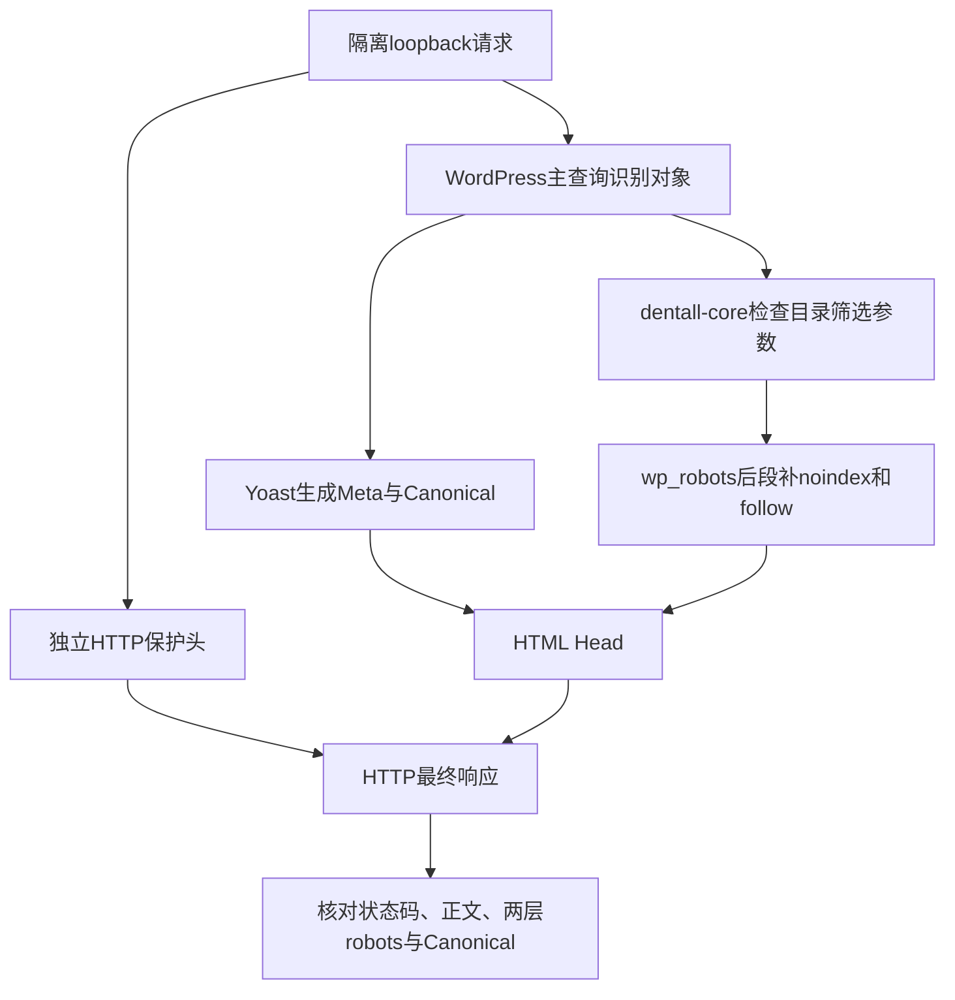

# Day92 WordPress实战：索引环境与Canonical分层验证

## 相关笔记

- 学习索引：[[WordPress实战笔记索引]]
- 对应项目笔记：[[../Day92-URL与Canonical受控验证|Day92-URL与Canonical受控验证]]
- 前置学习笔记：[[Day91-Yoast模板与缓存分层验证]]
- 后续学习笔记：[[Day93-抓取信号与站点地图分层]]
- 后续商品Schema抽样：[[Day94-商品Schema与可见内容一致性]]
- URL合同：[[../../URL_SEO_MAP|URL与SEO映射]]

## 今日学习成果

- [x] 能区分请求身份与正文、页面Meta robots、HTTP `X-Robots-Tag`及Canonical四类证据。
- [x] 能沿真实`wp_robots` Filter解释为什么筛选页为`noindex, follow`，同时保留Yoast基础归档Canonical。
- [x] 能用最少可逆TEST夹具在隔离副本验证有效第2页的主查询、Canonical和`prev/next`；目标环境重定向与缓存仍待。

## 真实项目场景与范围

D91对Staging匿名页面的检查显示全站`noindex,nofollow`且没有Canonical；商品正文还是WooCommerce Coming Soon。若直接把Staging改为可索引来观察Yoast正常分支，会使TEST内容与参数URL进入公开抓取面。因此D92只在独立旧Local数据库的loopback副本里临时设置`blog_public=1`并关闭Coming Soon；隔离PHP路由另加HTTP `X-Robots-Tag: noindex, nofollow`护栏，重新获取11类页面。它回答“当前代码在可索引分支生成什么”，尚未回答“Production能否开放索引”。

- 本篇要掌握：正常URL、参数URL、搜索、404的状态码、页面Meta robots与Canonical分层；隔离护栏与应用输出分离。
- 不展开：修改Staging可见性、正式内容索引、完整分页、D93 Sitemap/robots.txt、D94结构化数据或搜索引擎排名。
- 真实入口：`app/public/wp-content/plugins/dentall-core/includes/seo-compatibility.php`的`wp_robots` Filter；Yoast生成的页面Head；隔离证据`.codex-tmp/day92-94-runtime/evidence/summary.json`。
- 版本边界：DentAll子主题与Core取当前分支，WordPress 7.1及WooCommerce等依赖取旧Local副本；本轮未把旧数据库标题或商品事实外推目标环境。

## 先建立整体模型

### 一句话模型

同一次请求先由WordPress确定页面类型，再由Yoast和站点代码生成页面SEO Head，而HTTP保护头可由外层路由独立追加；只有把状态码、正文、Meta robots、保护头和Canonical一起看，才能判断该URL的实际验收范围。

### 记忆宫殿与真实机制

把网站想成一栋只供内部检查的展厅：门外的“访客限制牌”是隔离路由的HTTP保护头；展品旁的“可否收录牌”是页面Meta robots；“同系列首选展品地址”是Canonical。打开展厅内部灯光以查看展品，相当于在隔离数据库设置`blog_public=1`并关闭Coming Soon，但不等于移走门外限制牌。

| 比喻 | WordPress真实对象 | 失效边界 |
|---|---|---|
| 展厅门 | 仅监听loopback的测试服务与`X-Robots-Tag` | 路由保护只在该隔离服务生效，不会自动保护Staging |
| 展品类型 | WordPress主查询、Woo商品/归档/搜索/404 | 相同URL可因Coming Soon或身份而显示不同正文 |
| 收录牌 | HTML Meta robots及`wp_robots` Filter | 页面Meta不替代HTTP头或实际公网可达性 |
| 首选地址 | Yoast Canonical | Canonical不是重定向，也不保证页面会被索引 |

## 思维导图与请求链



主干是“请求类型 → 应用Head → 外层保护 → 联合验收”；不能把任何一层单独写成D92完成。

## 核心概念卡

| 概念 | 准确定义 | DentAll样本与误区 |
|---|---|---|
| 页面Meta robots | HTML Head中的页面抓取提示 | 隔离首页为`index, follow`，同时测试路由HTTP头仍为`noindex,nofollow`；不能只看Meta判断公网安全 |
| HTTP `X-Robots-Tag` | 响应头中的抓取提示 | 复测11类请求均有测试路由护栏；这不是Staging配置变更 |
| Canonical | 页面声明的首选URL | 合法变体参数指向父商品，排序指向Shop；不能把Canonical当成301 |
| `noindex, follow` | 不将此响应作为独立索引目标，仍允许沿链接发现页面的策略 | 价格筛选与商品搜索均如此，但前者Canonical回Shop、后者无Canonical |
| 有效分页 | 有真实结果且主查询为第2页的200响应 | 首轮两件商品时第2页为404；第二轮隔离库临时扩至13件后，Page 2为200、主查询确认为第2页且自身Canonical |

## 项目实战代码

真实文件：`app/public/wp-content/plugins/dentall-core/includes/seo-compatibility.php`。下面摘录筛选键命中后的原代码，条件守卫与完整键判断见源文件。

```php
unset( $robots['index'], $robots['nofollow'] );
$robots['noindex'] = true;
$robots['follow']  = true;
break;
```

该回调注册到`wp_robots`，优先级为`PHP_INT_MAX`。它只针对非搜索的Shop或商品分类，检查请求是否含价格、`filter_*`或`query_type_*`键；命中时改页面Meta robots，不改Yoast Canonical表示层。若直接改变Yoast更早的robots presentation，历史Local验证发现Yoast可能停止输出所需的基础Canonical，所以此处保留两条职责边界。

## 隔离运行证据

| URL类 | HTTP/页面Meta | Canonical | 可得结论 |
|---|---|---|---|
| 首页、Shop、TEST分类、Simple/Variable | 200；`index, follow` | 各自无参数URL | 当前代码的正常对象分支可观察 |
| 合法Variation属性参数 | 200；`index, follow` | 父商品URL | 不创建变体独立首选URL |
| Shop排序 | 200；`index, follow` | Shop | 排序不是独立首选URL |
| Shop价格筛选 | 200；`noindex, follow` | Shop | robots与Canonical由不同机制收敛 |
| 商品搜索 | 200；`noindex, follow` | 无 | 搜索与Shop不是等价内容 |
| 首轮Shop第2页、未知URL | 404；`noindex, follow` | 无 | 首轮第2页是样本量不足；未知URL为真实404 |

第二轮只在独立数据库以WooCommerce CRUD新增11件唯一TEST商品，让原2件变成13件、Shop每页12件。Shop首页主查询为13件/2页，Head `next`与可见分页指第2页；`/shop/page/2/`为200，主查询`paged=2`、唯一TEST卡片可见，页面Meta `index, follow`、Canonical自身、Head `prev`与可见上一页回Shop，且无`next`；越界第3页为404、无Canonical。11件夹具删除后，商品、term、关系、Woo lookup及关键设置九组快照的行数和SHA-256均回到创建前，相关Yoast Indexable夹具残留0；Coming Soon恢复并停服务。证据位于忽略目录`evidence/day92-page2/`，不把TEST数据写入正式内容。

- 11类GET的HTTP保护头在隔离PHP路由复测均为`noindex,nofollow`；HTML页面Meta仍保留上述可索引分支，便于检查Yoast输出。服务只监听`127.0.0.1`，这不代表Staging已改变或Production抓取策略通过。
- `/shop/page/1/`在隔离PHP路由为200、Canonical回Shop；运行中的Local Nginx及Staging则是301回Shop。这里存在路由环境差异，不能把隔离PHP路由当成最终重定向验收。
- 当前旧Local的标题为`Dentall`，TEST商品在该库中存在；Staging样本、名称与Coming Soon状态不同，不外推内容事实。
- 11类结果保存在忽略目录`.codex-tmp/day92-94-runtime/evidence/summary.json`；本笔记没有把JSON或用户凭据加入Git。

## 职责、风险与排错

| 层级 | 负责内容 | 当前待验 |
|---|---|---|
| WordPress主查询 | URL对象与200/404、搜索和分页身份 | 隔离有效Page 2已通过，目标环境仍待 |
| WooCommerce | 商品、归档和Coming Soon响应分支 | Staging受控可见商品正文 |
| Yoast | 页面Meta、Canonical及SEO Head | 目标环境索引状态和实际缓存 |
| `dentall-core` | 目录筛选参数页的`noindex, follow` | Staging部署版本与参数组合 |
| 隔离PHP路由 | 仅测试服务的HTTP保护头 | 已复核回环监听、恢复与停机；公网目标环境仍待验 |

本次没有修改运行代码、Staging/Production数据库、URL、缓存或真实交易。隔离Coming Soon已恢复为`yes`，临时PHP/MySQL服务已停止，源Local关键选项和`wp-config`哈希保持。若某个参数页Canonical消失，先看响应身份与Coming Soon，再看页面Meta robots、Yoast输出和`wp_robots`优先级，最后检查缓存；不能直接补一个硬编码Canonical。若Page 1在不同环境状态码不同，先查Web服务器及WordPress规范化路由，再查主题链接，不把Canonical相同误写为重定向相同。

## 动手练习与掌握标准

1. **只读观察：** 在隔离结果中选Shop、排序、价格筛选、搜索各一条，分别说出HTTP状态、Meta robots、HTTP保护头和Canonical。
2. **Local最小实验：** 仅在有访问限制的独立副本切换`blog_public`并对比Head；操作前记录原值，完成后恢复、确认保护头与服务停机。本篇记录的是已有隔离测试，不授权在Staging照做。
3. **故障推演：** 假设参数URL被索引，先核对是否真正访问到了目标页面及缓存状态，再核对两层robots与Canonical，最后确认哪个配置/Filter实际负责。

当前掌握度仍为初识，尚未由开发者本人完成费曼自测。达到“能排错”至少需说明有效分页的主查询与`prev/next`证据、PHP路由与Nginx的Page 1差异，以及夹具恢复边界。

### 费曼测试题

1. 为什么隔离首页的页面Meta是`index, follow`，HTTP响应还能带`noindex,nofollow`？两层各由谁生成？
2. 为什么商品合法Variation URL为200，却把Canonical指向父商品？这与301有什么不同？
3. 为什么排序和价格筛选都指向Shop，但两者的页面Meta robots不同？
4. 为什么商品搜索不能机械地Canonical到Shop？
5. 为什么`/shop/page/2/`的404不证明分页错误或分页通过？
6. 为什么隔离PHP路由的`/shop/page/1/`结果不能覆盖Local Nginx和Staging的301证据？

自测与D+1/D+3/D+7/D+14复习尚未执行，不以笔记生成代替掌握。

## 收尾总结与提问材料

面对SEO索引问题，先提供环境和访问身份、完整URL、状态码、正文是否Coming Soon、页面Meta、HTTP `X-Robots-Tag`、Canonical与缓存头，再说明该URL在合同中应是正常页、参数页、搜索页还是404。请勿附带Cookie、密码、数据库凭据或未批准公开的业务资料。

## 可复用核心思想

### 跨平台不变量

索引状态、首选URL和路由状态码分别回答不同问题。受控验证应同时证明测试系统可观察目标分支和外层保护有效；样本不具备有效分页时可用最少可逆夹具补足，随后按原数据快照核对恢复。

### WordPress/WooCommerce当前实现

WordPress主查询决定页面身份，Yoast负责Canonical和基础Meta，`dentall-core`在`wp_robots`后段补目录筛选noindex规则，WooCommerce Coming Soon决定匿名正文分支。隔离路由保护头与这些应用输出分层验证；临时数据库设置不随Git传播。

### Shopify或其他平台的对应机制

可迁移的是按URL类型列状态码、索引与首选URL矩阵，并在私有环境验证公开目标分支。其他平台的SEO设置、参数路由和保护头入口需按其实际实现重新核对，不能直接搬用`wp_robots`或Yoast配置。
