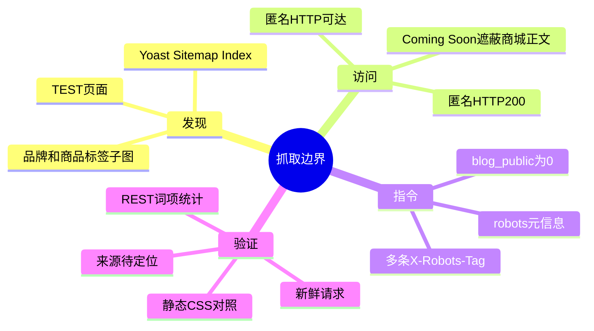
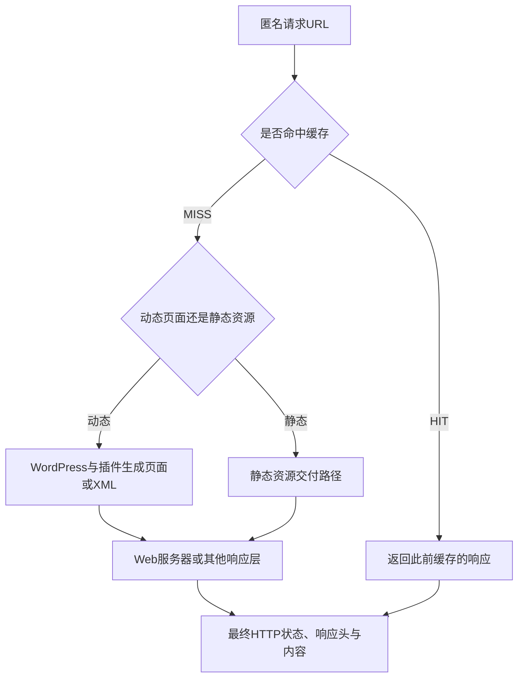

# Day93 WordPress实战：抓取信号与站点地图分层

## 相关笔记

- 学习索引：[[WordPress实战笔记索引]]
- 对应项目笔记：[[../Day93-Sitemap与抓取边界审计|Day93-Sitemap与抓取边界审计]]
- 前置学习笔记：[[Day91-Yoast模板与缓存分层验证]]
- 同轮Canonical机制对照：[[Day92-索引环境与Canonical分层验证]]
- 品牌taxonomy基线：[[Day52-WooCommerce原生品牌taxonomy与筛选URL]]
- 项目URL合同：[[../../URL_SEO_MAP|URL与SEO映射]]

## 今日学习成果

- [x] 能把Sitemap中的URL、页面robots、HTTP响应头和访问控制视为不同证据层。
- [x] 能解释`blog_public=0`为何影响WordPress的robots输出，却不能据此定位静态CSS上的`X-Robots-Tag`来源。
- [ ] 能在受控环境定位双响应头来源并完成D93抓取矩阵；本轮尚未做到。

## 真实项目场景

### 今天解决了什么问题

Staging仍禁止索引，但匿名请求能读到Sitemap Index及其品牌、商品标签和TEST页面URL。`robots.txt`和Sitemap响应各有两条不同的`X-Robots-Tag`，静态CSS也带固定`noindex,nofollow`。只看WordPress“建议搜索引擎不索引”开关，无法解释这些HTTP响应的完整来源，也不能据品牌已入图就断言品牌可被索引。

### 学习范围

- 本篇掌握：URL发现、抓取访问、索引指令、内容可见性和缓存响应的分层检查。
- 本篇不展开：未知响应头的具体配置归属、商品标签最终SEO策略、Production搜索引擎收录结果。
- 实际入口：Staging的`/robots.txt`、`/sitemap_index.xml`、`/product_brand-sitemap.xml`、`/product_tag-sitemap.xml`及一条静态CSS；只读WordPress REST词项分页。
- 本轮只读，没有保存设置、改变`blog_public`、关闭Coming Soon、清缓存或提交Sitemap。

## 先建立整体模型

### 一句话模型

Sitemap告诉爬虫“可能去哪里”，访问控制决定“能否取到”，HTTP与HTML robots信号说明“如何处理”，页面内容与缓存决定“实际取到什么”；这些层不能互相替代。

### 记忆宫殿或实体比喻

把网站想成资料馆：Sitemap是目录，访问密码是馆门，`robots`是每份资料附带的使用说明，缓存是前台可能递出的旧影印件。目录列出档案不表示大门开放，也不表示使用说明允许公开；前台递出的旧影印件还可能与后台的新规则不同。

| 记忆对象 | 真实机制 | 比喻边界 |
|---|---|---|
| 目录 | Yoast XML Sitemap中的URL | 列出URL不是已收录证明，也不是内容质量审批 |
| 馆门 | HTTP认证或仅本机可达等访问控制 | `noindex`和WooCommerce Coming Soon不等于全站认证；当前Staging匿名可得200 |
| 使用说明 | HTML robots元标签与`X-Robots-Tag` | 来源可在WordPress、插件或服务器层；同一响应可能出现多条指令 |
| 旧影印件 | Varnish/Breeze等缓存交付的响应 | `HIT`和`MISS`需分别看实际Head与正文，不能只读后台设置 |

## 思维导图

主干是“发现 → 访问 → 指令 → 实际内容”；任何一层的通过，都不能推出其余层已经正确。

## 请求与生命周期调用链

这是排查用的职责图，不宣称已定位Cloudways内部路由。WordPress官方[`wp_robots_noindex()`](https://developer.wordpress.org/reference/functions/wp_robots_noindex/)说明：站点未公开时，它向`wp_robots`结果加入禁止索引指令。该机制解释动态页面可能受`blog_public`影响；它本身不能证明静态CSS响应头由WordPress发出。[Yoast也说明](https://yoast.com/help/canonical-urls-in-yoast-seo/)标记`noindex`的页面可能不输出Canonical，故当前Staging不能替代Production Canonical验收。

## 核心概念卡

| 概念 | 准确定义 | DentAll当前证据 |
|---|---|---|
| `blog_public` | WordPress全站搜索可见性选项 | Staging读回0，动态页面处于禁止索引边界；不表示匿名HTTP被拦截 |
| Sitemap | 提供URL发现线索的XML输出 | 新鲜Index有7个子图；品牌3条、商品标签248条、Page仍有TEST |
| `robots.txt` | 告知爬虫可抓取路径与Sitemap入口的文本文件 | 当前Staging可匿名读取；它与页面robots元信息或HTTP `X-Robots-Tag`不是同一层 |
| `X-Robots-Tag` | HTTP响应中的抓取/索引指令 | robots与XML均见`noindex,follow`和`noindex,nofollow`两条；来源未定位 |
| 静态资源对照 | 用不依赖WordPress页面模板的资源观察响应层 | 核心CSS为200，也带`noindex,nofollow`；提示存在疑似独立响应头规则，不能定性为Cloudways平台设置 |
| 访问控制 | 阻止未经授权者取得内容的边界 | 当前匿名200；Coming Soon只遮蔽部分商城正文，不能替代应用级密码保护 |

## 项目实战代码与证据

### 涉及文件与入口

- 项目事实：[[../Day93-Sitemap与抓取边界审计]]记录本轮HTTP、REST、边界和待办；[[../../DECISIONS|项目决策]]的ADR-033及[[../../URL_SEO_MAP|URL与SEO映射]]记录品牌第一版不入图合同。
- 项目代码：`app/public/wp-content/plugins/dentall-core/includes/seo-compatibility.php`中已有`wp_robots`过滤器，仅在Shop或商品分类带价格/筛选键时给参数页设置`noindex, follow`；这段代码不负责全站`blog_public`，也不能据此解释静态CSS上的响应头。本轮没有改该文件。
- 平台机制：WordPress核心`wp_robots_noindex()`和Yoast的Sitemap/Canonical输出；生产环境Web服务器或缓存层的实际头规则仍待定位。

### 从入口开始追踪

1. 先确认目标环境`blog_public=0`、Coming Soon开启，并用匿名请求核对页面实际可达性；本轮未重新读取Cloudways Password Protection设置。
2. 对`robots.txt`、Sitemap Index和目标子图发新鲜只读请求，记录状态、`X-Cache`/`Age`、全部`X-Robots-Tag`和XML URL数；不把地图数量当成索引数量。
3. 请求静态CSS作对照：若同样有`noindex,nofollow`，只能将“存在独立于Yoast页面动态输出的规则”列为强提示，再查Web服务器、应用和缓存各层来源。
4. 用只读REST分页统计商品标签：294个，其中46个为空、199个关联1商品、49个关联至少2商品；分类策略仍由业务用途和内容质量决定。

### 最小运行证据与局限

| 样本 | 已观察结果 | 不能推出 |
|---|---|---|
| 新鲜Sitemap Index | 200，7个子图 | 这些URL都应在Production索引 |
| 品牌与商品标签子图 | 品牌3条、商品标签248条 | Staging品牌Yoast开关值或每个标签的业务价值 |
| Page子图 | 含TEST页面 | TEST页面已经取得正式发布批准 |
| 新鲜robots/Sitemap头 | 各有两条不同`X-Robots-Tag` | 已确定哪一条来自WordPress、Yoast或Cloudways |
| 静态CSS头 | 200且有`noindex,nofollow` | 所有动态路径的同值头必来自同一配置 |

既有Local数据库里Yoast `noindex-tax-product_brand=true`、品牌词项为0；Staging品牌子图有3条。这是两个环境的不同事实，不能用Local选项推定Staging选项。Staging REST中ADS、Aidite和Toboom的Yoast `robots.index=noindex`，但全站`blog_public=0`，仍无法区分全站与品牌专属规则，也不能解释品牌为何入图。品牌当前**输出**与ADR-033合同不符，具体配置、派生索引与缓存须继续只读核实。公开Staging当前仍`blog_public=0`，没有通过短暂开放索引来制造Canonical证据。

## 职责边界与站点影响

| 层级 | 负责什么 | 本轮判断边界 |
|---|---|---|
| WordPress | `blog_public`与`wp_robots`等动态页面机制 | 不能解释静态文件响应头的全部来源 |
| WooCommerce | Coming Soon遮蔽商城正文 | 匿名200及Sitemap仍可存在，不能替代全站认证 |
| Yoast | SEO Head、Indexable与XML Sitemap | 地图输出需对照配置、索引与缓存；本轮未写设置 |
| Web服务器与缓存 | 最终HTTP响应及可能的重放 | 双头与静态CSS提示继续调查；具体来源未定位 |
| 内容负责人 | 正式品牌/标签/TEST页面策略和内容 | 未获决定前不批量删除或改索引规则 |

本轮运行代码、数据库、URL、robots配置、缓存、支付、物流、邮件及部署变化均为0，因而无站点回滚。未来若修正品牌或标签地图，应先备份获授权目标设置，只改最小字段，再核对原点与缓存的标准URL及子图；不要把Local结果外推Production。关于临时开放，Google的[访问与索引控制文档](https://developers.google.com/search/docs/crawling-indexing/control-what-you-share)区分密码保护和`noindex`，本项目优先在受控隔离副本观察可索引状态，现有公网Staging继续禁止索引。

## 动手练习与排错顺序

1. **已做的只读观察：** 对同一URL记录状态码、所有同名响应头、缓存头和XML内容，再用一条静态资源对照。检查“新鲜请求”时仍应观察是否真的`MISS`，不能只依赖查询参数。
2. **已做的D92机制对照：** 当前分支隔离副本只监听环回，HTTP额外带`noindex,nofollow`；隔离数据库`blog_public=1`时观察到正常页Canonical与参数页robots，随后恢复Coming Soon并停服务。D93仍需核实Sitemap配置与双头来源，不能据此宣称公开搜索引擎验收。
3. **故障推演：** 若后台品牌设为`noindex`但Sitemap仍列品牌，依次读回同环境选项、词项、Yoast派生索引、新鲜XML和标准XML缓存；不先清全站缓存或假定后台保存失败。若动态与静态响应都出现固定头，再分层找实际添加点。

常见误区是把“地图列出”“匿名200”“`noindex`”“Coming Soon”和“密码保护”当作同一个开关。正确排查先收集最终HTTP，再核对应用状态和生成源；一旦需要改环境边界，先让访问控制与回滚经过单独验证。

## 掌握标准与费曼自测

- 能给出一个Sitemap URL出现、页面仍不应索引的具体情形，并说出要核对哪些实际响应。
- 能解释为什么静态CSS上的`X-Robots-Tag`不能直接归因于WordPress或Cloudways。
- 能把“品牌Sitemap 3条”准确表述为输出合同差异，而非未经读取的Staging开关值。

1. Sitemap列出248条商品标签，是否意味着248页都应收录？**否**。需要先确定正式标签策略及页面内容，再核对真实robots与公开状态。
2. `blog_public=0`是否阻止匿名访客访问？**否**。本轮匿名请求仍得到200；它主要影响搜索可见性信号。
3. 为什么要请求静态CSS？**为了对照动态WordPress页面以外的响应**；同值头提示有其他响应层，具体来源仍待定位。
4. 两条`X-Robots-Tag`可否只挑喜欢的一条记录？**不可**。必须完整保存同名头，按最终响应判断并追查来源。
5. 暂时把公网Staging设成可索引再改回，是否等于安全测试？**否**。TEST内容、缓存旧响应及匿名访问会使开放窗口带来实际风险；隔离副本更适合先验机制。

自评仍为“初识”：可以解释已取证的分层关系，尚不能解释第二条响应头的实际配置位置，也未完成D93正式策略验收。后续复习时优先重做同一URL的生成源、HTTP原点与缓存三层对照。

## 后续如何向AI高效提问

给出目标环境、标准URL与新鲜请求的完整响应头、缓存状态、`blog_public`和Coming Soon值、对应Yoast选项的只读值，再问：“哪一层的证据可支持当前结论？下一条最小只读验证是什么？哪些来源仍无法确定？”避免只提供后台截图就要求断定爬虫实际收到什么。

## 变种应用到其他项目

当商城同时存在商品分类、品牌、标签与参数页时，先逐类列出“正式内容门槛、是否进地图、robots、Canonical、访问限制”，再拿同一代表URL测试生成源和最终HTTP。其他托管平台可能有独立CDN与边缘规则；不能照搬本项目的两条响应头来源假设。

## 可复用核心思想

### 跨平台不变量

发现、访问、索引指令、实际内容和缓存是不同层。任何一层的单次200或列表条目，都不能证明某个URL已具备正式收录条件；对外策略须以最终响应和内容责任为准。

### WordPress/WooCommerce当前实现

WordPress `blog_public`能影响动态页面的robots输出，WooCommerce Coming Soon会遮蔽商城正文，Yoast生成Sitemap及SEO Head，项目Core另对筛选参数页设置robots；Web服务器和缓存仍可能改变或重复最终响应头。静态CSS上的`noindex,nofollow`只把调查范围扩展到页面动态生成之外，未定位配置源。

### Shopify或其他平台的对应机制

也应分别检查集合/标签发现清单、访问控制、robots与边缘缓存；Shopify具体字段、Sitemap行为和响应头规则未在本轮验证，保持待查。
