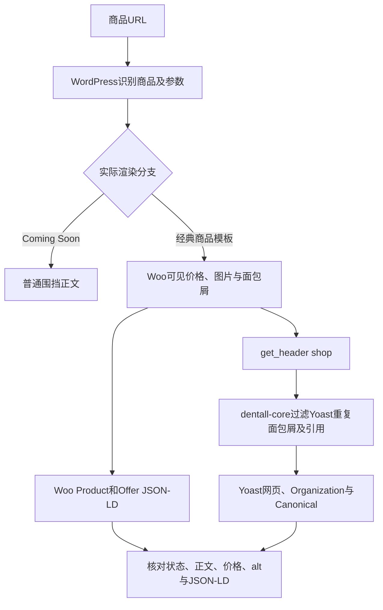

# Day94 WordPress实战：商品Schema与可见内容一致性

## 相关笔记

- 学习索引：[[WordPress实战笔记索引]]
- 对应项目笔记：[[../Day94-商品与组织Schema阶段验证|Day94-商品与组织Schema阶段验证]]
- 前置知识：[[Day65-渲染生命周期与结构化数据去重]]
- URL与索引分层：[[Day92-索引环境与Canonical分层验证]]

## 今日学习成果

- [x] 能区分Simple的Offer现价、Variable的AggregateOffer范围和合法变体参数URL的Offer。
- [x] 能说明为什么只在真实商品模板分支撤去Yoast重复面包屑，同时保留WooCommerce Product。
- [ ] 能在浏览器与目标公开环境完成动态变体价格、正式图片、Organization和在线验证器复核；本轮未做。

## 真实项目场景与学习范围

Staging匿名商品正文仍是WooCommerce Coming Soon，且全站`blog_public=0`；直接从该输出判断Product Schema缺失，会把“访客没看到商品”误判成“商品结构化数据故障”。D94于是用当前分支代码、独立旧Local数据和仅监听本机的副本观察真实商品模板。它解决的是技术输出归因和价格一致性抽样，不负责正式商品事实、Logo、社交图片或Production索引验收。

- 真实入口：WooCommerce经典商品模板与原生商品数据；`app/public/wp-content/plugins/dentall-core/includes/seo-compatibility.php`的`get_header`监听及两个Yoast Filter。
- 验证版本：WordPress 7.1、WooCommerce 11.0.0、Yoast 28.2、PHP 8.2.29；数据是独立旧Local TEST副本。
- 不展开：编造品牌/评价、修改第三方插件、在线富结果承诺、支付/库存写入、Staging开放索引。

## 先建立整体模型

一句话模型：先确认本次请求实际显示商品，再对照可见价格、WooCommerce商品JSON-LD、Yoast网页图谱和Canonical；不同输出必须指向同一商品事实，但各有独立职责。

把商品页想成一张货架：消费者看到的价签是页面价格，机器读取的价签是Offer，过道指示是BreadcrumbList，门店名片是Organization，商品地址是Canonical。变体未选择时货架展示价格范围；选择属性后才有某个具体组合的价格。这个比喻不能说明WordPress的执行顺序，也不能把结构化数据当成交易价格的唯一来源。

| 记忆对象 | 真实机制 | 边界 |
|---|---|---|
| 消费者价签 | WooCommerce模板中的现价或范围 | 服务端初始HTML与浏览器选中变体后的状态不同 |
| 机器价签 | Product内的Offer或AggregateOffer | 必须核对实际商品/变体与可见内容，不能随意补值 |
| 过道指示 | Woo可见面包屑与BreadcrumbList | 当前经典商品页只保留一条机器路径 |
| 门店名片 | Yoast Organization图谱 | 旧Local组织资料不等于正式公司资料 |
| 门口限制牌 | 隔离路由的HTTP`noindex`头 | 不改变页面Meta或Staging的索引配置 |

## 思维导图与请求生命周期



主干是“真实渲染分支 → 同一商品事实的两种表达 → 逐项对照”；URL看起来像商品页，不保证匿名访客真正看到商品模板。

## 核心概念卡

| 概念 | 准确定义 | DentAll证据与误区 |
|---|---|---|
| Product与Offer | Woo输出具体商品及可购买报价 | Simple促销现价24.99与Offer一致；不能拿划线原价29.99充当当前报价 |
| AggregateOffer | 一个可变商品可用报价的范围 | Variable可见39.99～49.99，JSON-LD同范围；不能把范围误作已选变体 |
| 变体参数URL | 带已选属性的父商品请求 | Schema Offer 39.99，Canonical仍指父商品；初始HTML仍是父级价格范围 |
| BreadcrumbList | 机器可读路径 | 三个商品样本均仅一条，Yoast WebPage无悬空引用 |
| Organization | 站点组织实体 | 隔离首页Yoast有一条；资料来自旧Local，不能证明正式Logo和社交账号已核准 |
| `alt` | 图片替代文本属性 | 商品样本无缺/空；是否准确仍要逐图审查 |

## 项目实战代码与输出责任

真实代码位于`app/public/wp-content/plugins/dentall-core/includes/seo-compatibility.php`。当前函数先检查实际调用`get_header('shop')`、Yoast存在、商品查询成立及Woo面包屑回调仍挂载，再在本次请求注册：

```php
add_filter( 'wpseo_schema_needs_breadcrumb', '__return_false' );
add_filter( 'wpseo_schema_webpage', 'dentall_core_remove_yoast_breadcrumb_reference' );
```

同文件的引用清理只处理WebPage数组：

```php
function dentall_core_remove_yoast_breadcrumb_reference( $data ) {
    unset( $data['breadcrumb'] );
    return $data;
}
```

第一条Filter移除Yoast的重复BreadcrumbList；第二条清除WebPage指向已不存在节点的引用。它们没有生成Product、Offer或商品价格，也没有改数据库。当前商品响应的另一段JSON-LD包含WooCommerce Product/Offer和一条BreadcrumbList；组织图谱仍由Yoast输出。若Coming Soon改走普通页头，该条件过滤不应机械地删除唯一的Yoast路径。

## 隔离运行证据

| 样本 | 实际输出 | 可见内容对照 | 尚不能推出 |
|---|---|---|---|
| Simple TEST商品 | Product 1、Offer 1、BreadcrumbList 1；USD 24.99、InStock | 划线原价29.99，促销现价24.99 | 正式商品价格或真实库存已确认 |
| Variable TEST商品 | Product 1、AggregateOffer 1、BreadcrumbList 1；39.99～49.99 | 服务端可见同一范围 | 每个正式变体都已校对 |
| 合法变体参数 | Product 1、Offer 1、BreadcrumbList 1；USD 39.99 | 服务端初始HTML仍显示父级范围；Canonical指父商品 | 浏览器选中后的动态价格已通过 |
| 隔离首页 | Yoast Organization 1 | 旧Local首页及组织资料 | Staging/Production首页组织信息已通过 |

三个商品页面图片均有非空`alt`；隔离首页一张空`alt`是否为装饰图待人工判断。11类GET的真实商品、归档、搜索与404原始HTML/响应头位于本机忽略目录`.codex-tmp/day92-94-runtime/evidence/raw-guarded/`，解析结果见`summary.json`及`product-details.jsonl`。隔离PHP路由对11个HTML样本均返回HTTP`noindex,nofollow`，页面Meta仍按`blog_public=1`生成；这是两层不同输出。副本Coming Soon已恢复并停机。

这些证据只证明本次旧Local数据与当前分支代码的样本输出。没有运行Google Rich Results Test/Schema验证器、浏览器变体动态交互、正式图片授权检查或公开目标环境缓存复验。

## 职责、安全与排错顺序

| 层级 | 本主题责任 | 不应混淆 |
|---|---|---|
| WordPress | 识别商品请求和模板生命周期 | 查询为商品不保证正文不是Coming Soon |
| WooCommerce | 商品/变体价格、模板展示及商品JSON-LD | 不把测试价格写为正式数据 |
| Yoast | WebPage、Organization、Canonical及社交输出 | 不负责替业务方确认Logo或公司资料 |
| DentAll Core | 在目标经典商品模板协调重复面包屑 | 不自建一套Product Schema |
| 浏览器 | 展示变体选择后的动态价格与库存 | 服务端初始HTML不能替代交互验收 |
| 隔离运行时 | 私有复制、HTTP保护、恢复与停机 | 不自动证明Staging公开输出 |

若Product缺失，依次检查HTTP状态与实际H1/正文是否Coming Soon、商品模板是否进入、Woo JSON-LD是否输出；若价格不一致，先区分原价/促销现价、父商品范围/选定变体，再查商品事实；若有两条面包屑，先确认Woo可见路径与两段JSON-LD及WebPage引用，不直接删除整个Yoast图谱。

## 动手练习与掌握标准

1. **只读观察：** 从`product-details.jsonl`找出三个商品的Offer类型、价格和Canonical，再对照各自原始HTML价格区块。
2. **隔离最小实验：** 只在私有数据库记录Coming Soon原值、暂时显示商品正文、抓取结构化数据，然后恢复原值并确认端口停机；本篇记录的是已完成实验，不授权修改Staging。
3. **故障推演：** 设想选定变体网页显示49.99而Offer为39.99，先核对属性组合及客户端实际选中状态，再比对Woo变体数据和服务器JSON-LD；不直接硬编码Schema价格。

当前掌握度为初识，开发者本人未完成费曼自测。达到“能排错”还需在浏览器验证变体选择后的价格与库存，并能说明同一URL在Coming Soon和真实模板下为什么会有不同Schema。

### 费曼测试题

1. 为什么Staging匿名商品页未见Product，不能直接判定D94商品Schema失败？
2. Simple的29.99原价和24.99现价中，Offer应与哪一个对齐？怎样从页面证明？
3. Variable的AggregateOffer与合法变体参数页的Offer各表示什么？
4. 为什么删除重复BreadcrumbList时还要检查WebPage的`breadcrumb`引用？
5. 为什么隔离首页有Organization仍不足以宣布正式Logo及社交图片验收通过？
6. 哪些证据必须通过真实浏览器、目标环境和在线验证器另行取得？

自测答案、D+1/D+3/D+7/D+14复习尚未记录，不以笔记生成代替掌握。

## 收尾总结与高效提问

下次提问应给出环境版本、访问身份、完整商品URL、Coming Soon状态、可见现价/范围、JSON-LD类型和价格、Canonical、图片`alt`以及具体差异；只提供脱敏样本，不附Cookie、数据库凭据或真实客户资料。

## 可复用核心思想

### 跨平台不变量

机器可读数据必须与用户实际可见的商品事实一致，但要先说明比较的是服务端初始状态、范围还是客户端已选变体。Schema计数、内容质量和搜索平台展示是不同验收层级。

### WordPress/WooCommerce当前实现

WooCommerce负责商品事实及Product/Offer，Yoast负责网页、组织和Canonical；`dentall-core`只在真实经典商品模板中移除重复面包屑及引用。旧Local TEST数据与Staging Coming Soon响应不能代替正式公开内容。

### Shopify或其他平台的对应机制

可迁移的是“页面价签、机器价签、规范地址和图片语义逐项对照”的方法。其他平台的结构化数据生成、变体选择和分享图片机制需按其当前实现查证，不能照搬WordPress Hook或Yoast字段。
