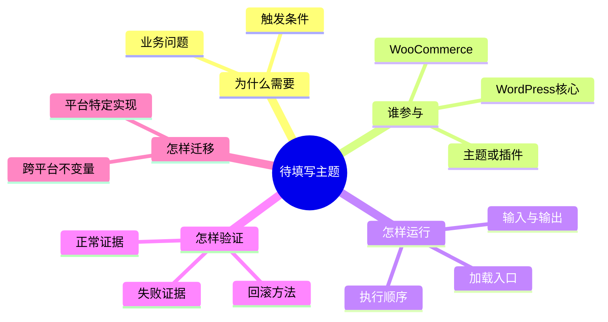
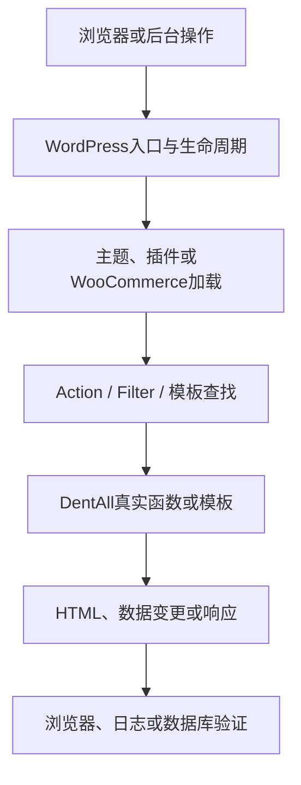

# Day待填写 WordPress实战：待填写主题

> [!tip] 使用方式
> 自Day27起至Day120，每个Day在当天收尾时默认复制本文件并填写，不要等到后续集中补写，也不要直接把学习内容长期写在模板里。删除所有“待填写”提示，并把文件命名为`Day{天数}-中文主题.md`；内容必须来自当天真实开发、配置、验证或排错，不能用空泛教程凑篇数。D1～D25不自动追溯补写。

## 相关笔记

- 学习索引：[[WordPress实战笔记索引]]
- 对应项目笔记：[[Day待填写-项目笔记名称]]
- 前置学习笔记：待填写；没有则写“无”
- 后续学习笔记：完成后回填
- 同主题知识：待填写；只链接有直接关系的笔记

> [!check] 双向链接完成条件
> 本学习笔记链接对应项目笔记；对应项目笔记反向链接本学习笔记；[[WordPress实战笔记索引]]的目录表也登记本笔记。

## 今日学习成果

最多写3项，而且要能够验证。

- [ ] 我能用自己的话解释：待填写
- [ ] 我能沿真实代码追踪：待填写
- [ ] 我能在Local安全修改、验证并回滚：待填写

## 真实项目场景

### 今天解决了什么问题

待填写：用一段话说明DentAll为什么在今天遇到这个知识点。

### 学习范围

- 本篇要掌握：待填写
- 本篇明确不展开：待填写
- 项目中的真实入口：`待填写真实文件路径、Hook、页面或后台路径`
- 验证版本与环境：待填写WordPress、WooCommerce、主题、PHP及Local/Staging范围

## 先建立整体模型

### 一句话模型

待填写：用一句因果关系概括，不只写名词定义。

### 记忆宫殿或实体比喻

待填写：选择一个稳定场景，例如商场、酒店、流水线或邮局，说明参与者和先后关系。

### 比喻对应回真实机制

| 记忆对象 | 真实技术对象 | 不能混淆的边界 |
|---|---|---|
| 待填写 | WordPress/WooCommerce/PHP中的准确对象 | 待填写 |
| 待填写 | 待填写 | 待填写 |

> [!warning] 准确性检查
> 比喻只能辅助记忆。若比喻与WordPress真实加载顺序、数据流或权限边界冲突，以真实机制为准，并修改比喻。

## 思维导图

把本篇知识压缩成一张关系图。节点写“对象或判断”，连线层级体现因果与职责；不要把正文原样塞进图中。



图后用一句话指出最重要的主干：待填写。

## 请求与生命周期调用链

先说明“谁触发谁”，再看单个函数。按实际主题替换下图；不适用的节点应删除。



- 触发条件：待填写
- 加载入口：待填写
- 执行顺序：待填写
- 输入数据：待填写
- 输出或副作用：待填写
- 可观察证据：待填写

## 核心概念卡

| 概念 | 准确定义 | DentAll真实例子 | 常见误区 | 如何验证 |
|---|---|---|---|---|
| 待填写 | 待填写 | 待填写 | 待填写 | 待填写 |
| 待填写 | 待填写 | 待填写 | 待填写 | 待填写 |

## 项目实战代码

> [!important] 代码真实性
> 本节必须使用DentAll当前仓库中的真实代码并标明来源。可以截取最小片段，但不能把虚构代码写成项目现状；若为教学而改写，明确标为“简化示例”。

### 涉及文件

- `待填写绝对或项目相对路径`：待填写职责
- `待填写绝对或项目相对路径`：待填写职责

### 从入口开始追踪

1. 入口在哪里：待填写。
2. 为什么此时加载：待填写。
3. 调用了哪个WordPress/WooCommerce API或Hook：待填写。
4. 最终影响哪个页面、数据或资源：待填写。
5. 如果移除这段代码，会出现什么可验证现象：待填写。

### 关键代码片段

只摘录理解所需的最小真实片段，不复制整份源码；在代码块上方写明源文件和用途。

```php
// 待填写：真实最小代码片段。
```

| 代码 | 表面动作 | WordPress中的真实作用 | 为什么这样写 |
|---|---|---|---|
| 待填写 | 待填写 | 待填写 | 待填写 |

### 运行证据

- 使用的命令、页面或后台路径：待填写。
- 正常结果：待填写。
- 失败或边界结果：待填写。
- 证据能证明什么：待填写。
- 证据不能证明什么：待填写。

## 职责边界

| 层级 | 本主题中负责什么 | 不应该负责什么 |
|---|---|---|
| WordPress Core | 待填写 | 不修改核心文件 |
| WooCommerce | 待填写 | 不绕过CRUD/API依赖内部表结构 |
| Storefront父主题 | 待填写 | 不直接修改第三方主题文件 |
| DentAll子主题 | 待填写展示职责 | 不承载跨主题核心业务规则 |
| `dentall-core` | 待填写站点级业务职责 | 不堆放纯展示代码 |
| 数据库与媒体 | 待填写 | 不把TEST或推测数据当正式内容 |
| 浏览器 | 待填写DOM、CSS、JS表现 | 不把前端显示误当服务端事实 |

## Hook、API或模板机制详解

不适用的字段删除，不要为填表虚构内容。

| 项目 | 说明 |
|---|---|
| 机制类型 | Action / Filter / Template Hierarchy / Enqueue / REST / CRUD / 其他 |
| 名称或入口 | 待填写 |
| 注册位置 | 待填写 |
| 默认优先级或查找顺序 | 待填写 |
| 回调输入 | 待填写 |
| 必须返回内容 | 待填写；Action通常不以返回值修改数据，Filter通常必须返回过滤后的值 |
| 副作用 | 待填写 |
| 影响范围 | 前台/后台、具体页面、角色或请求类型 |
| 移除或覆盖方式 | 待填写，说明执行时机和优先级要求 |

## 安全、数据与站点影响

| 检查面 | 本次结论 | 证据或待验证项 |
|---|---|---|
| 输入清洗与验证 | 待填写/不适用 | 待填写 |
| Capability | 待填写/不适用 | 待填写 |
| Nonce | 待填写/不适用；不能替代Capability | 待填写 |
| 输出转义 | 待填写/不适用 | 待填写 |
| 数据库写入 | 有/无，使用何种API | 待填写 |
| URL与SEO | 待填写 | 待填写 |
| 缓存 | 待填写 | 待填写 |
| 支付、物流与订单 | 待填写/不适用 | 待填写 |
| 部署与回滚 | 待填写 | 待填写 |

## 动手练习

### 练习一：只读观察

- 目标：待填写
- 操作：待填写
- 预期：待填写
- 实际证据：待填写

### 练习二：Local最小改动

- 改动：待填写
- 风险边界：仅Local；不修改核心、真实支付或Production数据
- 验证：待填写
- 回滚：待填写

### 练习三：故障推演

- 假设症状：待填写
- 可能原因：待填写
- 第一项检查：待填写
- 为什么先查它：待填写

## 常见误区与排错顺序

| 现象或误区 | 可能原因 | 推荐检查顺序 | 最小验证方法 |
|---|---|---|---|
| 待填写 | 待填写 | 1. 待填写；2. 待填写 | 待填写 |
| 待填写 | 待填写 | 1. 待填写；2. 待填写 | 待填写 |

## 掌握标准

- [ ] 不看笔记，能在2分钟内讲清整体因果链。
- [ ] 能指出项目中的真实入口文件、Hook或模板。
- [ ] 能区分WordPress核心、父主题、子主题、插件和WooCommerce的职责。
- [ ] 能说明正常路径、至少一个失败路径及检查顺序。
- [ ] 能在Local完成最小验证，并说清回滚方法。
- [ ] 能判断该知识是否影响数据、URL、SEO、缓存、支付、物流或部署。

当前掌握度：初识 / 能解释 / 能修改 / 能排错 / 能迁移

## 费曼测试题（保留5～7道）

先合上笔记，假设你要教一位刚接触WordPress的同事。答案必须同时包含“通俗解释、准确术语、DentAll证据”；如果只能复述术语，就还没有真正掌握。不适用时最多删除2题，最终保留5～7题。

1. 不使用专业术语，你会怎样在2分钟内解释本主题解决了什么问题、为什么需要它？
2. 把记忆宫殿里的每个实体对应回WordPress真实对象；比喻在哪个边界会失效？
3. 从一次真实请求或后台操作开始，按顺序讲出谁加载谁、谁调用谁、最后产生什么结果。
4. 指着本篇真实代码解释每一行的职责；如果删除或改变关键一行，最可能出现什么现象？
5. 它与最容易混淆的相邻概念有什么区别？请各举一个DentAll中的正例或反例。
6. 页面或功能失效时，你会先收集哪三项证据，为什么按这个顺序排查？
7. 把同一目标迁移到另一个WordPress项目、不同父主题或其他平台时，哪些原则不变，哪些实现必须重新验证？

### 我的费曼答案与纠正

待填写。对每道题标记`通过`、`含糊`或`答错`；把暴露出的知识缺口链接回本篇对应章节，不只记录“已复习”。

### 自测评分

| 分数 | 标准 |
|---:|---|
| 0 | 无法解释，或只能猜术语 |
| 1 | 能说定义，但说不清因果、边界和证据 |
| 2 | 能用通俗语言解释，并准确对应技术机制与项目证据 |

总分：待填写 / 14。若保留5或6题，按实际满分计算；存在0分题时不提升“掌握度”。

## 间隔复习记录

| 复习节点 | 计划日期 | 完成 | 暴露的问题 | 修正位置 |
|---|---|---|---|---|
| D+1 | 待填写 | [ ] | 待填写 | 待填写 |
| D+3 | 待填写 | [ ] | 待填写 | 待填写 |
| D+7 | 待填写 | [ ] | 待填写 | 待填写 |
| D+14 | 待填写 | [ ] | 待填写 | 待填写 |

## 收尾总结

- 我今天真正理解了：待填写。
- 我仍然容易混淆：待填写。
- 下次遇到类似问题，我会先检查：待填写。
- 下一篇直接相关学习笔记：待填写；创建后补成Wiki链接并双向回填。

## 后续如何向AI高效提问

### 提问公式

`真实环境 + 明确目标 + 最小相关代码 + 已观察证据 + 已尝试步骤 + 风险边界 + 希望的输出格式`

低效问题通常只有“为什么不工作”；高效问题会让AI区分已确认事实、推断和待验证项，并要求给出最小验证步骤。

### 提问前准备

- WordPress、WooCommerce、PHP、父/子主题或插件版本。
- 问题发生在Local、Staging还是Production，以及具体页面、角色和触发步骤。
- 最小真实代码、Hook名称、模板路径、错误日志或浏览器证据。
- 已尝试什么、结果如何，以及不能触碰的数据、支付、URL或部署边界。
- 删除密码、Cookie、私钥、支付密钥、真实客户资料和其他敏感信息。

### 可复制的代码理解提示词

```text
你是我的WordPress实战教练。请基于下面的真实环境和代码解释，不要假设不存在的文件或配置。

环境：[WordPress/WooCommerce/PHP/主题或插件版本，Local或Staging]
目标：[我想理解或实现什么]
真实入口：[文件路径、Hook、模板或后台路径]
最小代码：[粘贴最小相关片段]
已观察证据：[页面结果、日志、命令输出]
我的当前理解：[先写自己的解释]

请按以下顺序回答：
1. 用实体比喻建立整体模型，并逐项对应回准确技术机制；
2. 画出加载或调用顺序；
3. 逐段解释真实代码的输入、输出、副作用和优先级；
4. 区分已确认事实、合理推断与待验证项；
5. 给出Local最小验证和回滚方法；
6. 最后出5道费曼测试题，先不要给答案。

边界：[不改核心/不写数据库/不碰Production/其他限制]
```

### 可复制的排错提示词

```text
这是一个WordPress/WooCommerce排错问题。请先基于证据缩小原因，不要直接给大规模重构方案。

预期：[应该发生什么]
实际：[发生了什么]
复现步骤：[最短步骤]
环境与版本：[待填写]
相关代码或Hook：[待填写]
错误日志与网络/HTML证据：[待填写]
已排除或已尝试：[待填写]
风险边界：[数据、URL、SEO、缓存、支付、物流、部署限制]

请输出：按概率和风险排序的原因、每个原因的最小只读检查、确认后的最小修复候选、验证与回滚步骤。把事实和推断分开。
```

> [!warning] AI验证边界
> AI生成的解释、代码和平台映射不是项目证据。版本相关结论优先核对官方文档或源码；代码先做静态检查，再在Local按正常、错误和边界路径验证。

## 变种应用到其他项目

先迁移“问题与原则”，再重新选择平台实现；不要把DentAll的目录、父主题、Hook名称或插件默认值直接复制成行业通则。

| 新场景 | 保持不变的原则 | 可能变化的实现 | 必须重新确认 | 最小验证 |
|---|---|---|---|---|
| 另一个Storefront子主题 | 待填写 | 品牌资源、模块与业务边界 | 版本、已启用插件、模板覆盖 | 待填写 |
| 使用其他经典主题的WordPress商城 | 待填写 | 父主题Hook、模板结构、样式依赖 | 主题扩展点与兼容性 | 待填写 |
| WordPress区块主题 | 待填写 | Site Editor、`theme.json`与区块模板机制 | 当前版本与模板查找规则 | 待填写 |
| 独立插件中的相似功能 | 待填写 | 加载入口、生命周期和职责归属 | 是否应跨主题存在 | 待填写 |
| Shopify或其他平台 | 待填写跨平台不变量 | 平台模板、扩展点与部署机制，待验证 | 官方能力、权限、数据与发布模型 | 待填写 |

### 变种练习

选择上表一个场景，不写代码，先回答：

1. 原业务问题是否仍然存在？
2. 哪三条原则可以直接迁移？
3. 哪些WordPress专有机制必须丢弃或替换？
4. 最小需要查证的官方资料、源码或实验是什么？
5. 如何避免把“看起来相似”误当成“一一对应”？

## 可复用核心思想

### 跨平台不变量

待填写：提炼可迁移的因果关系、职责边界或验证原则，不复述操作步骤。

### WordPress/WooCommerce当前实现

待填写：说明本项目用哪些核心机制、Hook、API、模板或数据模型实现，并注明验证版本与环境。

### Shopify或其他平台的对应机制

待填写：只记录与本主题直接相关且可靠的对应关系；未实际验证时必须标注“待验证”，且不把知识对照写成DentAll实施范围。
